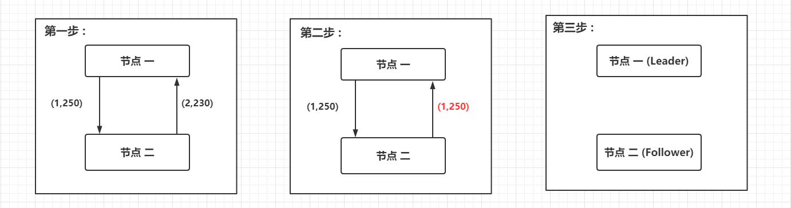

# Zookeeper 的崩溃恢复

假如Zookeeper当前的主节点挂掉了，集群会进行**崩溃恢复**。

分为三个阶段。

## 领导选举 （Leader election）

国不可一日无君，领袖挂掉后必须立刻选举信任君主，选举期间国家停业不处理外来事物。

- 选举阶段，此时集群中的节点处于`Looking`状态。它们会各自向其他节点发起投票，投票当中包含自己的**服务器ID**和**最新事务ID（ZXID）**。
- 节点会用自身的ZXID和从其他节点接收到的ZXID做比较，如果发现别人家的ZXID比自己大，也就是数据比自己新，那么就重新发起投票，投票给目前已知最大的ZXID所属节点。
- 每次投票后，服务器都会统计投票数量，判断是否有某个节点得到半数以上的投票。如果存在这样的节点，该节点将会成为准Leader，状态变为Leading。其他节点的状态变为Following。

## 发现阶段 （Discovery）

发现阶段用于在从节点中发现**最新的ZXID**和**事务日志**。

> 或许有人会问：既然Leader被选为主节点，已经是集群里数据最新的了，为什么还要从节点中寻找最新事务呢？
>
> 这是为了以防万一，比如因网络原因在上一阶段产生多个Leader的情况。

所以这一阶段，`Leader`集思广益，接收所有Follower发来各自的最新epoch值。Leader从中选出最大的epoch，基于此值加1，生成新的epoch分发给各个Follower。

各个Follower收到全新的epoch后，返回ACK给Leader，带上各自最大的ZXID和历史事务日志。Leader选出最大的ZXID，并更新自身历史日志。

## 同步 （Synchronization）

同步阶段，把Leader刚才收集得到的最新历史事务日志，同步给集群中所有的Follower。只有**当半数Follower同步成功，这个准Leader才能成为正式的Leader**。

