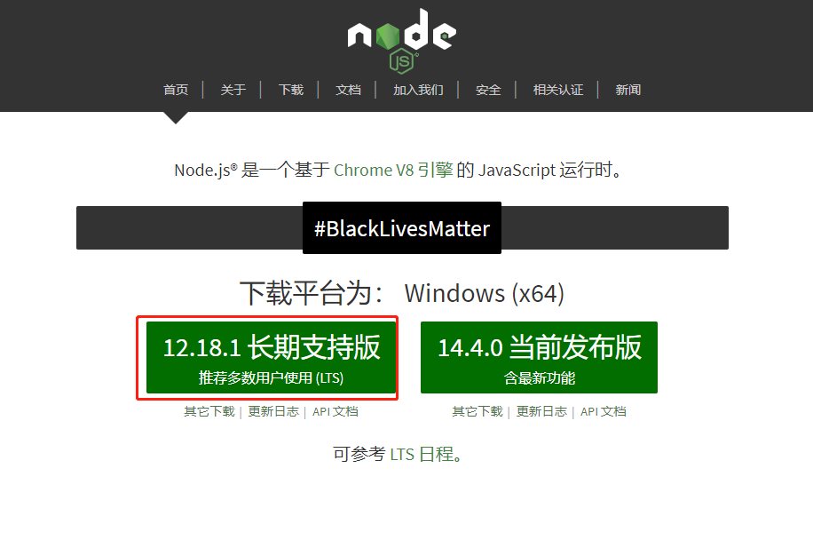

# Node环境安装

## 下载及安装

前往`node.js`的[官网](https://nodejs.org/zh-cn/)下载最新的客户端，并安装



## 测试是否成功

```shell
C:\Users\admin>node -v
v10.16.3

C:\Users\admin>npm -v
6.9.0
```


# VUE-Clie 安装

```shell
# 可以选择安装淘宝npm源
npm install -g cnpm --registry=https://registry.npm.taobao.org
# vue-cli 安装
npm install --g vue-cli
```

> 如果已存在旧版本的可以尝试 `cnpm uninstall --g vue-cli`进行卸载。
>
> `vue -V` 查看版本
>
> 如果总是不能安装新版本可以尝试 `npm install -g @vue/cli`
>


# 启动VUE UI

```shell
vue ui
🚀  Starting GUI...
🌠  Ready on http://localhost:8000
```

