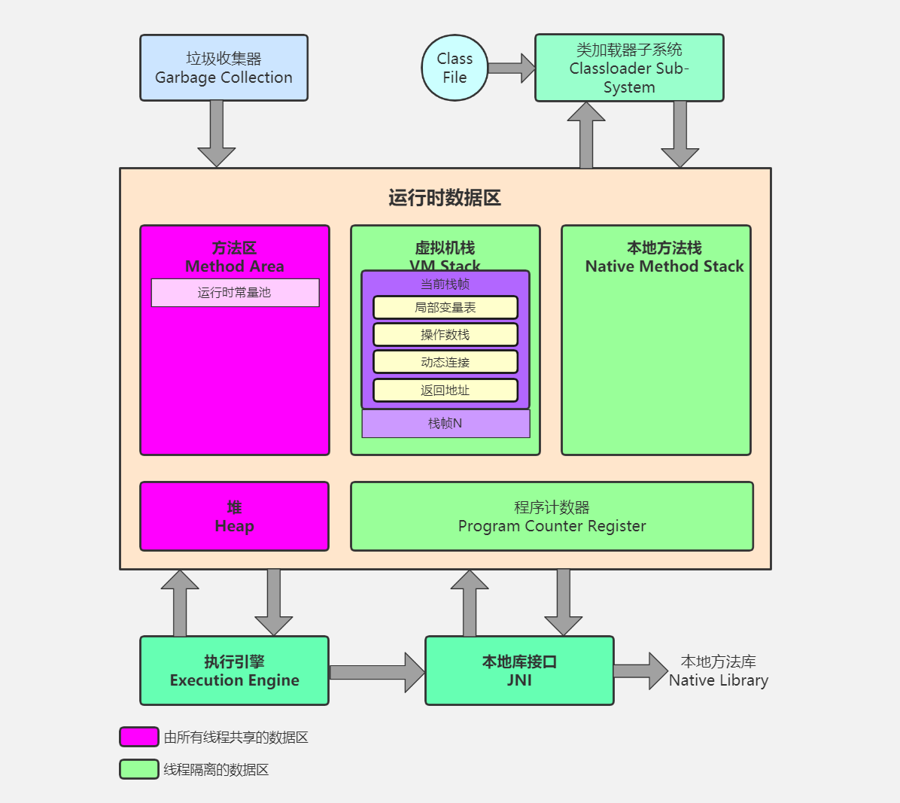
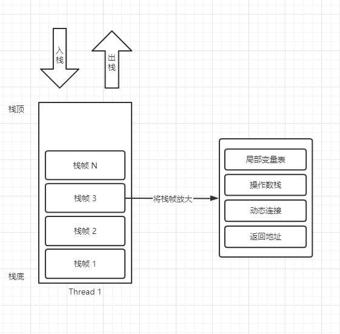
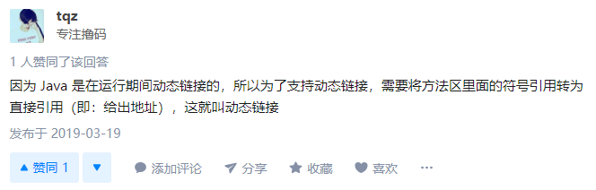

# 内存结构

根据上图我们发现 Java 内存结构由堆、虚拟机栈、方法区、程序计算器、本地方法栈。如果分为两种类型则是：**线程共享的** 和 **线程私有的**。

## 线程私有

- ### 程序计数器（PC Register）

  ​	在图中看到了很大一块程序计数器其实在现实中只是开辟了很小很小的一部分，他的核心作用是用于：记录线程执行到的位置。

  > ​	由于Java虚拟机的多线程是通过线程轮流切换并分配处理器执行时间的方式来实现的，在任何一个确定的时刻，一个处理器（对于多核处理器来说是一个内核）只会执行一条线程中的指令。因此，**为了线程切换后能恢复到正确的执行位置**，每条线程都需要有一个独立的程序计数器，各条线程之间的计数器互不影响，独立存储。

  ​	**程序计数器中只存储当前线程执行程序的行号，一个类指针的数据结构。**

  ​	JVM线程中执行的方法有2种类型：普通Java方法和由其他语言实现的native方法。如果当前执行的是普通Java方法，则程序计数器记录的是**虚拟机字节码指令的地址**。如果当前执行的是native方法，则**计数器的值为空（Undefined）**。

  

  

   

- ### 虚拟机栈（VM Stack）

  ​	和程序计数器一样，虚拟机栈也是线程私有的，即生命周期和线程相同。Java虚拟机栈**和线程同时创建，用于存储栈帧**。每个方法在执行时都会创建一个**栈帧(Stack Frame)，**用于存储**局部变量表**、**操作数栈**、动态链接、方法出口等信息。每一个方法从调用直到执行完成的过程就对应着一个栈帧在虚拟机栈中从入栈到出栈的过程。

  ​	**栈帧**：一个栈帧随着一个方法的调用开始而创建，这个方法调用完成而销毁。栈帧内存放者方法中的局部变量，操作数栈等数据。栈帧也叫过程活动记录，是编译器用来实现过程/函数调用的一种数据结构。

  ​	

  ​	

  ​	

  - **栈帧结构**
    - 局部变量表（Local Variable Table）是一组变量值存储空间，用于存放方法参数和方法内部定义的局部变量。并且在Java编译为Class文件时，就已经确定了该方法所需要分配的局部变量表的最大容量。
    
    - 每个栈帧都包含一个指向运行时常量池中该栈帧所属方法的引用，持有这个引用是为了支付方法调用过程中的动态连接（Dynamic Linking）。
    
      
    
    - 操作数栈和局部变量表一样，在编译时期就已经确定了该方法所需要分配的局部变量表的最大容量。
    
    - 当一个方法开始执行后，只有2种方式可以退出这个方法 ：
      - 方法返回指令 执行引擎遇到一个方法返回的字节码指令，这时候有可能会有返回值传递给上层的方法调用者，这种退出方式称为正常完成出口。
      - 异常退出 ： 在方法执行过程中遇到了异常，并且没有处理这个异常，就会导致方法退出。
      
       

  

- ### 本地方法栈（Native Method Stack）

  简单来说就是一个java调用非java代码的接口，一般是C或C++代码。至于为什么使用其他语言主要是使用更底层的语言效率更高。

   

## 线程共享

- ### 堆（Heap）

  

- ### 方法区（Method Area）

