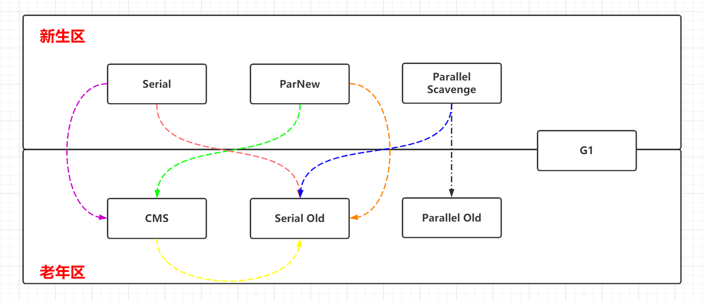
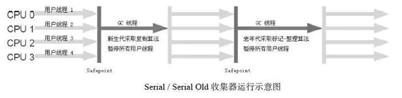
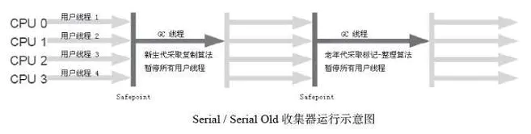
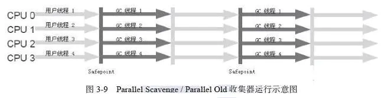
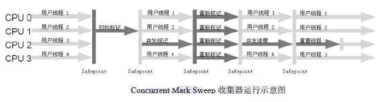
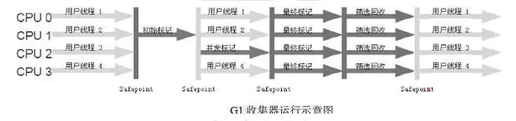

# 概念

**如果说收集算法是内存回收的理论，那么垃圾收集器就是内存回收的具体实现。**Java虚拟机规范中对垃圾收集器应该如何实现并没有任何规定，因此不同的厂商、版本的虚拟机所提供的垃圾收集器都可能会有很大差别，并且一般都会提供参数供用户根据自己的应用特点和要求组合出各个年代所使用的收集器。

# 常见的收集器

从途中可以得到哪些信息：

- 囊括了最近几个版本最常见的七种收集器
- 按照图中彩色的虚线可以进行两两组合配合使用
- 上方三个收集器工作在新生区、下方三个工作在老年区，而处在中间的 G1 则都可以

## Serial 收集器

### 特性：
这个收集器是一个**单线程**的收集器，但它的单线程”的意义并不仅仅说明它只会使用一个CPU或一条收集线程去完成垃圾收集工作，更重要的是在它进行垃圾收集时，必须暂停其他所有的工作线程，直到它收集结束。`Stop The World`

### 应用场景：
Serial收集器是虚拟机运行在Client模式下的默认新生代收集器。

### 优势：
简单而高效（与其他收集器的单线程比），对于限定单个CPU的环境来说，Serial收集器由于没有线程交互的开销，专心做垃圾收集自然可以获得最高的单线程收集效率。

### 总结：

老奶奶收集器，历史最悠久的收集器在`jdk 1.3.1`之前是HostSpot的唯一选择。单线程以及清理时需停止其他一切活动导致性能不符合现在普遍的需求，因为没有人会同意电脑运行一小时就要死机两分钟。

## Serial old 收集器

### 特性：
Serial Old是Serial收集器的**老年代版本**，它同样是一个**单线程收集器**，使用**标记－整理**算法。

### 应用场景：

- **Client模式**
   Serial Old收集器的主要意义也是在于给Client模式下的虚拟机使用。
- **Server模式**
   如果在Server模式下，那么它主要还有两大用途：一种用途是在JDK 1.5以及之前的版本中与Parallel Scavenge收集器搭配使用，另一种用途就是作为CMS收集器的后备预案，在并发收集发生Concurrent Mode Failure时使用。

## ParNew 收集器

### 特性：
ParNew收集器其实就是Serial收集器的**多线程版本**，除了使用多条线程进行垃圾收集之外，其余行为包括Serial收集器可用的所有控制参数、收集算法、Stop The World、对象分配规则、回收策略等都与Serial收集器完全一样，在实现上，这两种收集器也共用了相当多的代码。

**应用场景：**
ParNew收集器是许多运行在Server模式下的虚拟机中首选的新生代收集器。

### 总结：

与 **Serial** 相比除了多线程和并行收集没什么创新和升级

 

##　Parallel Scavenge 收集器

### 特征：

ps收集器也是一个**并行**的**多线程新生代**收集器，它也使用**复制算法**。Parallel Scavenge收集器的特点是它的关注点与其他收集器不同，Parallel Scavenge 收集器的目标是**达到一个可控制的吞吐量（Throughput）**。

### 场景：

停顿时间越短就越适合需要与用户交互的程序，良好的响应速度能提升用户体验，而高吞吐量则可以高效率地利用CPU时间，尽快完成程序的运算任务，主要适合在后台运算而不需要太多交互的任务。

 

## Parallel Old收集器

### 特性：
Parallel Old是Parallel Scavenge收集器的**老年代版本**，使用**多线程**和**标记－整理**算法。

###　场景：
在注重吞吐量以及CPU资源敏感的场合，都可以优先考虑Parallel Scavenge加Parallel Old收集器。

## CMS

### 特性：
CMS（Concurrent Mark Sweep）收集器是一种以获取最短回收停顿时间为目标的收集器。目前很大一部分的Java应用集中在互联网站或者B/S系统的服务端上，这类应用尤其重视服务的响应速度，希望系统停顿时间最短，以给用户带来较好的体验。CMS收集器就非常符合这类应用的需求。

### 过程

- **初始标记（CMS initial mark）**

  初始标记仅仅只是标记一下GC Roots能直接关联到的对象，速度很快，需要 Stop The World 。可以说只是象征性的标记一下。

- **并发标记（CMS concurrent mark）**

  并发标记阶段就是进行GC Roots Tracing的过程。

- **重新标记（CMS remark）**

  重新标记阶段是为了修正并发标记期间因用户程序继续运作而导致标记产生变动的那一部分对象的标记记录，这个阶段的停顿时间一般会比初始标记阶段稍长一些，但远比并发标记的时间短，仍然需要“Stop The World”。

- **并发清除（CMS concurrent sweep）**

  并发清除阶段会清除对象。

### 优缺点

- 优点：

  **并发收集**、**低停顿**

- 缺点：

  - **CMS收集器对CPU资源非常敏感**

    并发阶段不会停止用户线程，因为并发标记的时候会占用一些线程（也就是CPU资源了）。程序会变慢，总吞吐量会降低。

  - **无法处理浮动垃圾**

    伴随程序运行自然就还会有新的垃圾不断产生，这一部分垃圾出现在标记过程之后，CMS无法在当次收集中处理掉它们，只好留待下一次GC时再清理掉。这一部分垃圾就称为“浮动垃圾”。

  - 大量内存碎片

    基于标记—清除算法的收集器，该算法之前说过会制造碎片。往往会出现老年代还有很大空间剩余，但是无法找到足够大的连续空间来分配当前对象，不得不提前触发一次Full GC。

## G1 收集器

### 特征：

G1（Garbage-First）是一款面向**服务端应用**的垃圾收集器。HotSpot开发团队赋予它的使命是未来可以替换掉JDK 1.5中发布的CMS收集器。与其他GC收集器相比，G1具备如下特点。

- **并行与并发**
  G1能充分利用多CPU、多核环境下的硬件优势，使用多个CPU来缩短Stop-The-World停顿的时间，部分其他收集器原本需要停顿Java线程执行的GC动作，G1收集器仍然可以通过并发的方式让Java程序继续执行。

- **分代收集**
  与其他收集器一样，分代概念在G1中依然得以保留。虽然G1可以不需要其他收集器配合就能独立管理整个GC堆，但它能够采用不同的方式去处理新创建的对象和已经存活了一段时间、熬过多次GC的旧对象以获取更好的收集效果。

- **空间整合**
  与CMS的“标记—清理”算法不同，G1从**整体来看是基于“标记—整理”**算法实现的收集器，从**局部（两个Region之间）上来看是基于“复制”**算法实现的，但无论如何，这两种算法都意味着G1运作期间不会产生内存空间碎片，收集后能提供规整的可用内存。这种特性有利于程序长时间运行，分配大对象时不会因为无法找到连续内存空间而提前触发下一次GC。

- **可预测的停顿**
  这是G1相对于CMS的另一大优势，降低停顿时间是G1和CMS共同的关注点，但G1除了追求低停顿外，还能建立可预测的停顿时间模型，能让使用者明确指定在一个长度为M毫秒的时间片段内，消耗在垃圾收集上的时间不得超过N毫秒。

# 一张表总结

|          | Serial   | Serial old | ParNew   | Parallel Scavenge | Parallel Old | CMS          | G1       |
| -------- | -------- | ---------- | -------- | ----------------- | ------------ | ------------ | -------- |
| 收集范围 | 新生代   | 老年代     | 新生代   | 新生代            | 老年代       | 老年代       | 整个堆   |
| 收集算法 | 标记复制 | 标记整理   | 标记复制 | 标记复制          | 标记整理     | 标记清除     | 标记整理 |
| 线程     | 单线程   | 单线程     | 多线程   | 多线程            | 多线程多线程 | 多线程       | 多线程   |
| STW      | 是       | 是         | 是       | 否                | 否           | 是           | 是       |
| 其他     | 最早的   | 最早的     | 搭配CMS  | 吞吐量优先        | 吞吐量优先   | 并发、低停顿 |          |

