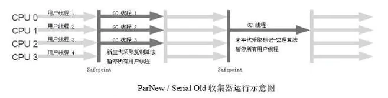

# 概念

**如果说收集算法是内存回收的理论，那么垃圾收集器就是内存回收的具体实现。**Java虚拟机规范中对垃圾收集器应该如何实现并没有任何规定，因此不同的厂商、版本的虚拟机所提供的垃圾收集器都可能会有很大差别，并且一般都会提供参数供用户根据自己的应用特点和要求组合出各个年代所使用的收集器。

# 常见的收集器

从途中可以得到哪些信息：

- 囊括了最近几个版本最常见的七种收集器
- 按照图中彩色的虚线可以进行两两组合配合使用
- 上方三个收集器工作在新生区、下方三个工作在老年区，而处在中间的 G1 则都可以

## Serial收集器

### 特性：
这个收集器是一个**单线程**的收集器，但它的单线程”的意义并不仅仅说明它只会使用一个CPU或一条收集线程去完成垃圾收集工作，更重要的是在它进行垃圾收集时，必须暂停其他所有的工作线程，直到它收集结束。`Stop The World`

### 应用场景：
Serial收集器是虚拟机运行在Client模式下的默认新生代收集器。

### 优势：
简单而高效（与其他收集器的单线程比），对于限定单个CPU的环境来说，Serial收集器由于没有线程交互的开销，专心做垃圾收集自然可以获得最高的单线程收集效率。

### 总结：

老奶奶收集器，历史最悠久的收集器在`jdk 1.3.1`之前是HostSpot的唯一选择。单线程以及清理时需停止其他一切活动导致性能不符合现在普遍的需求，因为没有人会同意电脑运行一小时就要死机两分钟。

## ParNew收集器

**特性：**
ParNew收集器其实就是Serial收集器的**多线程版本**，除了使用多条线程进行垃圾收集之外，其余行为包括Serial收集器可用的所有控制参数、收集算法、Stop The World、对象分配规则、回收策略等都与Serial收集器完全一样，在实现上，这两种收集器也共用了相当多的代码。

**应用场景：**
ParNew收集器是许多运行在Server模式下的虚拟机中首选的新生代收集器。

### 总结：

与**Serial**相比除了多线程和并行收集没什么创新和升级，但是