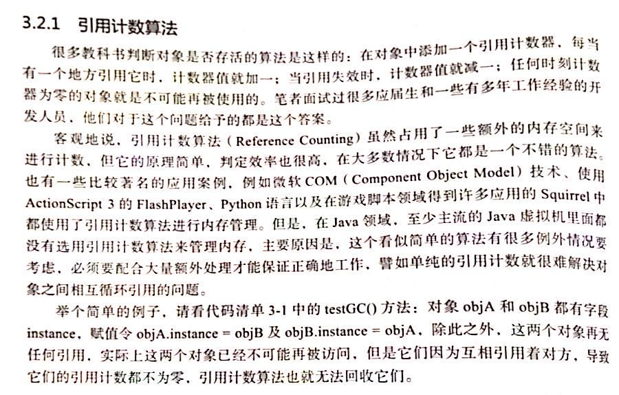

# 什么是垃圾

**没有引用的指向的对象就是垃圾。**

 

# 如何找到垃圾

本文我们要说的是垃圾回收，所以我们首先要确定的是**哪些对象需要被回收**，如果对象本本分分的在被人引用你是不能回收的。

## 一、 引用计数器 （ Reference Count）

首先明确一点：这是一个 捡垃圾的思想，但是 JVM 现在不使用该方法 ，以前也没用过该方法。但是在个别领域还有用到。

> 给对象中添加一个引用计数器，
>
> 每当有一个地方引用他时，计数器值就+1，
>
> 当引用失效时，计数器值就-1，
>
> 任何时刻计数器为0的对象就是不可能在被使用。

案例一：当一个对象被引用一次的时候就在该对象内标记一个1，被引用两次的时候就标记一个2...

但是在实际情况中：**为0的一定是垃圾，但是不为零的也不一定是有用的对象**

虽然其拥有**极强的性能**，但是在极高的**错误率**下引用计数器并不算是一个合理的垃圾回收的方法。

案例二：此时有三个方法相互引用，所以这三个方法的引用数量都是1，但是他们和其他方法没有任何联系，按照规则是视为垃圾的，但是因为其引用数量不是1 并不能对其回收。

## 二、 可达算法 （Reachability Analysis）

通过一系列的GC Roots的对象作为起始点，从这些根节点开始向下搜索，搜索所走过的路径称为引用链（Reference Chain），当一个对象到GC Roots没有任何引用链相连时，则证明此对象是不可用的。

所以该算法的核心在于一个**根**，在 Java 的技术体系里，固定座位 `GC Roots`的对象包括如下：

> - 在虚拟机栈（栈帧中的本地变量表）中引用对象，譬如各个线程被调用的方法堆栈中使用到的参数、局部变量、临时变量等。
> - 在方法区类中类静态属性引用的对象，譬如 Java 类的引用类型静态变量。
> - 在方法区中常量引用的对象，譬如字符串常量池里的引用
> - 本地方法中的JNI（Native）方法引用的对象。
> - Java虚拟机内部使用的引用，比如基本数据类型对应的Class对象，一些常驻的异常对象。
> - 所有被同步锁（Synchronized）持有的对象
> - 反映Java虚拟机内部情况的JMXBean、JVMTI中注册的回调、本地代码缓存等。

画下重点：**JVM 栈**、**静态变量**、**常量池**、**Native方法**

 

# 垃圾收集算法

当知道哪些对象是垃圾需要回收时就需要将他们收集起来，方法有很多可以用：扫把、扫地机器人、吸尘器...

## 一、 标记 - 清除算法 （Mark - Sweep）

### 概念

### 实例

### 优劣

- 优点：实现简单、存活对象少的时候效率高
- 缺点：碎片化严重、两次扫描效率低

### 应用

新生区

## 二 、 标记 - 复制算法（Mark - copying）

### 概念

把给对象分配内存的堆(heap)分成大小相等的两部分，或者申请2块大小相同的堆，其中一个堆称为From空间，另一个称为To空间。首次给对象分配内存时，活动堆为From空间，从From空间分配；触发GC时，采用标记-清除算法中的标记算法遍历活动对象，把活动对象复制到To空间，然后就把To空间当做当前活动堆。To空间满触发GC时，把活动对象复制到From空间，如此交替进行。

简单总结：先将内存**一分为二**，找到所有有用的对象**复制**到内存的另一边

### 实例

### 优劣

优点：防止碎片化、适用于存活较少的、一次扫描

缺点：空间利用率低（只有50%）、复制操作多效率差

### 应用

老年区

## 三 、标记 - 整理算法（Mark - Compact）

### 概念

算法不直接对可回收对象进行清理，而是让所有可用的对象都向一端移动。然后直接清理掉边界意外的内存。

### 实例

### 优劣

- 优点：没有碎片、方便分配、内存使用率高
- 缺点：需要两次扫描、需要移动对象、效率低

### 应用

老年区

# 收集算法总结

|            | 标记清除      | 标记整理   | 标记复制                             |
| ---------- | ------------------ | ---------------- | ------------------------------------- |
| 速度       | 中等               | 最慢             | 最快                                  |
| 空间开销   | 少（但会堆积碎片） | 少（不堆积碎片） | 通常需要活对象的2倍大小（不堆积碎片） |
| 移动对象 | 否                 | 是               | 是                                    |

