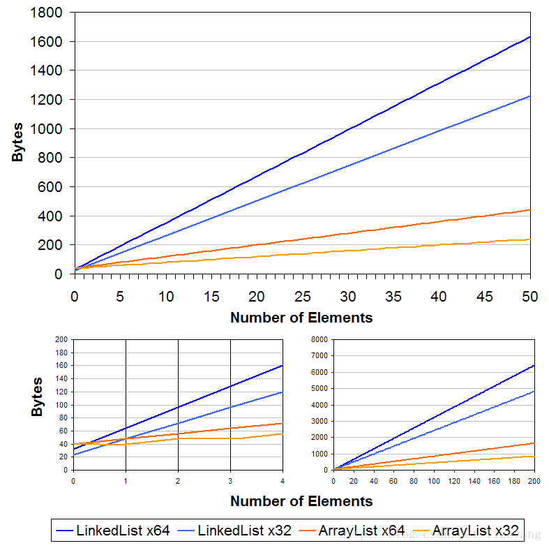

之前笔记中容器关系图中看到， **ArrayList** 和 **LinkedList** 都实现于 `List`接口，相似点还是很多的只是根据可能出现的不同业务场景又衍生了多种不同的容器类。

**划重点**：差异是有的，实现效果都差不多，根据不同业务场景选择不同容器。

## 存储结构

- **ArrayList** 基于**动态数组**的数据结构
- **LinkedList** 基于**链表**的数据结构

**数组** 和 **链表** 本身就存在着差异，所以由此也产生了 **ArrayList** 和 **LinkedList** 的几个不同点。

数组的特性有：内存中是**连续存放**的、固定长度、占用资源较少。

而在链表中：在内存中不连续，链表成员之间是通过指针进行指向、长度不是固定的

## 效率

**LinkedList** 是一个**双向链表**，在源码中可以看到头尾的指针

### 随机访问

因为 **数组** 在内存中是连续存放的，很轻松就可以查到其他的成员。但是 **链表** 需要移动指针，如果想获取某个值则需要获取到他的前一个节点。

### 插入

- 首尾插入

  - 因为双向链表的原因**LinkedList**在首尾插入的时候效率很高，因为只需要修改首尾的节点值

  - 但是**ArrayList**首部插入则会很慢，因为需要将每一个元素向后挪一位。向尾部插入很快，需要移动的元素很少

    

- 中部插入
  - **LinkedList** 在**数据量大**的情况下中部进行插入效率会很慢，因为需要对链表的指针进行查找。
  - **ArrayList** 则不会有什么影响，因为元素连续存放定位快

## 资源占用

- 占用资源较少是数组的一个特性，所以 **ArrayList** 优势还是很明显的

  

## 总结

|          |  **ArrayList**   |                  **LinkedList**                  |
| :------: | :--------------: | :----------------------------------------------: |
| 存储结构 |     动态数组     |                     双向链表                     |
| 随机访问 |     **更优**     |                       略低                       |
| 资源占用 |     **较小**     |                       较大                       |
|   结论   | 大部分场景下使用 | 数据量不大时使用，或者主要进行首尾插入、删除操作 |

