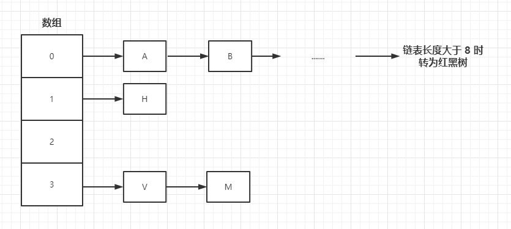

1.7 之前的版本 HashMap 的存储结构就是 数组 + 链表，直到 1.8 加入了红黑树。

## 为什么要转


链表前面有说过是通过指针指向下一个元素实现的。而且在 HashMap 的源码中可以查到节点的类是一个**单向链表**的结构

```java
static class Node<K,V> implements Map.Entry<K,V> {
    final int hash;
    final K key;
    V value;
    Node<K,V> next;
	...
}
```

单向链表如果想定位到靠后的数据就只能通过**遍历**查询了，时间复杂度为O(N)。

而红黑树的时间复杂度为O(logN)

此时得出结论：**因为红黑树的时间复杂度小于链表，所以我们会在长度为8的时候将存储结构由链表转为红黑树**


### 为什么开始不直接使用红黑树

首先贴上 JKD的开发者写出的注释，在 HashMap 方法175行

```java
Because TreeNodes are about twice the size of regular nodes, we use them only when bins contain enough nodes to warrant use (see TREEIFY_THRESHOLD)
```

因为树节点的大小是普通的节点的两倍，所以只有在足够的元素下才会使用树节点，具体多少个元素的时候进行转换可以通过`TREEIFY_THRESHOLD`

### 为什么默认是 8 

跟着上一个注释，开发者还介绍了为什么是 8 

```java
 In usages with well-distributed user hashCodes, tree bins are rarely used.
```

因为在合理使用`hashcode`的时候是很少会使用到树结构的。

并且提到了一个**泊松分布**的东西

```java
* 0:    0.60653066
* 1:    0.30326533
* 2:    0.07581633
* 3:    0.01263606
* 4:    0.00157952
* 5:    0.00015795
* 6:    0.00001316
* 7:    0.00000094
* 8:    0.00000006
* more: less than 1 in ten million
```

长度大于8的概率小于千万分之1？


## 总结

红黑树确实可以提升查询效率，但是由于他的内存占用是翻倍的开发者认为这样缺点是大于优点的，所以在**小数据量**的时候还是优先使用**链表结构**。