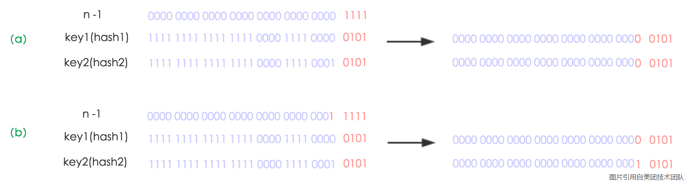
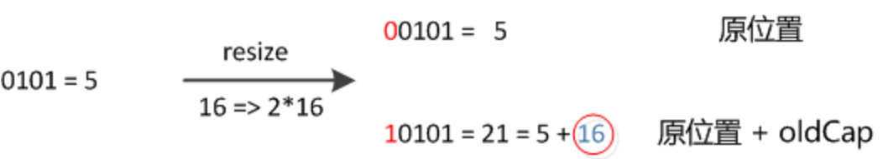
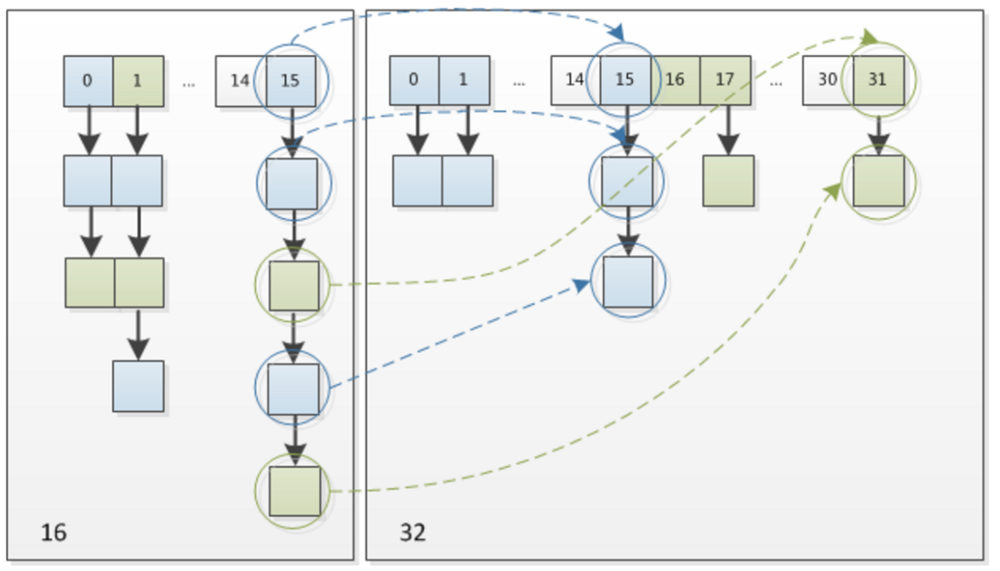

```java
/**
* The default initial capacity - MUST be a power of two.
*/
static final int DEFAULT_INITIAL_CAPACITY = 1 << 4; // aka 16
```

`Default Initial Capacity` 翻译为**默认初始值**

注释中前调 `MUST be a power of two` 一定是2的N次幂

开发者既然这么说了肯定有他的道理，慢慢通过源码来了解

## 自定义初始值

通过文档可以看出 `HashMap` 是可以指定容量和负载系数，但是如果有一个没看过源码的开发人员随便写了一个长度不符合2的N次幂不就出问题了。在源码中有参构造中发现了猫腻。

```java
public HashMap(int initialCapacity, float loadFactor) {
    if (initialCapacity < 0)
        throw new IllegalArgumentException("Illegal initial capacity: " +
                                           initialCapacity);
    if (initialCapacity > MAXIMUM_CAPACITY)
        initialCapacity = MAXIMUM_CAPACITY;
    if (loadFactor <= 0 || Float.isNaN(loadFactor))
        throw new IllegalArgumentException("Illegal load factor: " +
                                           loadFactor);
    this.loadFactor = loadFactor;
    // 传来的长度没有直接赋值给threshold 而是走了一个方法
    this.threshold = tableSizeFor(initialCapacity);
}

 /**
 * Returns a power of two size for the given target capacity.
 */
static final int tableSizeFor(int cap) {
    int n = cap - 1;
    n |= n >>> 1;
    n |= n >>> 2;
    n |= n >>> 4;
    n |= n >>> 8;
    n |= n >>> 16;
    // 不管你传的参数是个啥 我都给你返回个一个 2的N次幂数
    return (n < 0) ? 1 : (n >= MAXIMUM_CAPACITY) ? MAXIMUM_CAPACITY : n + 1;
}

```


## 作用

### 快速取余

通过 Hash 码计算数组索引时通常方式是使用 `hash % length`

在 HashMap 中使用的是`(length - 1 ) & hash` ，如下源码

```java
// HashMap 源码630行左右 一次计算数组索引 
if ((p = tab[i = (n - 1) & hash]) == null)
	tab[i] = newNode(hash, key, value, null);
```

**位运算**确实比**取模运算**要快很多 （参考了网友的测试结果 大约快20倍左右）

既然`&`运算那么快为什么还有`%`运算，很简单因为并不是所有数值都成立，所以长度在定义时要求是`2的N次幂`


### 扩容时快速迁移

在扩容之后涉及到元素的迁移过程，迁移的时候只需要判断二进制的前一位是0或者是1即可

如果是0，表示新数组和就数组的下标位置不变，如果是1，只需要将索引位置加上旧的数组的长度值即为新数组的下标



`n`为`table`的长度，图（a）表示扩容前的`key1`和`key2`两种`key`确定索引位置的示例，图（b）表示扩容后`key1`和`key2`两种`key`确定索引位置的示例，其中`hash1`是`key1`对应的哈希与高位运算结果。

元素在重新计算hash之后，因为n变为2倍，那么n-1的mask范围在高位多1bit(红色)，因此新的index就会发生这样的变化：

因此，我们在扩充HashMap的时候，不需要像JDK1.7的实现那样重新计算hash，只需要看看原来的hash值新增的那个bit是1还是0就好了，是0的话索引没变，是1的话索引变成 **原索引** + **oldCap**

16扩充为32的resize示意图:

