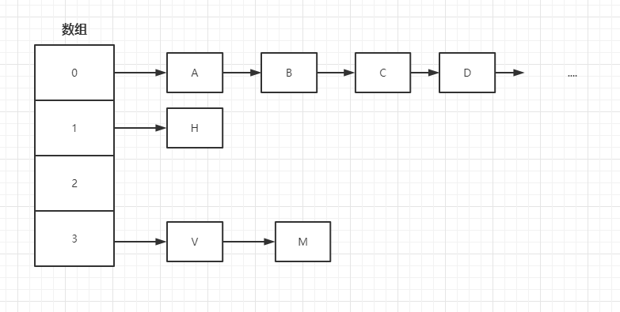
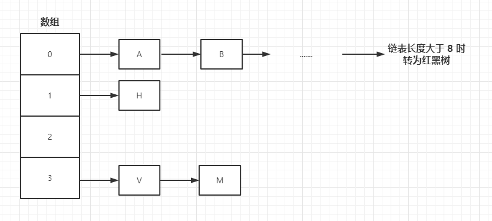

## 基本使用

```java
HashMap<Object, Object> map = new HashMap<>();
map.put("不知妻美","刘强东");
map.put("悔创阿里","杰克马");
map.put("普通家庭","马化腾");
map.put("长相一般","孙彦祖");
System.out.println(map);

// 输出结果
{不知妻美=刘强东, 长相一般=孙彦祖, 悔创阿里=杰克马, 普通家庭=马化腾}	

```

```java
// 克隆一个新的Map容器
HashMap<Object, Object> map2 = (HashMap<Object, Object>) map.clone();
System.out.println(map2);
// map 和 map2 比较
boolean equals1 = map.equals(map2);
System.out.println(equals1);
// 实例化一个新的 map3
HashMap<Object, Object> map3 = new HashMap<>();
// map 和 map3 比较
boolean equals2 = map.equals(map3);
System.out.println(equals2);

// 输出结果
{长相一般=孙彦祖, 悔创阿里=杰克马, 不知妻美=刘强东, 普通家庭=马化腾}
true
false
```

```java
System.out.println(map.get("杨花落尽子规啼"));
System.out.println(map.get("长相一般"));

// 输出结果
null
孙彦祖
```

```java
map.clear();
System.out.println(map);

// 输出结果
{}
```

```java
// 获取所有Key值
Set<Object> keys = map.keySet();
// 获取所有value值
Collection<Object> values = map.values();
// 打印
System.out.println(keys);
System.out.println(values);

// 输出结果
[不知妻美, 长相一般, 悔创阿里, 普通家庭]
[刘强东, 孙彦祖, 杰克马, 马化腾]

```

```java
// 是否存在指定Key
System.out.println(map.containsKey("不知妻美"));
// 是否存在指定Value
System.out.println(map.containsValue("马化腾"));

// 输出
true
true
```


## 存储结构

HashMap 目前是由 数组+链表+红黑树 实现的（红黑树是在`jdk1.8`新增的）

- 1.8 之前

  

- 1.8 之后

  

  **当红黑树长度小于 6 时会转回链表**

至于为什么要转请移步[《HashMap 为什么会在长度为 8 的时候链表转红黑树》](基础/容器/HashMap为什么会在长度为8的时候链表转红黑树)

