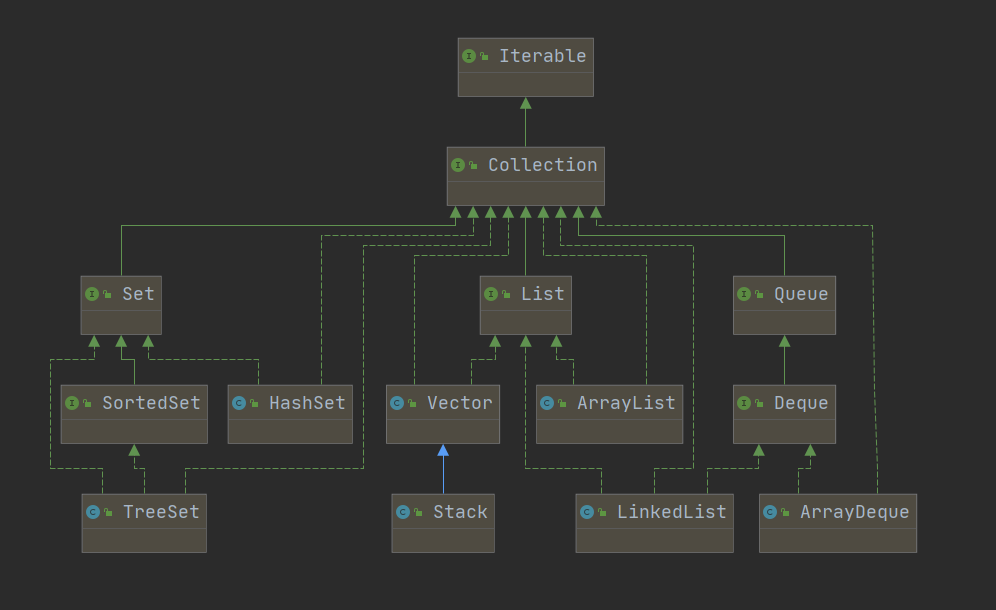
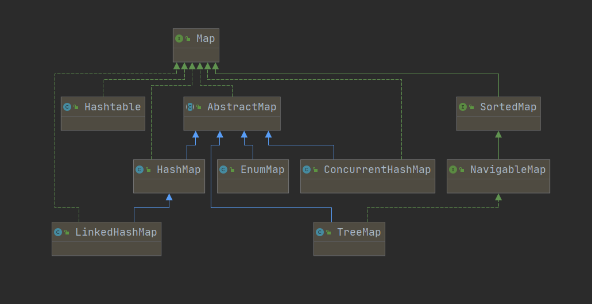

## 什么是容器?

其实就是字面意思，用来装东西的器皿例如：`厨房的米缸`,`客厅的花瓶`

在编程中少不了就是对数据进行`增删改查`获取到的数据都会装在某个器皿里通过 HTTP 发送给页面。

此处注意：容器也分很多种，本文所说的容器装的是数据，可以是`int`、`String`...也有一种存放对象的容器，后续再Spring中会用到。反正涉及到容器都很重要就对了

## 两大阵营

在前文介绍 Java 中四种容器类型：`List`、`Set`、`Queue`、`Map`，不难发现他们在以下特性上存在一些差异

- 是否可以重复
- 是否有序
- 是否有键值

配合`idea`的对象关系模型可以看到如下效果

