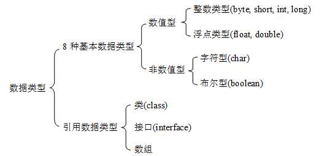

## 从一张图介绍 Java 的 数据类型

### 基本数据类型  -  四类八种

-  整数类型  
   -  byte   
   -  short   
   -  int     
   -  long

- 浮点类型

  -  float   
  -  double

- 这符型

  - char

- 布尔型

  - boolean 
  
  

### 引用数据类型

- 类
- 接口
- 数组

