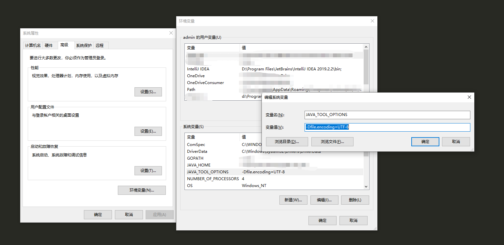

## 开始

### 首先写一个简单的 Java 程序

```java
class Test{
	public static void main(String[] args) {
		System.out.println("Hello Lksun");
	}
}
```


### 编译

```shell
javac Test.java
```


### 执行

```shell
java Test
```

```shell
# 返回结果
Hello Lksun
```


## 可能遇到问题

### 乱码

```shell
java Test

▒▒▒▒: ▒Ҳ▒▒▒▒▒▒޷▒▒▒▒▒▒▒▒▒ Test
```

**解决方法：**

- 方法一

  ```shell
  java -Dfile.encoding=utf-8 Test.java
  错误: 找不到或无法加载主类 Test.java
  ```

  每次都要加很长的配置就很烦

- 方法二

  

  JAVA_TOOL_OPTIONS => -Dfile.encoding=UTF-8

