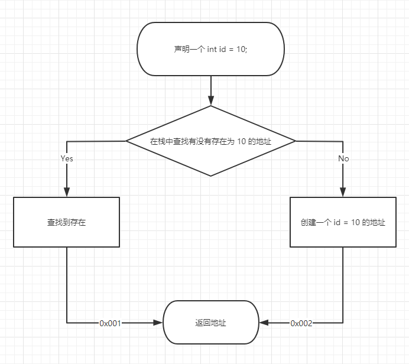

## 什么是堆，什么是栈

**栈(stack)** 与 **堆(heap)** 都是Java用来在内存中存放数据的地方。

栈解决程序的**运行问题**，即程序如何执行，或者说如何处理数据；

堆解决的是数据存储的问题，即数据怎么放、放在哪儿。

### 栈

#### 优缺点

- 优势：存取速度比堆要快，仅次于直接位于CPU中的寄存器。
- 缺点：存在栈中的数据大小与生存期必须是确定的，缺乏灵活性。而且栈数据在**多个线程**或者**多个栈**之间是**不共享**的，但是在栈内部多个值相等的变量是可以指向一个地址的。

#### 特殊性

- 数据可以共享

  例如我们定义一个`int id = 10;`时，首先会创建一个变量名为 `id`的空间，然后去查找有没有字面为`10`的已存在的地址，如果有则直接指向已存在的内存地址，没有则创建新的。

- 堆的优势是可以动态地分配内存大小，生存期也不必事先告诉编译器，Java的垃圾收集器会自动收走这些不再使用的数据。但缺点是，由于要在运行时动态分配内存，存取速度较慢。

