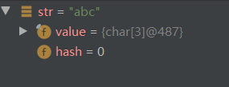
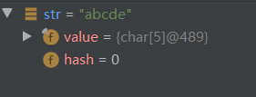
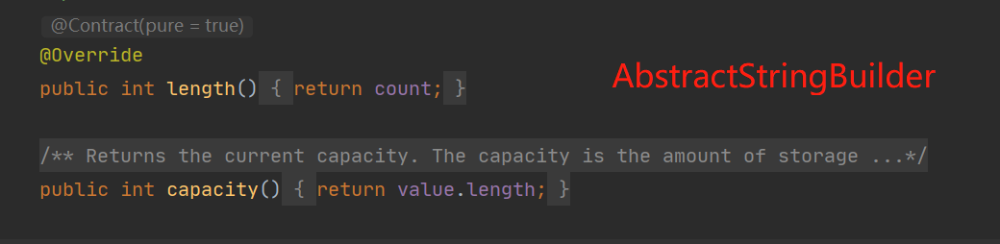
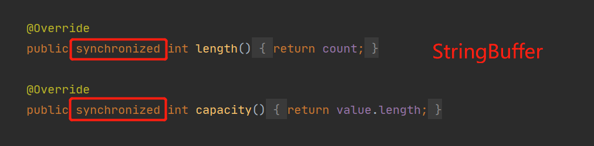

## String、StringBuilder、StringBuffe

### 基本使用

```java
public static void demo() {
    String str="abc";
    System.out.println(str);	// abc
    str=str+"de";
	System.out.println(str);	// abcde
}

public static void demo() {
    StringBuffer stringBuffer = new StringBuffer();
    stringBuffer.append("锄禾日当午").append(",").append("汗滴禾下土");
    System.out.println(stringBuffer);	// 锄禾日当午,汗滴禾下土

    StringBuilder stringBuilder = new StringBuilder();
    stringBuilder.append("谁知盘中餐").append(",").append("粒粒皆辛苦");
    System.out.println(stringBuilder);	// 谁知盘中餐,粒粒皆辛苦
}

```


### 运行速度：

 StringBuilder > StringBuffer > String


### 定义后修改的区别

**String** 对象一旦创建之后该对象是不可更改的，但后两者的对象是变量，是可以更改的。

肉眼看到字符串`str`被追加了`de`但是在**JVM**中实则并没有具体流程：

1. 创建一个`String`类型的`str`,并赋值`abc`
2. 毫无疑问此时输出为`abc`
3. 此时在`str`后面追加了`de`
4. JVM重新赋值一个新的`str`,而旧的则被自动回收掉

通过 IDEA 的 Debug 测试

- 定义一个`str`赋值`abc`

  
  
- 重新赋值后

  


###  线程安全

**StringBuffer** 线程安全，**StringBuilder** 线程不安全是老生常谈的问题了，具体怎么看出来的呢






随便截了两段源码，肉眼可见相似度还是很高的，最核心的就是安全的 **StringBuffer** 多了一个 `synchronized`修饰


### 总结

- String：适用于少量的字符串操作的情况

- StringBuilder：适用于单线程下在字符缓冲区进行大量操作的情况

- StringBuffer：适用多线程下在字符缓冲区进行大量操作的情况