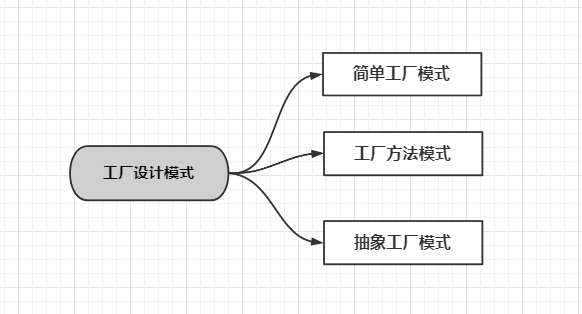
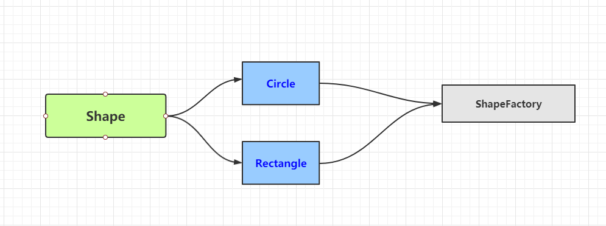
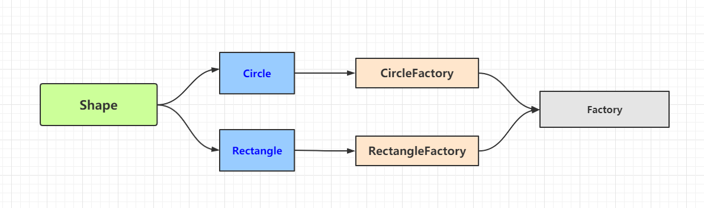

# 工厂设计模式

> "Define an interface for creating an object, but let subclasses decide which class to instantiate. Factory Method lets a class defer instantiation to subclasses."
>
> 在基类中定义创建对象的一个接口，让子类决定实例化哪个类。工厂方法让一个类的实例化延迟到子类中进行。

## 分类：



- 简单工厂（Simple Factory）模式，又称静态工厂方法模式（Static Factory Method Pattern）。

- 工厂方法（Factory Method）模式，又称多态性工厂（Polymorphic Factory）模式或虚拟构造子（Virtual Constructor）模式；
- 抽象工厂（Abstract Factory）模式，又称工具箱（Kit 或Toolkit）模式。

## 优点

- **解耦** ：把对象的创建和使用的过程分开

- **降低代码重复:** 如果创建某个对象的过程都很复杂，需要一定的代码量，而且很多地方都要用到，那么就会有很多的重复代码。

- **降低维护成本** ：由于创建过程都由工厂统一管理，所以发生业务逻辑变化，不需要找到所有需要创建对象B的地方去逐个修正，只需要在工厂里修改即可，降低维护成本。

## 实例

### 简单工厂模式

```php
interface Shape
{
    public function draw();
}
```

```php
class Circle implements Shape
{
    public function draw()
    {
        echo "Draw Circle";
    }
}

class Rectangle implements Shape
{
    public function draw()
    {
        echo "Draw Rectangle";
    }
}
```

```php
class ShapeFactory
{
    public static function getShape(string $type):Shape
    {
        if ($type == 'Circle'){
            return new Circle();
        }elseif ($type == 'Rectangle'){
            return new Rectangle();
        }
        return null;
    }
}
```

```php
$shape1 = ShapeFactory::getShape('Circle');
$shape2 = ShapeFactory::getShape('Rectangle');
var_dump($shape1);
var_dump($shape2);
```


> 由于工厂类集中了所有实例的创建逻辑，违反了高内聚责任分配原则，将全部创建逻辑集中到了一个工厂类中；它所能创建的类只能是事先考虑到的，如果需要添加新的类，则就需要改变工厂类了。




### 工厂方法模式

**工厂方法模式**是在**简单工厂模式**基础上加了一个工厂接口

```java
interface Factory
{
    public function getShape();
}
```

```php
class CircleFactory implements Factory
{
    public function getShape()
    {
        return new Circle();
    }
}
```

```php
$circleFactory = new CircleFactory();
$circle = $circleFactory->getShape();
$circle->draw();
```





### 抽象工厂模式

抽象工厂是生产一整套有产品的（至少要生产两个产品)，这些产品必须相互是有关系或有依赖的，而工厂方法中的工厂是生产单一产品的工厂。

> 假设某手机厂商有`α`（高配）和`β`（低配）两款产品，用了相同的**模具**、**供应商**和**销售渠道**，只是个别硬件配置不同，供应商也提供了`High`和`Low`两条供应链。

- 供应商

  ```java
  // 屏幕供应商
  package Screen;
  public class High {
      public High(){
          System.out.println("2K 120HZ 三星定制屏");
      }
  }
  
  package Screen;
  public class Low {
      public Low(){
          System.out.println("1080P 普通屏幕");
      }
  }
  
  // CPU 供应商
  package CPU;
  public class High {
      public High(){
          System.out.println("骁龙865");
      }
  }
  
  
  package CPU;
  public class Low {
      public Low(){
          System.out.println("骁龙710");
      }
  }
  
  
  // 电池供应商
  package Battery;
  public class High {
      public High(){
          System.out.println("4500毫安时超大电池");
      }
  }
  
  package Battery;
  public class Low {
      public Low(){
          System.out.println("4000毫安时大电池");
      }
  }
  ```

- 手机组装工厂

  ```java
  public interface Phone {
      public void Battery();
      public void CPU();
      public void Screen();
  }
  ```

- 产品α

  ```java
  public class Alpha implements Phone{
      @Override
      public void Battery() {
          new Battery.High();
      }
  
      @Override
      public void CPU() {
          new CPU.High();
      }
  
      @Override
      public void Screen() {
          new Screen.High();
      }
  }
  ```

- 产品β

  ```java
  public class Beta implements Phone{
      @Override
      public void Battery() {
          new Battery.Low();
      }
  
      @Override
      public void CPU() {
          new CPU.Low();
      }
  
      @Override
      public void Screen() {
          new Screen.Low();
      }
  }
  ```

- 商城

  ```java
  public class Mall {
      public static void main(String[] args) {
          System.out.println("销售产品α:");
          Alpha alpha = new Alpha();
          alpha.Battery();
          alpha.CPU();
          alpha.Screen();
  
          System.out.println("------");
  
          System.out.println("销售产品β:");
          Beta beta = new Beta();
          beta.Battery();
          beta.CPU();
          beta.Screen();
      }
  }
  
  // 控制台结果
  销售产品α:
  4500毫安时超大电池
  骁龙865
  2K 120HZ 三星定制屏
  ------
  销售产品β:
  4000毫安时大电池
  骁龙710
  1080P 普通屏幕
  
  Process finished with exit code 0
  ```

