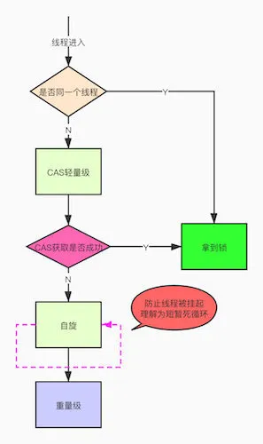
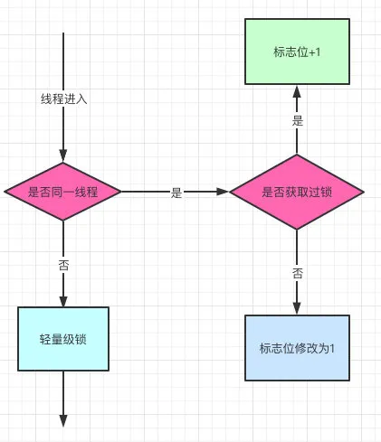

# Synchronized

## 概念

`synchronized` 是 Java 中的关键字，是利用锁的机制来实现同步的。

锁机制有如下两种特性：

- 互斥性：**在同一时间只允许一个线程持有某个对象锁**，通过这种特性来实现多线程中的协调机制，这样在同一时间只有一个线程对需同步的代码块(复合操作)进行访问。互斥性我们也往往称为操作的原子性。
- 可见性：必须确保在锁被释放之前，对共享变量所做的修改，对于随后获得该锁的另一个线程是可见的（即在获得锁时应获得最新共享变量的值），否则另一个线程可能是在本地缓存的某个副本上继续操作从而引起不一致。

## 用法

### 修饰实例方法

```java
public class Demo {
    public synchronized void get(){

    }
}
```


### 修饰静态方法

```java

public class Demo {
    public void get(){
        synchronized(Synchronized.class){

        }
    }
}
```


### 修饰代码块

```java
public class Synchronized {
    public void husband(){
        synchronized(new test()){

        }
    }
}
```

## 场景

- 保证原子性
- 保证可见性


## 锁升级

这是`synchronized`比较重要的一个概念了，首先说明一下这个锁的重量级是很大的：

重量级锁通过对象内部的监视器（monitor）实现，其中monitor的本质是依赖于底层操作系统的Mutex Lock实现，操作系统实现线程之间的切换需要从用户态到内核态的切换，切换成本非常高。

**重量级大**，**成本高**注定了他会消耗更多的**资源**和**时间**，他是他的稳是可以放弃性能的，但是在还是会在提升性能的边缘疯狂试探。



 🔒的升级方向：


### 轻量级锁

还是跟Mark Work 相关，如果这个对象是无锁的，jvm就会在当前线程的栈帧中建立一个叫锁记录（Lock Record）的空间，用来存储锁对象的Mark Word 拷贝，然后把Lock Record中的owner指向当前对象。

JVM接下来会利用CAS尝试把对象原本的Mark Word 更新会Lock Record的指针，成功就说明加锁成功，改变锁标志位，执行相关同步操作。

如果失败了，就会判断当前对象的Mark Word是否指向了当前线程的栈帧，是则表示当前的线程已经持有了这个对象的锁，否则说明被其他线程持有了，继续锁升级，修改锁的状态，之后等待的线程也阻塞。

### 自旋锁

自旋锁原理非常简单，如果持有锁的线程能在很短时间内释放锁资源，那么那些等待竞争锁的线程就不需要做内核态和用户态之间的切换进入阻塞挂起状态，它们只需要等一等（自旋），等持有锁的线程释放锁后即可立即获取锁，这样就**避免用户线程和内核的切换的消耗**。

但是线程自旋是需要消耗CPU的，说白了就是让CPU在做无用功，线程不能一直占用CPU自旋做无用功，所以需要设定一个自旋等待的最大时间。

如何使用：

自旋锁尽可能的减少线程的阻塞，这对于锁的竞争不激烈，且占用锁时间非常短的代码块来说性能能大幅度的提升，因为自旋的消耗会小于线程阻塞挂起操作的消耗！

但是如果锁的竞争激烈，或者持有锁的线程需要长时间占用锁执行同步块，这时候就不适合使用自旋锁了，因为自旋锁在获取锁前一直都是占用cpu做无用功，占着XX不XX，线程自旋的消耗大于线程阻塞挂起操作的消耗，其它需要cup的线程又不能获取到cpu，造成cpu的浪费。

总结：当**线程少**且**单个进程执行时间短**自旋性能会最好


### 偏向锁

是一种针对加锁操作的优化手段，经过研究发现，在大多数情况下，锁不仅不存在多线程竞争，而且总是由同一线程多次获得，因此为了减少同一线程获取锁(会涉及到一些CAS操作,耗时)的代价而引入偏向锁。偏向锁的核心思想是，如果一个线程获得了锁，那么锁就进入偏向模式，此时Mark Word 的结构也变为偏向锁结构，当这个线程再次请求锁时，无需再做任何同步操作，即获取锁的过程，这样就省去了大量有关锁申请的操作，从而也就提供程序的性能。所以，对于没有锁竞争的场合，偏向锁有很好的优化效果，毕竟极有可能连续多次是同一个线程申请相同的锁。但是对于锁竞争比较激烈的场合，偏向锁就失效了，因为这样场合极有可能每次申请锁的线程都是不相同的，因此这种场合下不应该使用偏向锁，否则会得不偿失，需要注意的是，偏向锁失败后，并不会立即膨胀为重量级锁，而是先升级为轻量级锁。下面我们接着了解轻量级锁。

这个过程是采用了CAS乐观锁操作的，每次同一线程进入，虚拟机就不进行任何同步的操作了，对标志位+1就好了，不同线程过来，CAS会失败，也就意味着获取锁失败。

偏向锁在1.6之后是默认开启的，1.5中是关闭的，需要手动开启参数是`xx:-UseBiasedLocking=false`。




