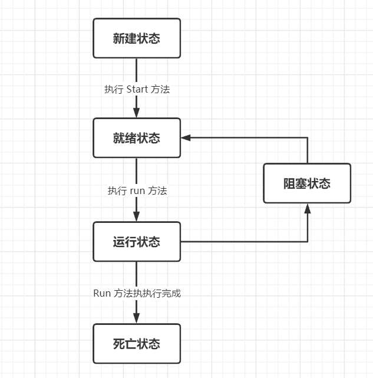

## 什么是多线程

Java 给多线程编程提供了内置的支持。 一条线程指的是进程中一个单一顺序的控制流，一个进程中可以并发多个线程，每条线程并行执行不同的任务。

多线程是多任务的一种特别的形式，但多线程使用了更小的资源开销。


## 生命周期




- **新建状态**

  使用 **new** 关键字和 **Thread** 类或其子类建立一个线程对象后，该线程对象就处于新建状态。它保持这个状态直到程序 `start()` 这个线程。

- **就绪状态**

  当线程对象调用了`start()`方法之后，该线程就进入就绪状态。就绪状态的线程处于就绪队列中，要等待JVM里线程调度器的调度。

- **运行状态**

  如果就绪状态的线程获取 CPU 资源，就可以执行 `run()`，此时线程便处于运行状态。处于运行状态的线程最为复杂，它可以变为阻塞状态、就绪状态和死亡状态。

- **阻塞状态**

  如果一个线程执行了sleep（睡眠）、suspend（挂起）等方法，失去所占用资源之后，该线程就从运行状态进入阻塞状态。

  - 等待阻塞：运行状态中的线程执行 wait() 方法，使线程进入到等待阻塞状态。
  - 同步阻塞：线程在获取 synchronized 同步锁失败(因为同步锁被其他线程占用)。
  - 其他阻塞：通过调用线程的 sleep() 或 join() 发出了 I/O 请求时，线程就会进入到阻塞状态。当sleep() 状态超时，join() 等待线程终止或超时，或者 I/O 处理完毕，线程重新转入就绪状态。

  进入的方式：

  - `sleep`方法   
  - 等待 IO 资源  
  - `join`方法（代码中执行的逻辑） 

**死亡状态**

一个运行状态的线程完成任务或者其他终止条件发生时，该线程就切换到终止状态。

- 进入的方式：
  - 正常运行完成且结束
  - 人为中断执行，比如使用stop方法 
  - 程序抛出未捕获的异常


## 线程的优先级

每一个 Java 线程都有一个优先级，这样有助于操作系统确定线程的调度顺序。

Java 线程的优先级是一个整数，其取值范围是 **1** `Thread.MIN_PRIORITY `  ~    **10** `Thread.MAX_PRIORITY`。

默认情况下线程优先级为 **5 **

数值越大等级越高，CPU会优先调度。

**注意：**线程优先级不能保证线程执行的顺序。就是你设置一个线程优先级为10，但是程序实际运行时不一定是第一个

```java
thread.setPriority(10);
```


