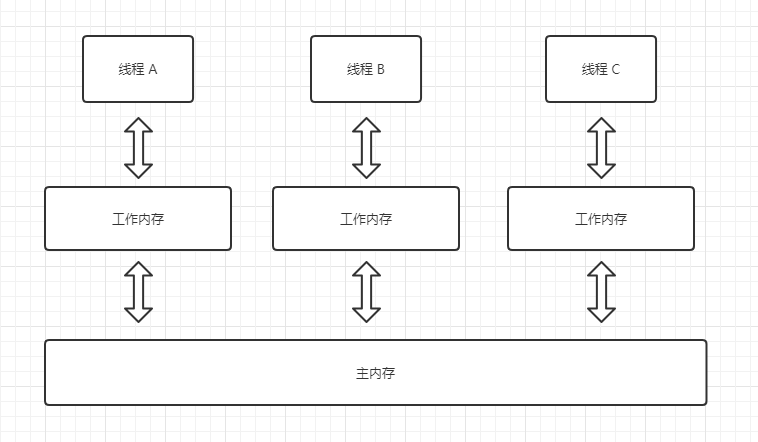

# 原子性

## 概念

原子性指的是一个或者多个操作在 CPU 执行的过程中**不被中断**的特性。

画一下重点：**操作不被打断**

换做生活中的例子就是：你去取钱当你找到ATM机、插卡、输入密码、输入金额之后突然一个壮汉把你丢到外面他拿走了本该属于你的RMB，这也肯定是不行的。

## 举个例子

### 代码讲解

```java
a = 0;       // 1
b = a ;      // 2
b++;         // 3
c = b + 1;   // 4
```

如上四个操作请问哪个是符合原子性的：

- 第一条： java 中对基本数据类型的赋值操作，符合原子操作。
- 第二条：看似一行代码其实是两个操作，获取 `a` 的值并赋值给 `b`
- 第三条：首先要获取 `b`的值，然后执行`b + 1`的操作，结果再赋值给`b`
- 第四条：本质上类似于三，要获取 `b`的值，然后执行`b + 1`的操作，结果再赋值给`c`

### 卖票的例子

在后面文章有讲过一个卖票的例子：定义一个 `num ` 变量存放总的票数，然后定义数个窗口（线程）去卖票，当余票为0的时候结束程序。

```java
public class Ticket implements Runnable{
    
    // 定义票总数为10
    public Integer num = 10;
    
    @Override
    public void run() {
        // 各线程循环卖票，直到票卖完
        while(num > 0){
            if (num > 0){
                System.out.println(Thread.currentThread().getName()+"：正在出售第"+num--+"张票");
            }
        }
    }
}

public class Demo {
    public static void main(String[] args) {
        Ticket ticket = new Ticket();
        Thread t1 = new Thread(ticket,"窗口1");
        Thread t2 = new Thread(ticket,"窗口2");
        Thread t3 = new Thread(ticket,"窗口3");
        Thread t4 = new Thread(ticket,"窗口4");
        Thread t5 = new Thread(ticket,"窗口5");
        t1.start();
        t2.start();
        t3.start();
        t4.start();
        t5.start();
    }
}
```

如果单纯的用`Thread`去跑代码可能会出现超卖、漏卖，导致的原因就是：A线程卖出去最后一张票后需要去内存中更新`num`的值，可能A还没来得及更新`num`另一个进程又卖出去一张票并快速的修改了`num`导致A实际卖出去一张票但是没有更新，导致`num`最后成了`-1`。

## 如何保证原子性

在买票实例中我们使用了`synchronized`关键字修饰，有效防止防止了超卖现象。

`synchronized` 是一个互斥锁，它的工作原理就是一旦一个线程抢占了得到锁，其它线程便进入等待状态，只有当该线程释放锁，其它线程才有获取锁的机会。


# 可见性

## 概念

可见性是指当多个线程访问同一个变量时，一个线程修改了这个变量的值，其他线程能够立即看得到修改的值。

画一下重点：**修改后告知其他线程**

换做生活中的例子就是：亚索在召唤师峡谷属于极度缺蓝的英雄，此时你想要第一个蓝BUFF快速的建立优势你要勇敢的向打野表达出来，不说他可能就直接惩戒掉了。

## 举个例子

### 代码讲解

```java
// 共享内存
int a = 10;

// 线程A执行的代码
a = 25;

// 线程B执行的代码
c = a;
```

如上 A 和 B 两个线程，当 A 修改了 `a` ，在其他进程都是不可见的。所以线程 B 输出a的话还是10

每个线程都会有一份**独立的内存空间**，线程对共享变量所有的操作都必须在自己的工作内存中进行，不能直接从主内存中读写（不能越级）。



### 如何保证可见性

Java提供了 `volatile`关键字来保证可见性。当一个共享变量被`volatile`修饰时，它会保证修改的值会立即被更新到主存，当有其他线程需要读取时，它会去内存中读取新的值。

此外上面说的`synchronized`也可以保证可见性，但是！**`volatile`不能保证原子性**。

既然`synchronized` 和 `volatile` 都可以保证可见性有什么区别：很简单`synchronized` 过于重量级了，`volatile` 性能更好

# 有序性

## 概念

**即程序执行的顺序按照代码的先后顺序执行**，这个比较简单就字面意思了。

## 举个例子

```java
static int a = 0;
static int x = 0;

public static void main(String[] args) throws InterruptedException {
    for (int i = 0; i < 50; i++) {
        new Thread(()->{
            a = 1;
            x = a;
        }).start();
        // 最终结果
        System.out.print(x);
        // 恢复默认值
        a = x = 0;
    }
}
```

```java
00010000000000001110001000100010000000100000010001
```

按照我们代码写的我们想要的结果肯定都是1，但是我们看到了很多 0。

原因是：初始设置了a的默认值为0，在后续赋值的时候JAVA虚拟机可能会将`x = a`放在了`a = 1`的前面 导致了 没有将1赋值上最终返回了 0 。


### 如何保证有序性

在 java 虚拟机中是严格遵守指令之间的数据依赖性

```java
int a = 10;   // 语句1
int r = 2;    // 语句2
a = a + 3;    // 语句3
r = a*a;      // 语句4
```

在如上代码中一定不会出现：2，1，4，3

