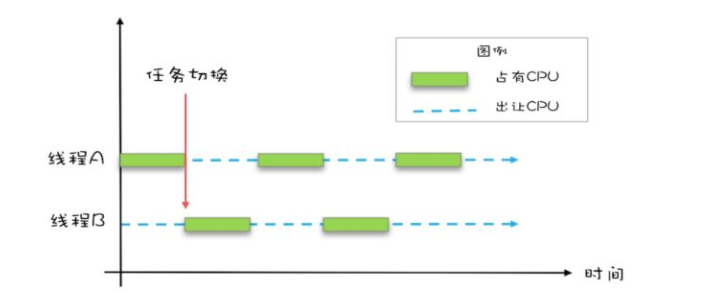

## 什么叫并发编程

首先对概念做一下介绍：

- 一个处理器同事处理多个任务的时候交并发。
- 多个处理器同时处理多个任务的时候交并行。

如果说二者的区别可能就是：**一群人在一个饭桌上吃饭** 和 **一群人在多个饭桌上吃饭**

Java 并发程序都是基于多线程的，操作系统为了充分利用CPU的资源，将CPU分成若干个时间片，在多线程环境下，线程会被操作系统调度进行任务切换。

程序员面对并发编程要做的就是合理的调度管理各个任务和线程。

