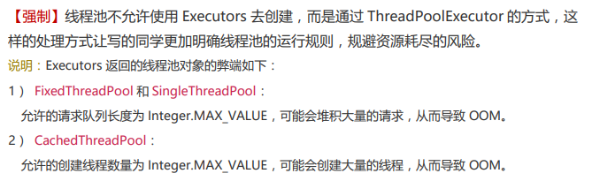

# 使用

```java
public static void main(String[] args) {
    ThreadPoolExecutor pool = new ThreadPoolExecutor(
        2,		// 核心线程数
        5,		// 最大线程数
        60,		// 存活时间
        TimeUnit.SECONDS,	// 时间单位 
        new ArrayBlockingQueue<Runnable>(5),		// 任务队列
        Executors.defaultThreadFactory(),			// 线程工厂
        new ThreadPoolExecutor.CallerRunsPolicy()	 // 线程拒绝策略
    );

    for (int i = 0; i < 10; i++) {
        pool.execute(new Runnable() {
            @Override
            public void run() {
                System.out.println(Thread.currentThread().getName());
            }
        });
    }

    System.out.println(pool.getQueue());
}

// 输出结果
[demo200521.Demo1$1@6d6f6e28, demo200521.Demo1$1@135fbaa4, demo200521.Demo1$1@45ee12a7, demo200521.Demo1$1@330bedb4, demo200521.Demo1$1@2503dbd3]
pool-1-thread-1
pool-1-thread-1
pool-1-thread-1
pool-1-thread-1
pool-1-thread-1
pool-1-thread-1
pool-1-thread-2
pool-1-thread-3
pool-1-thread-4
pool-1-thread-5
```


根据阿里开发手册推荐使用`ThreadPoolExecutor`




# 原理

