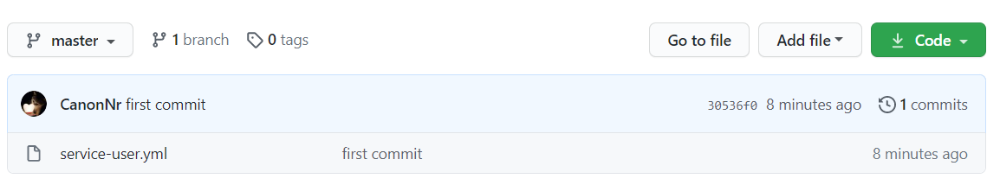

# Spring Cloud Config - 分布式微服务配置中心

项目越来越多配置文件也越来越难以管理，如果某一个需要修改可能要修改N多个，繁琐而且容易出错。

`Spring Cloud Config`为微服务提供了 **集中化的外部配置支持**，配置服务器为所有应用提供了一个中心化的外部部署。


## 集成

### 引入包

```xml
<dependency>
    <groupId>org.springframework.cloud</groupId>
    <artifactId>spring-cloud-config-server</artifactId>
</dependency>
```


### 配置

- `bootstrap.yml`

  ```yaml
  spring:
    application:
      name: config-single-server  # 应用名称
    cloud:
       config:
          server:
            git:
              uri: https://github.com/huzhicheng/config-only-a-demo #配置文件所在仓库
              username: github 登录账号
              password: github 登录密码
              default-label: master #配置文件分支
              search-paths: config  #配置文件所在根目录
  ```

  

- `application.yml`

  ```yaml
  server:
    port: 4455
  ```

  

### 启动类

```java
@SpringBootApplication
@EnableConfigServer
public class ConfigMain {
    public static void main(String[] args) {
        SpringApplication.run(ConfigMain.class,args);
    }
}
```


### 远程仓库

前往`GitHub`、`GitLab`、`Gitee`等创建一个仓库。

仓库存几个配置文件



```yaml
data:
  title: "Config From Git"
```


### 访问

`http://127.0.0.1:4455/service-user.yml`

浏览器中得到


## 客户端

### 引入包

```xml
<dependency>
    <groupId>org.springframework.cloud</groupId>
    <artifactId>spring-cloud-starter-config</artifactId>
    <version>2.2.5.RELEASE</version>
</dependency>
```

### 修改配置文件

- 创建一个 `bootstrap.yml` 配置文件

  > 简单的话说`bootstrap.yml` 拥有更高的优先级，默认情况下不会被本地的配置所覆盖。而且加载顺序也高于`application。yml`

  

  - 完整的`bootstrap.yml`  文件

  ```yaml
  spring:
    application:
      name: user
    zipkin:
      base-url: http://localhost:9411/
    boot:
      admin:
        client:
          url: http://localhost:7020
    cloud:
      config:
        label: master
        name: user
        profile: dev
        uri: http://localhost:4455
  eureka:
    instance:
      hostname: localhost
      appname: user
    client:
      fetch-registry: true
      service-url:
        defaultZone: http://euk1.local:7001/eureka,http://euk1.local:7002/eureka,http://euk1.local:7003/eureka
  
  management:
    endpoint:
      health:
        show-details: always
    endpoints:
      web:
        exposure:
          include: "*"
  ```

- 旧的 `application.yaml`则变为

  ```yaml
  server:
    port: 9001
  spring:
    profiles: node1
  ---
  server:
    port: 9002
  spring:
    profiles: node2
  ---
  server:
    port: 9003
  spring:
    profiles: node3
  ```

  

### 控制器

```java
@Value("${data.title}")
public String title;


@RequestMapping("/title")
public CommonResult title(Integer id){
    return new CommonResult(200,this.port,title);
}
```


### 访问

`http://127.0.0.1:9001/title`

```json
{
    "code": 200,
    "message": "9001",
    "data": "Config From Git"
}

```

可以到`data`使我们预设在`GitHub` 上的配置值