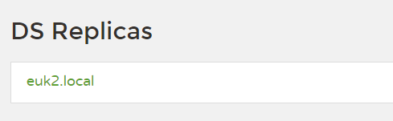
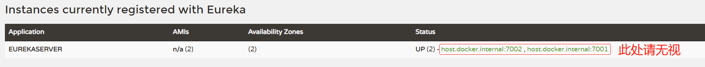
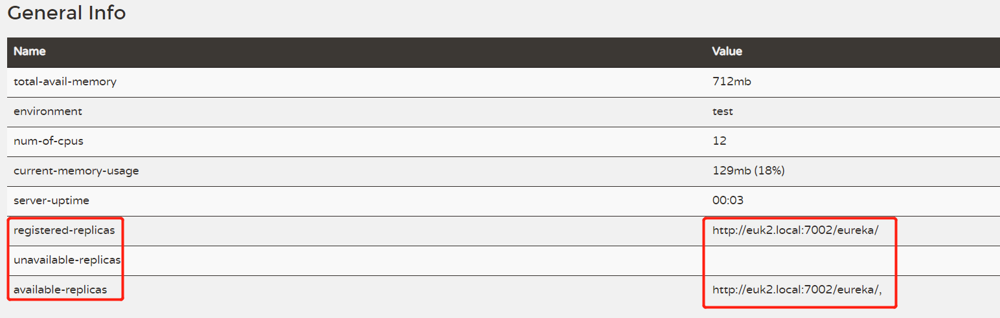
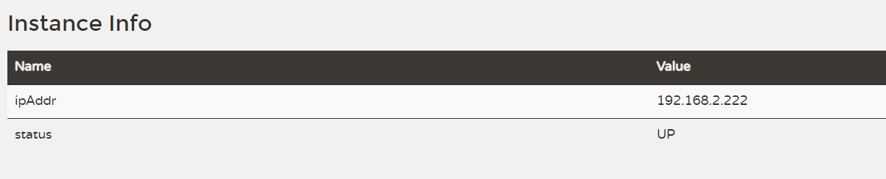
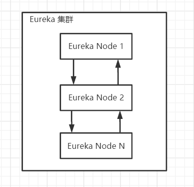
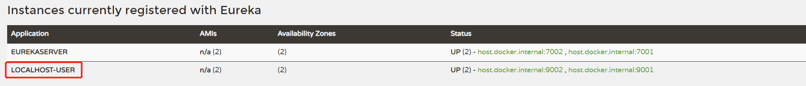

# Eureka服务的注册与发现

## 概念

> Eureka是基于REST（代表性状态转移）的服务，主要在AWS云中用于定位服务，以实现负载均衡和中间层服务器的故障转移。我们称此服务为Eureka服务器。Eureka还带有一个基于Java的客户端组件Eureka Client，它使与服务的交互变得更加容易。客户端还具有一个内置的负载平衡器，可以执行基本的循环负载平衡。在Netflix，更复杂的负载均衡器将Eureka包装起来，以基于流量，资源使用，错误条件等多种因素提供加权负载均衡，以提供出色的弹性。

简单来说如本文标题：**注册** 与 **发现**


在学习`Eureka`时普遍都会用**租房**来打比方，确实比较好理解。

假如你有闲置的房子想租出去现有两个选择：

1. 马路上抓个人就问，你租房吗？拎包入住南北通透
2. 到公告栏、社区服务站、中介处登记，有人需要租房的时候自然就给你联系了

假如你想租房现有两个选择：

1. 到某小区挨家挨户的敲门，问有没有房子出租
2. 到小区的公告栏、社区服务站、中介找房源

想都不用想都选2啊

这就是一个 **注册** 与 **发现** 的过程：

此时**公告栏、社区服务站、中介**就好比接下来要学的`Eureka`

房东把自己的房子注册到`Eureka`

房客到`Eureka`去寻找自己心仪的房源

> 如果想让更多的人看到你的招租信息就可以向多家中介或者多个公告栏去注册

两种方式：

假设你去同一家中介例如链家不同门店数据肯定是通的，你在AAA店注册了他会自动注册到BBB店或者CCC点...

你也可以分别去AAA、BBB、CCC...店去注册

## Eureka集群

### 构建Spring Boot 项目

> 此处省略...


### 导入包

```xml
<!-- 服务端 -->
<dependency>
    <groupId>org.springframework.cloud</groupId>
    <artifactId>spring-cloud-starter-netflix-eureka-server</artifactId>
    <version>2.2.5.RELEASE</version>
</dependency>
```


### 启动注解

在`Spring Boot`启动类加上

```java
@EnableEurekaServer
@SpringBootApplication
public class EurekaMain7001 {
    public static void main(String[] args) {
        SpringApplication.run(EurekaMain7001.class, args);
    }
}
```

如果是**客户端**则将`@EnableEurekaServer` 改为 `@enableeurekaclient`

### 配置文件

1. 节点一

   ```yaml
   server:
     port: 7001
   eureka:
     instance:
       hostname: euk1.local
       appname: EurekaServer
     client:
       register-with-eureka: true
       fetch-registry: true
       service-url:
         defaultZone: http://euk2.local:7002/eureka/
   ```
   
2. 节点二

   ```yaml
   server:
     port: 7002
   eureka:
     instance:
       hostname: euk2.local
       appname: EurekaServer
     client:
       register-with-eureka: true
       fetch-registry: true
       service-url:
         defaultZone: http://euk1.local:7002/eureka/
   ```

### 启动项目

> 启动两个 Spring Boot 项目即可

### 查看面板

访问`http://localhost:7001/` 或 `http://euk2.local:7002/`

接下来我以`http://localhost:7001/` 为例









### 可能遇到的坑

- **DS Replicas 没有注册的服务**

  > 目前我遇到了两种可能：
  >
  > 1、Instance Info 中的 `ipAddr` 是不是你见过的或者 `ipconfig` 一下看看是不是本机正常的ip地址
  >
  > 。有可能识别到了虚拟网卡上，就需要手动去禁用虚拟网卡
  >
  > 2、**同一台服务器上，以不同的端口来搭建集群，ip 或者 主机名相同时，无法形成副本**，所以我在本地host修改了`euk1.local`、`euk2.local`

  

- **TomCat端口必须配置**

  > `Eureka` 是基于HTTP 遵循 Restful 格式开发的，所以一定要配置端口

- **`Eureka` 启动注解**

  > 客户端用`@EnableEurekaClient`
  >
  > 服务端用`@EnableEurekaServer`
  >
  > 不要混淆了


## 服务发现注册

> 前面创建了一个mini的Eureka集群，并实现了两台机器的数据同步。
>
> 现在模拟一个集群的客户端，测试一下服务的注册与发现

### 构建Spring Boot 项目

> 此处省略...

### 导入包

```xml
<!-- 客户端 -->
<dependency>
    <groupId>org.springframework.cloud</groupId>
    <artifactId>spring-cloud-starter-netflix-eureka-client</artifactId>
    <version>2.2.5.RELEASE</version>
</dependency>
```


### 启动注解

```java
@SpringBootApplication
public class UserMain9001 {
    public static void main(String[] args) {
        SpringApplication.run(UserMain9001.class, args);
    }
}
```


### 配置文件

- 节点一

  ```yaml
  server:
    port: 9001
  eureka:
    instance:
      hostname: localhost
      appname: localhost-user
    client:
      service-url:
        defaultZone: http://euk1.local:7001/eureka
  ```

- 节点二

  ```yaml
  server:
    port: 9002
  eureka:
    instance:
      hostname: localhost
      appname: localhost-user
    client:
      service-url:
        defaultZone: http://euk1.local:7001/eureka
  ```
  



> 上面配置中虽然每个服务各自向一个Eureka注册，但是由于Eureka服务端各个节点是数据同步的所以都可以得到实现服务注册

### 启动项目

  > 启动两个 Spring Boot 项目即可

### 查看面板

访问`http://localhost:7001/` 或 `http://euk2.local:7002/`



一切正常

## 

