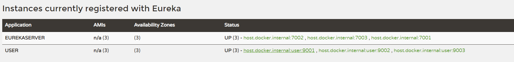

# Zuul - 微服务网关

## 如果微服务没有网关会出现什么问题?

1. 客户端请求多个微服务，增加了客户端复杂性，每个微服务都要做用户认证，限流等，避免和多个微服务打交道的复杂性。

2. 有跨域问题，不在同一个域。

3. 认证复杂，每个服务都要独立认证，服务要求的权限不一致。

4. 难以重构。因为微服务被客户端调用着，重构难以实施。

> **网关是介于客户端和微服务的中间层。**

## 有了网关可以做什么

1. 是所有微服务入口，进行分发。
2. 身份认证与安全。识别合法的请求，拦截不合法的请求。
3. 监控。在入口处监控，更全面。
4. 动态路由。动态将请求分发到不同的后端集群。
5. 压力测试。可以逐渐增加对后端服务的流量，进行测试。
6. 负载均衡。
7. 限流
8. 服务熔断


## 集成

### 依赖

```xml
<dependency>
    <groupId>org.springframework.cloud</groupId>
    <artifactId>spring-cloud-starter-netflix-eureka-client</artifactId>
</dependency>
<dependency>
    <groupId>org.springframework.cloud</groupId>
    <artifactId>spring-cloud-starter-netflix-zuul</artifactId>
</dependency>
```

### 启动类

添加启动类注释`@EnableZuulProxy`

```java
@SpringBootApplication
@EnableZuulProxy  
class ZuulMain {
    public static void main(String[] args) {
        SpringApplication.run(ZuulMain.class,args);
    }
}
```

### 配置

```yaml
server:
  port: 7010
spring:
  profiles: node1
  application:
    name: ZuulServer
eureka:
  client:
    register-with-eureka: false
    fetch-registry: true
    service-url:
      defaultZone: http://euk1.local:7001/eureka/,http://euk2.local:7002/eureka/,http://euk3.local:7003/eureka/
```

> 需要配合`Eureka`并注册一些服务
>
> 我是做了一个三个节点的`Eureka`集群，且有一个`User`（三个节点分别是9001、9002、9003）服务注册到`Eureka`服务端

### 访问

访问 `http://localhost:7010/user/user`

> `localhost:7010`:是当前项目的地址与端口
>
> 路径中第一个`user`是`Eureka`的服务名
>
> 第二个`user`是该提供者的`web`地址 



```java
// 提供者的控制器代码
@RestController
public class TestController {
    @Value("${server.port}")
    public String port;

    @RequestMapping("/user")
    public CommonResult get(Integer id) throws InterruptedException {
        GetUser user = new GetUser();
        return new CommonResult(200,this.port,user.getUserById(id));
    }
}
```

- 访问返回结果

```json
{
    "code": 200,
    "message": "9003",
    "data": {
        "id": null,
        "name": "周杰伦",
        "sex": "男",
        "age": 18
    }
}

```

> id为空，因为设置了请求参数
>
> 再访问下`http://localhost:7010/user/user?id=999`试试

```json
{
"code": 200,
"message": "9001",
    "data": {
        "id": 999,
        "name": "周杰伦",
        "sex": "男",
        "age": 18
    }
}

```

> 其实不止是`id`改变了，`message`对应的是端口也变了，实在均衡还是生效的


