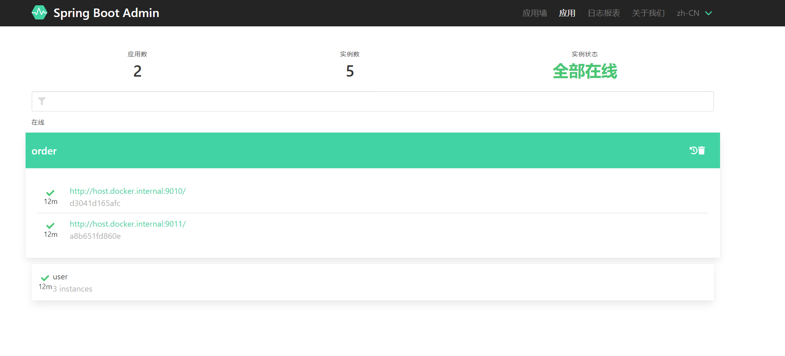
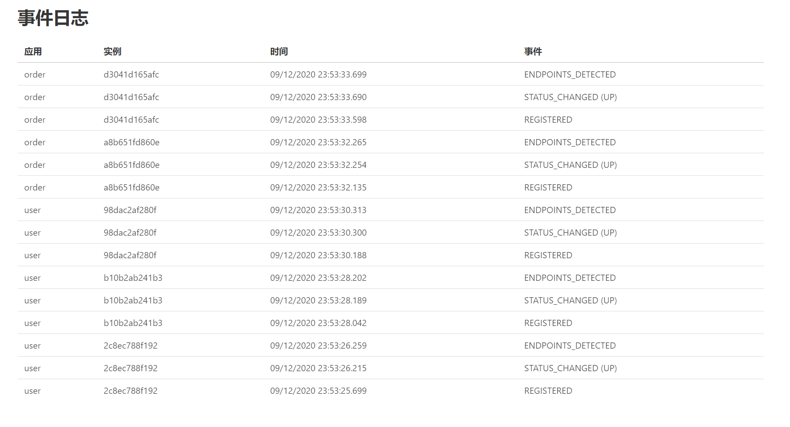

# Spring Boot Admin - 项目状态管理监控工具

**提前说清楚，其实在实现上并不是服务端去监控客户端。而是客户端装了相关的依赖会想服务端汇报**


## 集成

### 首先创建一个新项目（服务端）

```xml
<dependency>
    <groupId>org.springframework.boot</groupId>
    <artifactId>spring-boot-starter-web</artifactId>
</dependency>
<dependency>
    <groupId>org.springframework.boot</groupId>
    <artifactId>spring-boot-starter-actuator</artifactId>
</dependency>
<!-- Admin Server -->
<dependency>
    <groupId>de.codecentric</groupId>
    <artifactId>spring-boot-admin-starter-server</artifactId>
    <version>2.3.0</version>
</dependency>
<!-- Admin 界面 -->
<dependency>
    <groupId>de.codecentric</groupId>
    <artifactId>spring-boot-admin-server-ui</artifactId>
    <version>2.3.0</version>
</dependency>
```

> 除了要引入 `spring-boot-admin` 服务端本体还可以加一个可视化的面板，还有就是要引入`Spring Boot`

```yml
server:
  port: 7020
```

> 配置上只需要定义一个端口

### 客户端

```xml
<dependency>
    <groupId>de.codecentric</groupId>
    <artifactId>spring-boot-admin-starter-client</artifactId>
</dependency>
```

> 版本最好和服务端也一致

```yaml
spring:
  boot:
    admin:
      client:
        url: http://localhost:7020  # 这个是刚才配置的ip+端口
management:
  endpoint:
    health:
      show-details: always
  endpoints:
    web:
      exposure:
        include: "*"
```

### 效果



