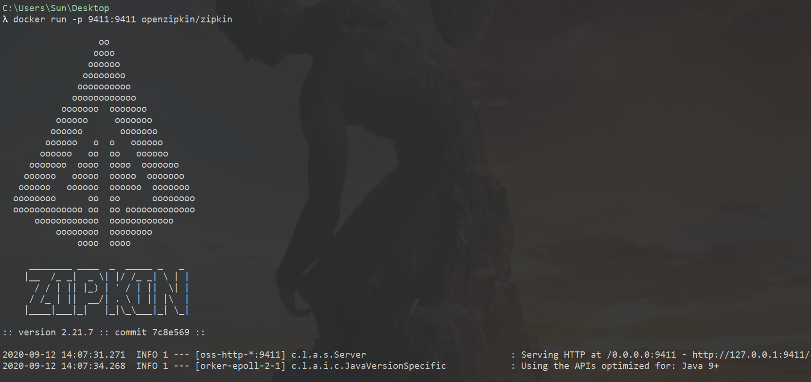
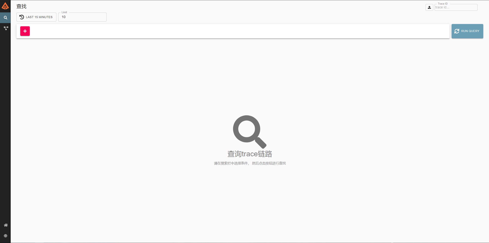
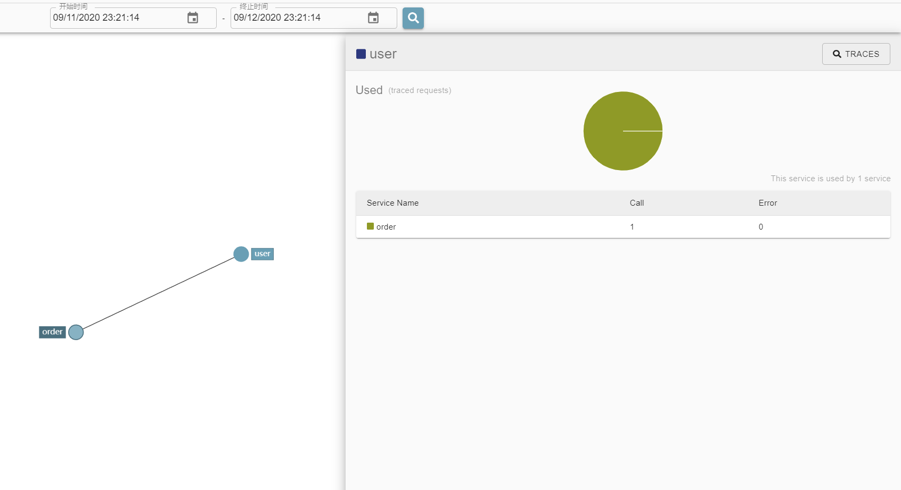
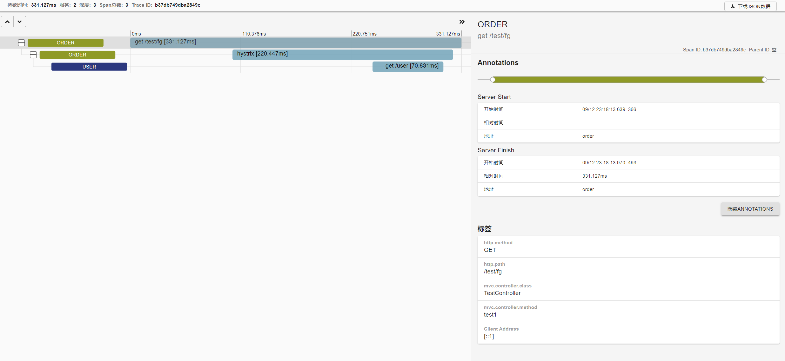

# Zipkin链路追踪


## 微服务的痛处

- 故障定位难
- 容量预估难
- 资源浪费多
- 链路梳理难

### 链路追踪的必要性

如果能跟踪每个请求，中间请求经过哪些微服务，请求耗时，网络延迟，业务逻辑耗时等。我们就能更好地分析系统瓶颈、解决系统问题。因此链路跟踪很重要。


我们自己思考解决方案：在调用前后加时间戳。捕获异常。

链路追踪目的：解决错综复杂的服务调用中链路的查看。排查慢服务。

市面上链路追踪产品，大部分基于google的Dapper论文。

- zipkin twitter开源

- pinpoint 韩国的 Naver公司

- Cat 美团点评

- EagleEye 淘宝


### 链路追踪要考虑的几个问题

1. 探针的性能消耗。尽量不影响 服务本尊。
2. 易用。开发可以很快接入，别浪费太多精力。
3. 数据分析。要实时分析。维度足够。


## Zipkin 客户端

### 下载镜像

```
docker pull openzipkin/zipkin
```

### 创建容器

```
docker run -p 9411:9411 openzipkin/zipkin
```



### 在浏览器上访问Web界面

```
http://localhost:9411/zipkin/
```



## 集成

1. 每个需要监听的服务的pom中添加。

```xml
<dependency>
    <groupId>org.springframework.cloud</groupId>
    <artifactId>spring-cloud-starter-zipkin</artifactId>
</dependency>
```

2. 每个需要监听的服务yml中

```sh
spring:
  zipkin:
    base-url: http://localhost:9411/
  sleuth:
    sampler:
      rate: 1  
```


## 面板



