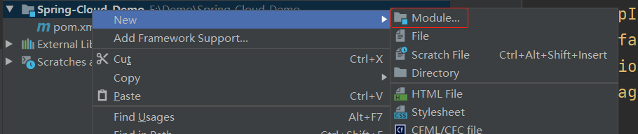
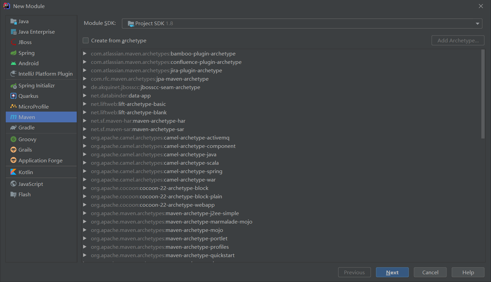
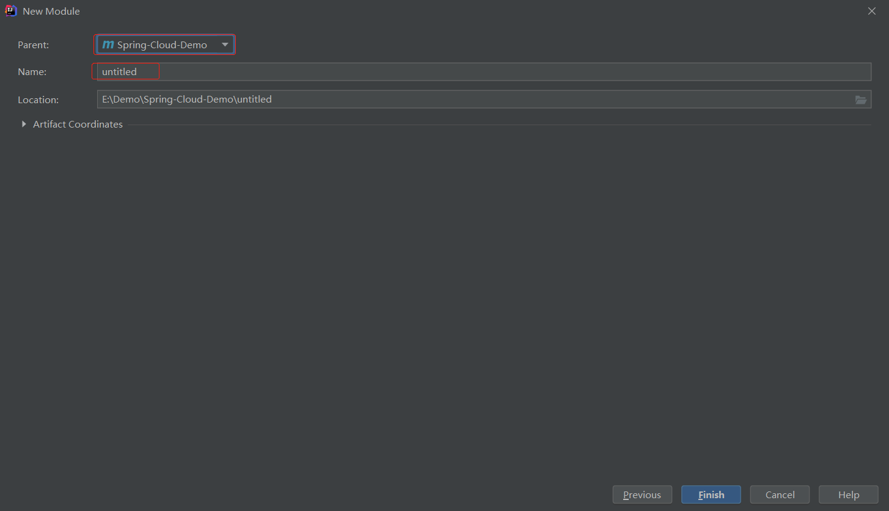

# 多模块父子工程

## 为什么使用它

1. 细化功能
2. 多个功能模块公用代码
3. 简化pom
4. 针对大项目可对子模块单独build节省时间

## 开始

### 首先创建一个普通的 Maven 项目

> 省略... 使用 idea 的 New Project 即可

### 删除没用的文件

> 父工程中只保留一个 `pom.xml` 即可，其余的都可以删掉

### 修改父工程 pom 文件

#### dependencyManagement

> 在顶层的 `pom`文件中，我们会看到`dependencyManagement`标签。可以通过它来管理包的版本，让子项目中引用一个依赖而不用显示的列出版本号。Maven会沿着父子层次向上走，直到找到一个拥有dependencyManagement元素的项目，然后它就会使用在这个dependencyManagement元素中指定的版本号。

**`dependencyManagement` 主要作用是管理版本，只声明依赖，没有实际引入包**

所以说只有在子工程中声明了依赖且没有指定版本，`dependencyManagement` 才会有实际用处

```xml
<dependencyManagement>
    <dependencies>
        <dependency>
            <groupId>org.springframework.boot</groupId>
            <artifactId>spring-boot-dependencies</artifactId>
            <version>2.2.2.RELEASE</version>
            <type>pom</type>
            <scope>import</scope>
        </dependency>
    </dependencies>
</dependencyManagement>
```

#### packaging

```xml
<groupId>com.lksun</groupId>
<artifactId>Spring-Cloud-Demo</artifactId>
<version>1.0-SNAPSHOT</version>
<packaging>pom</packaging>
```

如上加入一个`packaging` 的属性

> 使用`maven`分模块管理，都会有一个父级项目，pom文件一个重要的属性就是`packaging`（打包类型），一般来说所有的父级项目的packaging都为pom，packaging默认类型jar类型，如果不做配置，maven会将该项目打成jar包。

### 创建子工程

- New Module

  

- 配置

  

  

  父工程已经选好，只需要填写子工程的名字即可


### 修改子工程pom文件

```xml
<!-- 已经自动生成了父项目的一些配置 -->
<parent>
    <artifactId>Spring-Cloud-Demo</artifactId>
    <groupId>com.lksun</groupId>
    <version>1.0-SNAPSHOT</version>
</parent>

<modelVersion>4.0.0</modelVersion>
<!-- 这里是我子工程的名称 -->
<artifactId>user-9001</artifactId>

<!-- 无需写版本，会默认向上一层寻找 -->
<dependencies>
    <dependency>
        <groupId>org.springframework.boot</groupId>
        <artifactId>spring-boot-starter-web</artifactId>
    </dependency>
    <dependency>
        <groupId>org.springframework.boot</groupId>
        <artifactId>spring-boot-starter-actuator</artifactId>
    </dependency>
</dependencies>
```

### 配置启动类

```java
@SpringBootApplication
public class UserMain9001 {
    public static void main(String[] args) {
        SpringApplication.run(UserMain9001.class, args);
    }
}
```

### 修改配置文件

```yml
server:
  port: 9001
```


