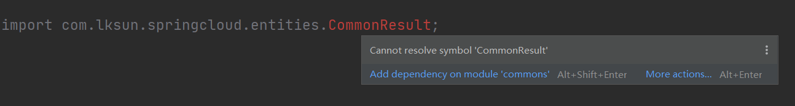
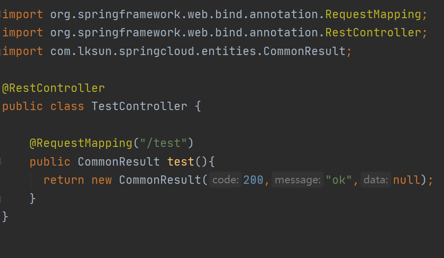

# 调用公共类

例如很多实体类、工具类很多项目都是需要的，如果每个子工程都复制一遍显然是不优雅的，所以本文来讲一下公共的类写一次如何全局调用。

## 开始

参考前面文章创建一个新的子工程 - **Commons**

在 pom 文件中看到，已经自动配置好了父工程

```xml
<parent>
    <artifactId>Spring-Cloud-Demo</artifactId>
    <groupId>com.lksun</groupId>
    <version>1.0-SNAPSHOT</version>
</parent>
<modelVersion>4.0.0</modelVersion>

<artifactId>commons</artifactId>
```

### 创建公共方法 

`com.lksun.springcloud.entities.CommonResult`

这是一个接口返回的公共类，注意报名要按照设定的来

```java
package com.lksun.springcloud.entities;

public class CommonResult {
    private Integer code;
    private String message;
    private Object data;

    public CommonResult(Integer code, String message, Object data){
        this.code = code;
        this.message = message;
        this.data = data;
    }

    // 省略了 Get Set 方法
}
```

### 调用

此时已经在 **Commons** 中定义好了类，但是直接调用会提示找不到包

```java
@RequestMapping("/test")
public CommonResult test(){
    return new CommonResult(200,"ok",null);
}
```



### 引入包

- 父工程  pom 文件

  ```xml
  <dependency>
      <groupId>com.lksun</groupId>
      <artifactId>commons</artifactId>
      <version>1.0-SNAPSHOT</version>
  </dependency>
  ```

- 子工程 pom 文件

  ```xml
  <dependency>
      <groupId>com.lksun</groupId>
      <artifactId>commons</artifactId>
  </dependency>
  ```

  与其他包一样无需写版本号


这样更新`Maven` 后就可以正常使用了

