# 简介

`EXPLAIN`关键字可以模拟优化器执行SQL查询语句，从而知道MySQL是如何处理你的SQL语句的。分析你的查询语句或是表结构的性能瓶颈。

➤ **通过EXPLAIN，我们可以分析出以下结果：**

- 表的读取顺序
- 数据读取操作的操作类型
- 哪些索引可以使用
- 哪些索引被实际使用
- 表之间的引用
- 每张表有多少行被优化器查询

# 使用方法

命令行下在需要检测的`SQL`语句中前加上`Explain`如：

```sql
EXPLAIN SELECT id FROM users
```

此时可以得到

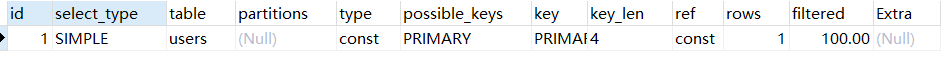


# 每个字段的含义

## id

select查询的序列号，包含一组数字，表示查询中执行select子句或操作表的顺序

**三种情况：**

- id相同，执行顺序由上至下

  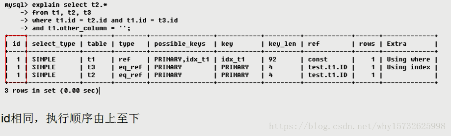

  [总结] 加载表的顺序如上图table列所示：t1 t3 t2

- id不同，如果是子查询，id的序号会递增，id值越大优先级越高，越先被执行

  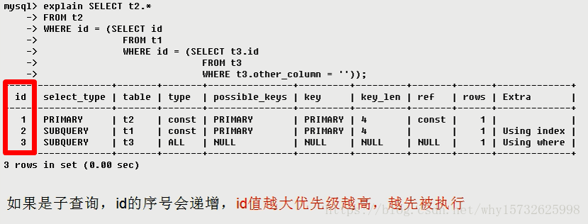

- id相同不同，同时存在

  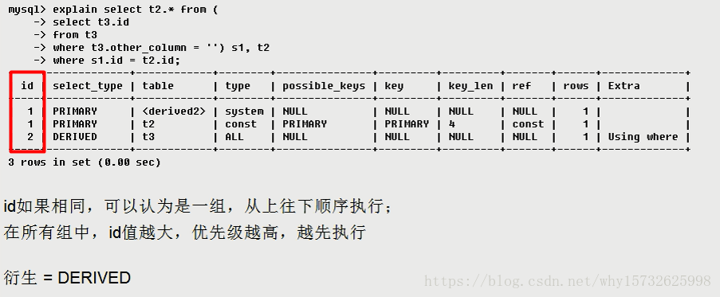

  如上图所示，在id为1时，table显示的是 `<derived2> `,这里指的是指向id为2的表，即t3表的衍生表。

## select_type

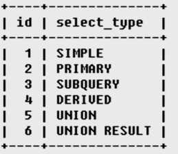

分别用来表示查询的类型，主要是用于区别普通查询、联合查询、子查询等的复杂查询。

- `SIMPLE` 简单的select查询，查询中不包含子查询或者UNION

- `PRIMARY` 查询中若包含任何复杂的子部分，最外层查询则被标记为PRIMARY

- `SUBQUERY` 在SELECT或WHERE列表中包含了子查询

- `DERIVED` 在FROM列表中包含的子查询被标记为DERIVED（衍生），MySQL会递归执行这些子查询，把结果放在临时表中

- `UNION` 若第二个SELECT出现在UNION之后，则被标记为UNION：若UNION包含在FROM子句的子查询中，外层SELECT将被标记为：DERIVED

- `UNION RESULT` 从UNION表获取结果的SELECT


## table

当前执行的表

## type 

`type`所显示的是查询使用了哪种类型，`type`包含的类型包括如下图所示的几种：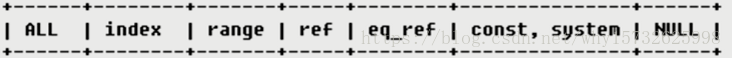

```sql
system > const > eq_ref > ref > range > index > all
```

**一般来说，得保证查询至少达到range级别，最好能达到ref。**

- `system` 表只有一行记录（等于系统表），这是const类型的特列，平时不会出现，这个也可以忽略不计

- `const` 表示通过索引一次就找到了，const用于比较`primary key`或者`unique`索引。因为只匹配一行数据，所以很快。如将主键置于where列表中，MySQL就能将该查询转换为一个常量。

  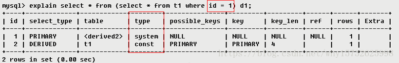

  ​	首先进行子查询得到一个结果的d1临时表，子查询条件为id = 1 是常量，所以type是const，id为1的相当于只查询一条记录，所以type为system。

- `eq_ref` 唯一性索引扫描，对于每个索引键，表中只有一条记录与之匹配。常见于主键或唯一索引扫描

- `ref` 非唯一性索引扫描，返回匹配某个单独值的所有行，本质上也是一种索引访问，它返回所有匹配某个单独值的行，然而，它可能会找到多个符合条件的行，所以他应该属于查找和扫描的混合体。

  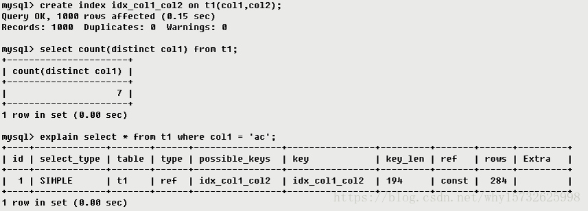

- `range` 只检索给定范围的行，使用一个索引来选择行，key列显示使用了哪个索引，一般就是在你的where语句中出现between、< 、>、in等的查询，这种范围扫描索引比全表扫描要好，因为它只需要开始于索引的某一点，而结束于另一点，不用扫描全部索引。

  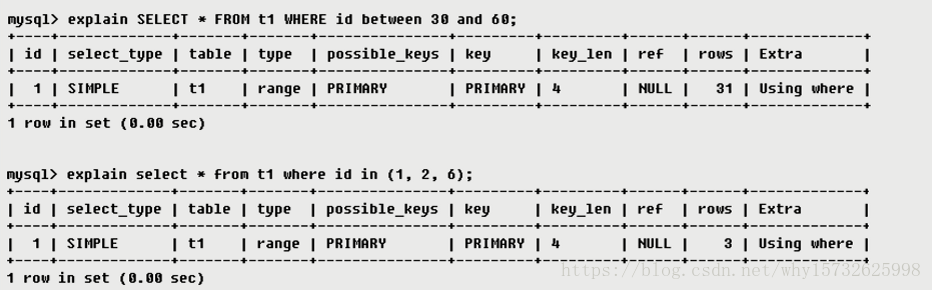

- `index` Full Index Scan，Index与All区别为index类型只遍历索引树。这通常比ALL快，因为索引文件通常比数据文件小。（也就是说虽然all和Index都是读全表，但index是从索引中读取的，而all是从硬盘读取的）

  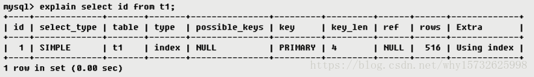

- `all` Full Table Scan 将遍历全表以找到匹配的行

  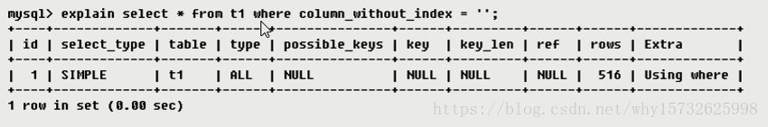

## possible_keys 和 key

​	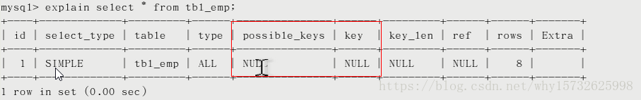

- `possible_keys` 显示可能应用在这张表中的索引，一个或多个。查询涉及到的字段上若存在索引，则该索引将被列出，**但不一定被查询实际使用**。 

   	

- `Key`实际使用的索引
  - 如果为NULL，则没有使用索引。（可能原因包括没有建立索引或索引失效）
  - 查询中若使用了`覆盖索引`（select 后要查询的字段刚好和创建的索引字段完全相同），则该索引仅出现在key列表中

##  key_len

表示索引中使用的字节数，可通过该列计算查询中使用的索引的长度，在`不损失精确性的情况下，长度越短越好`。key_len显示的值为索引字段的最大可能长度，并非实际使用长度，即key_len是根据表定义计算而得，不是通过表内检索出的。

## ref

显示索引的那一列被使用了，如果可能的话，最好是一个常数。哪些列或常量被用于查找索引列上的值。


## rows

根据表统计信息及索引选用情况，大致估算出找到所需的记录所需要读取的行数，也就是说，用的越少越好


## Extra

### Using filesort（九死一生）

说明mysql会对数据使用一个外部的索引排序，而不是按照表内的索引顺序进行读取。MySQL中无法利用索引完成的排序操作称为“文件排序”。

### Using temporary（十死无生）

使用了用临时表保存中间结果，MySQL在对查询结果排序时使用临时表。常见于排序order by和分组查询group by。

 Using index（发财了）
表示相应的select操作中使用了覆盖索引（Covering Index），避免访问了表的数据行，效率不错。如果同时出现using where，表明索引被用来执行索引键值的查找；如果没有同时出现using where，表明索引用来读取数据而非执行查找动作。

### Using where

表明使用了where过滤

###  Using join buffer

表明使用了连接缓存,比如说在查询的时候，多表join的次数非常多，那么将配置文件中的缓冲区的join buffer调大一些。

### impossible where

where子句的值`总是false`，不能用来获取任何元组

```sql
SELECT * FROM t_user WHERE id = '1' and id = '2'
```

### select tables optimized away

在没有GROUPBY子句的情况下，基于索引优化MIN/MAX操作或者对于MyISAM存储引擎优化COUNT(*)操作，不必等到执行阶段再进行计算，查询执行计划生成的阶段即完成优化。