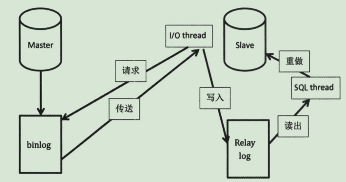

# 简介

MySQL 的二进制日志 binlog 可以说是 MySQL 最重要的日志，它记录了所有的 `DDL` 和 `DML` 语句（除了数据查询语句select、show等），**以事件形式记录**，还包含语句所执行的消耗的时间，MySQL的二进制日志是事务安全型的。binlog 的主要目的是**复制和恢复**。

# 使用场景

- 主从复制

  `Master`端开启`binlog`，`Master`把它的二进制日志传递给`slave`来达到主从数据一致

  

- 数据恢复

  使用 `mysqlbinlog`工具来使恢复数据

// TODO