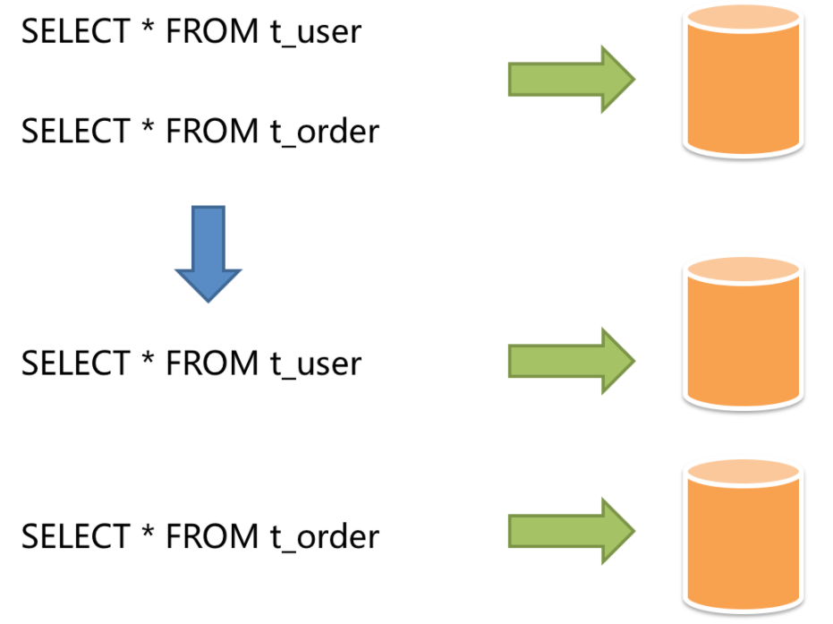
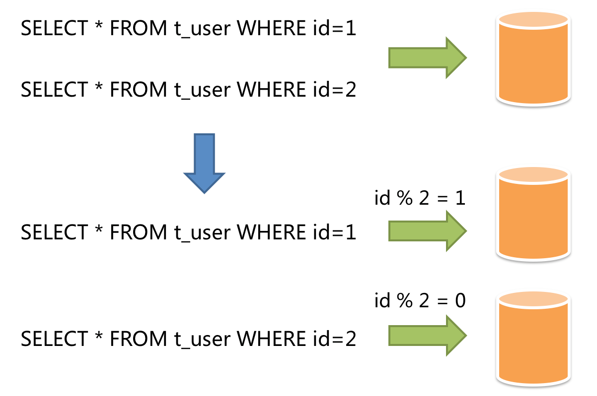

# 介绍

**Apache ShardingSphere** 是一套开源的分布式数据库中间件解决方案组成的生态圈，它由 	`JDBC`、`Proxy` 和 `Sidecar`（规划中）这 3 款相互独立，却又能够混合部署配合使用的产品组成。 它们均提供标准化的数据分片、分布式事务和数据库治理功能，可适用于如 Java 同构、异构语言、云原生等各种多样化的应用场景。

Apache ShardingSphere 5.x 版本开始致力于**可插拔架构**，项目的功能组件能够灵活的以可插拔的方式进行扩展。 目前，**数据分片**、**读写分离**、**数据加密**、**影子库压测**等功能，以及对 **MySQL**、**PostgreSQL**、**SQLServer**、**Oracle** 等 SQL 与协议的支持，均通过插件的方式织入项目。 开发者能够像使用积木一样定制属于自己的独特系统。Apache ShardingSphere 目前已提供数十个 SPI 作为系统的扩展点，而且仍在不断增加中。


# 数据分片的概念

**传统的将数据集中存储至单一数据节点的解决方案，在性能、可用性和运维成本这三方面已经难于满足互联网的海量数据场景。**

- 从**性能**方面来说，由于关系型数据库大多采用 B+ 树类型的索引，在数据量超过阈值的情况下，索引深度的增加也将使得磁盘访问的 IO 次数增加，进而导致查询性能的下降；同时，高并发访问请求也使得集中式数据库成为系统的最大瓶颈。

- 从**可用性**的方面来讲，服务化的无状态型，能够达到较小成本的随意扩容，这必然导致系统的最终压力都落在数据库之上。而单一的数据节点，或者简单的主从架构，已经越来越难以承担。数据库的可用性，已成为整个系统的关键。

- 从**运维成本**方面考虑，当一个数据库实例中的数据达到阈值以上，对于 DBA 的运维压力就会增大。数据备份和恢复的时间成本都将随着数据量的大小而愈发不可控。一般来讲，单一数据库实例的数据的阈值在 1TB 之内，是比较合理的范围。

数据分片指按照某个维度将存放在单一数据库中的数据分散地存放至多个数据库或表中以达到提升性能瓶颈以及可用性的效果。 数据分片的有效手段是对关系型数据库进行分库和分表。分库和分表均可以有效的避免由数据量超过可承受阈值而产生的查询瓶颈。 除此之外，分库还能够用于有效的分散对数据库单点的访问量；分表虽然无法缓解数据库压力，但却能够提供尽量将分布式事务转化为本地事务的可能，一旦涉及到跨库的更新操作，分布式事务往往会使问题变得复杂。 使用多主多从的分片方式，可以有效的避免数据单点，从而提升数据架构的可用性。

## 垂直分片

> 按照业务拆分的方式称为垂直分片，又称为纵向拆分，它的核心理念是专库专用。 在拆分之前，一个数据库由多个数据表构成，每个表对应着不同的业务。而拆分之后，则是按照业务将表进行归类，分布到不同的数据库中，从而将压力分散至不同的数据库。 下图展示了根据业务需要，将用户表和订单表垂直分片到不同的数据库的方案。
>
> **垂直分片往往需要对架构和设计进行调整。通常来讲，是来不及应对互联网业务需求快速变化的**；而且，它也并**无法真正的解决单点瓶颈**。 垂直拆分可以缓解数据量和访问量带来的问题，但无法根治。如果垂直拆分之后，表中的数据量依然超过单节点所能承载的阈值，则需要水平分片来进一步处理。





## 平行分片


> 水平分片又称为横向拆分。 相对于垂直分片，它不再将数据根据业务逻辑分类，而是通过某个字段（或某几个字段），根据某种规则将数据分散至多个库或表中，每个分片仅包含数据的一部分。 例如：根据主键分片，偶数主键的记录放入 0 库（或表），奇数主键的记录放入 1 库（或表），如下图所示。
>
> **水平分片从理论上突破了单机数据量处理的瓶颈，并且扩展相对自由，是分库分表的标准解决方案。**





# 实践

> 创建一个`user`表，有id（主键）、name、status三个字段
>
> 配合分库分表需要分别创建两个数据库源：`db1`，`db2`，每个源又将`user`表复制两份分别为`user_1`和`user_2`

## 导入包

```xml
<!-- 今天的主角 -->
<dependency>
    <groupId>org.apache.shardingsphere</groupId>
    <artifactId>sharding-jdbc-spring-boot-starter</artifactId>
    <version>4.1.1</version>
</dependency>

<!-- 今天的配角 -->
<dependency>
    <groupId>com.baomidou</groupId>
    <artifactId>mybatis-plus-boot-starter</artifactId>
    <version>3.4.1</version>
</dependency>

<dependency>
    <groupId>org.projectlombok</groupId>
    <artifactId>lombok</artifactId>
    <optional>true</optional>
</dependency>

<dependency>
    <groupId>com.alibaba</groupId>
    <artifactId>druid</artifactId>
    <version>1.1.17</version>
</dependency>

<dependency>
    <groupId>mysql</groupId>
    <artifactId>mysql-connector-java</artifactId>
</dependency>

<dependency>
    <groupId>org.springframework.boot</groupId>
    <artifactId>spring-boot-starter-web</artifactId>
</dependency>

<dependency>
    <groupId>org.springframework.boot</groupId>
    <artifactId>spring-boot-starter-test</artifactId>
    <scope>test</scope>
    <exclusions>
        <exclusion>
            <groupId>org.junit.vintage</groupId>
            <artifactId>junit-vintage-engine</artifactId>
        </exclusion>
    </exclusions>
</dependency>
</dependencies>

<dependencyManagement>
    <dependencies>
        <dependency>
            <groupId>org.springframework.boot</groupId>
            <artifactId>spring-boot-dependencies</artifactId>
            <version>${spring-boot.version}</version>
            <type>pom</type>
            <scope>import</scope>
        </dependency>
    </dependencies>
</dependencyManagement>
```


## 配置

```yaml
spring:
  shardingsphere:
    datasource:
      # 此处配置两个数据库源,分表会用到
      names: ds1,ds2
      ds1:
        type: com.alibaba.druid.pool.DruidDataSource
        driver-class-name: com.mysql.cj.jdbc.Driver
        url: jdbc:mysql://127.0.0.1:3306/test1?characterEncoding=UTF-8&serverTimezone=Asia/Shanghai
        username: test1
        password: 123456
      ds2:
        type: com.alibaba.druid.pool.DruidDataSource
        driver-class-name: com.mysql.cj.jdbc.Driver
        url: jdbc:mysql://127.0.0.1:3306/test2?characterEncoding=UTF-8&serverTimezone=Asia/Shanghai
        username: test2
        password: 123456
    sharding:
      tables:
        user:
          # 字段生成规则
          key-generator:
            # id
            column: id
            # 雪花
            type: SNOWFLAKE
          # 真实数据节点，由数据源名（读写分离引用master-slave:data-source中的id属性） + 表名组成，以小数点分隔。
          # 多个表以逗号分隔，支持inline表达式。不填写表示将为现有已知的数据源 + 逻辑表名称生成真实数据节点。
          # 用于广播表（即每个库中都需要一个同样的表用于关联查询，多为字典表）或只分库不分表且所有库的表结构完全一致的情况。
          actual-data-nodes: ds$->{1..2}.user_$->{1..2}
          # 分库策略
          database‐strategy:
            inline:
              sharding‐column: id
              algorithm‐expression: ds$->{ id % 2 + 1 }
          # 分表策略
          table-strategy:
            inline:
              sharding-column: status
              algorithm-expression: user_$->{ status % 2 + 1 }
    props:
      sql:
        # 打印sql
        show: true
```


## 数据库操作的准备

```java
// 省略了
// 完整代码 https://github.com/CanonNr/Sharding-JDBC-Demo
```


## 测试

```java
// 插入100条数据,状态为1-4随机取
int [] arr = {1,2,3,4};
for (int i = 0; i < 100; i++) {
    User user = new User();
    user.setName("游客"+i);
    user.setStatus(arr[(int)(Math.random()*arr.length)]);
    userMapper.insert(user);
}
```


## 结果

不截图了，效果很清晰，一百条数据均匀的添加到了四个表中。

`数据源ds1`下的两张`user`表`id`均为偶数 ，反之`ds2`均为奇数

`user_1`表中的`status`均为偶数，繁殖均为奇数


如果`selectAll`查询所有数据，无论在什么库什么表都能查询到