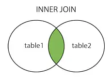
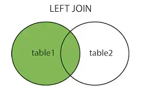
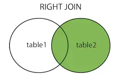
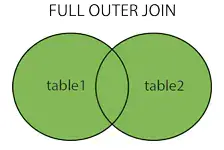
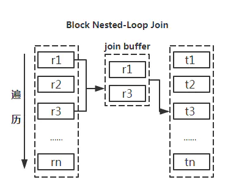

# 什么是Join

- `inner join`  内连接

- `left join` 左连接

- `right join` 右连接

- `full join` 全连接

#  限制 join 操作
在阿里开发手册有明确写了：

## 为什么限制

- 影响性能，占用资源
- 对分库分表不友好
- 大型系统中使用`join`语句不好易维护

## 分解查询后优势

- 让缓存的效率更高。许多应用程序可以方便地缓存单表查询对应的结果对象。如果关联中的某个表发生了变化，那么就无法使用查询缓存了，而拆分后，如果某个表很少改变，那么基于该表的查询就可以重复利用查询缓存结果了。
- 将查询分解后，执行单个查询可以减少锁的竞争。
- 在应用层做关联，可以更容易对数据库进行拆分，更容易做到高性能和可扩展。
- 查询本身效率也可能会有所提升。查询id集的时候，使用IN（）代替关联查询，可以让MySQL按照ID顺序进行查询，这可能比随机的关联要更高效。
- 可以减少冗余记录的查询。在应用层做关联查询，意味着对于某条记录应用只需要查询一次，而在数据库中做关联查询，则可能需要重复地访问一部分数据。从这点看，这样的重构还可能会减少网络和内存的消艳。
- 更进一步，这样做相当于在应用中实现了哈希关联，而不是使用MySQL的嵌套循环关联。某些场景哈希关联的效率要高很多。

# 如果一定要使用 - Join 优化

- **尽量使用`inner join`，避免`left join`**

  参与联合查询的表至少为2张表，一般都存在大小之分。如果连接方式是inner join，在没有其他过滤条件的情况下MySQL会自动选择小表作为驱动表，但是left join在驱动表的选择上遵循的是左边驱动右边的原则，即left join左边的表名为驱动表。

- **利用小表去驱动大表**
  
> Nested Loop Join 实际上就是通过驱动表的结果集作为循环基础数据，然后一条一条的通过该结果集中的数据作为过滤条件到下一个表中查询数据，然后合并结果。
  >
  > 如果还有第三个参与 Join，则再通过前两个表的 Join 结果集作为循环基础数据，再一次通过循环查询条件到第三个表中查询数据，以此类推。

  

  所以通过小表去驱动大表会减少很多遍历的次数。

- **合理利用索引**

  被驱动表的索引字段作为on的限制字段。

