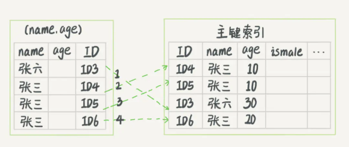
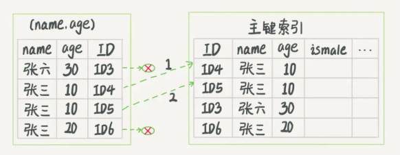

# 回表

假设一个`User`表拥有：主键`id`、创建了索引的用户名`name`，性别`sex`，生日`birthday`

## 示例

```sql
SELECT * FROM users WHERE name = 小明;
```

## 图解


## 执行流程：

- 查找`name`字段的B+树，查找到`小明`所对应的主键`id`值
- 得到`id`后回到主键的树上获取完整的数据

通过索引的树查询数据只得到主键`id`没有所有想要的数据还需要凭`id`到主键树查找一遍才能得到最终结果叫**回表**

# 索引覆盖

假设一个`User`表拥有：主键`id`、创建了索引的用户名`name`，性别`sex`，生日`birthday`

## 示例

```sql
SELECT id FROM users WHERE name = 小明;
```


## 图解


## 流程

- 查找`name`字段的B+树，查找到`小明`所对应的主键`id`值

因为叶子节点就存在id主键，不需要再从主键的B+树里获取数据，因此就没了回表的过程，回表的过程没了就叫索引覆盖。


# 最左匹配

假设一个`User`表拥有：主键`id`、用户名`name`，性别`sex`，生日`birthday`，年龄`age`

其中`name`、`sex`、`age`是组合索引

## 示例

- 示例一

  ```sql
  select * from t_user where name = 小明 and age = 男
  ```

  符合最左匹配，会执行索引

- 示例二

  ```sql
  select * from t_user where age = 男
  ```

  不符合最左匹配，不会执行索引

- 示例三

  ```sql
  select * from t_user where name = 小明 and age = 18
  ```

  符合最左匹配，会执行索引

- 示例四

  ```sql
  select * from t_user where name = 小明
  ```

  符合最左匹配，会执行索引

# 索引下推

假设现有组合索引`name`和`age`，老版本mysql是先将等于`name`的值从存储引擎里取出来，在server层再过滤age。

高版本是在从存储引擎里获取数据的时候，取等于name的数据时同时过滤掉age，这就叫索引下推。


 

## 图一




## 图二



- 图 1 中，在 (name,age) 索引里面我特意去掉了 age 的值，**这个过程 InnoDB 并不会去看 age 的值**，只是按顺序把`name` 第一个字是`张`的记录一条条取出来回表。因此，需要**回表4次**。

- 图 2 跟图 1 的区别是，InnoDB **在 (name,age) 索引内部就判断了 age 是否等于 10**，对于不等于 10 的记录，直接判断并跳过。在我们的这个例子中，只需要对 ID4、ID5 这两条记录回表取数据判断，就只需要**回表 2 次**。