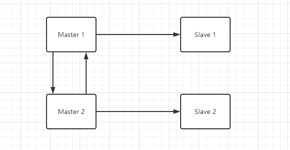

# 概念

既然有了主从节点进行读写分离性能得到大福提升，为什么还要双主的方案？

- 更高的吞吐
- 防止突然的宕机

也很好理解，双主就是有两个主节点：

当`Master 1`发生改变的时候同步到`Slave 1`以及`Master 2 `，`Master 2` 数据发生改变时同理。

此时`Master 1 `和`Master 2 `互为主机



# 配置

前面已经说了主从的配置，本文则在其基础上追加了`Node 3`和`Node 4`

> 💡 本质上双主和主从在配置上是一样的


# 创建 Node 3 和 Node 4

```shell
docker run -p 5503:3306 --name MySQL.Cluster.Node3 --network=net --restart=always -v "D:\Docker\MySQL.Cluster\Node3\conf":/etc/mysql -v "D:\Docker\MySQL.Cluster\Node3\logs":/var/log/mysql -v "D:\Docker\MySQL.Cluster\Node3\data":/var/lib/mysql -e MYSQL_ROOT_PASSWORD=root -d mysql:5.7

docker run -p 5504:3306 --name MySQL.Cluster.Node4 --network=net --restart=always -v "D:\Docker\MySQL.Cluster\Node4\conf":/etc/mysql -v "D:\Docker\MySQL.Cluster\Node4\logs":/var/log/mysql -v "D:\Docker\MySQL.Cluster\Node4\data":/var/lib/mysql -e MYSQL_ROOT_PASSWORD=root -d mysql:5.7
```


# 配置 Node 3 和  Node 4 主从复制

```sql
--- ①
show master status

--- ②
change master to
master_host='MySQL.Cluster.Node3',    
master_user='root',                   
master_log_file='mysql-bin.000001', 
master_log_pos=154,              
master_port=3306,                 
master_password='root';  

--- ③
start slave

--- ④
show slave status

--- 两 YES 则配置成功
Slave_IO_Running: Yes
Slave_SQL_Running: Yes

```


# 配置 Node 1 和 Node 2 相互主从


## 为 Node 3 配置为 Node 1 的从机

```sql

--- ① Node 1 下运行
show master status
--- 得到 File 和 Position 值

--- ② Node 3 下运行
change master to
master_host='MySQL.Cluster.Node1',    
master_user='root',                   
master_log_file='mysql-bin.000008', 
master_log_pos=313,              
master_port=3306,                 
master_password='root';  

--- ③ Node 3 下运行
start slave

--- ④ Node 3 下运行
show slave status

--- 由 ④ 得到结果：两个 YES 则配置成功
Slave_IO_Running: Yes
Slave_SQL_Running: Yes

```


## 为 Node 1 配置为 Node 3 的从机


```sql
--- ① Node 3 下运行
show master status
--- 得到 File 和 Position 值

--- ② Node 3 下运行
change master to
master_host='MySQL.Cluster.Node3',    
master_user='root',                   
master_log_file='mysql-bin.000001', 
master_log_pos=477,              
master_port=3306,                 
master_password='root';

--- ③ Node 3 下运行
start slave

--- ④ Node 3 下运行
show slave status

--- 由 ④ 得到结果：两个 YES 则配置成功
Slave_IO_Running: Yes
Slave_SQL_Running: Yes

```


