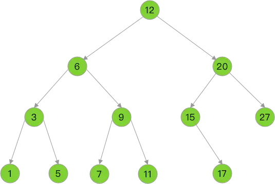
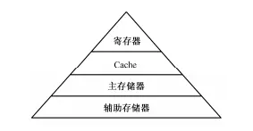

# 为什么使用B+树？

大家在数学课上一定听说过一个例子，在一堆已经排好序的数字当中找出一个特定的数字的最好办法是一种叫“二分查找”的方式。具体的过程就是先找到这些数字中间的那一个数，然后比较目标数字是大于还是小于这个数；然后根据结果继续在前一半或者后一半数字中继续查找。

这就类似于数据结构中的**二叉树**，二叉树就是如下的一种结构，树中的每个节点至多可以有两个子节点，而B+树每个节点则可以有N个子节点。

这里就不具体展开讲解二叉树了，我们只需要知道，平衡的二叉树是**内存**中查询效率最高的一种数据结构就可以了。

但是目前常用的数据库中，绝大多数的索引都是使用B+树实现的。那么为什么明明是二叉树查询效率最高，数据库中却偏偏要使用B+树而不是二叉树来实现索引呢？

# 计算机存储层次结构

计算机中的存储结构分为好几个部分，从上到下大致可以分为寄存器、高速缓存、主存储器、辅助存储器。其中主存储器，也就是我们常说的内存；辅助存储器也被称为外存，比较常见的就是磁盘、SSD，可以用来保存文件。在这个存储结构中，每一级存储的速度都比上一级慢很多，所以程序访问越上层存储中的数据，速度就会越快。

有过编程经验的小伙伴都知道，程序运行过程中操作的基本都是内存，对外存中数据的访问往往需要写一些文件的读取和写入代码才能实现。这正是因为CPU的计算速度比存储的I/O速度（输入/输出速度）快很多所做的优化，因为CPU在每次计算完成之后就需要等待下一批的数据进入，这个等待的时间越短，计算机运行得越快。

所以对于数据库索引来说，因为数据量很大，所以基本都是保存在外存中的，这样的话数据库读取一个索引节点的成本就非常大了。在数据量一样大的情况下，我们可以知道，B+树的单个节点中包含的值个数越多那么树中需要的节点总数就会越少，这样查询一次数据需要访问的节点数就更少了。

如果我们把二叉树看做是特殊的B+树（每个节点只有一个值和前后两个指针的B+树），那么就可以得出结论：**因为B+树的节点中包含的值个数（多个值）比二叉树（1个值）更多，所以在B+树中查询所需要的节点数就更少。**那么如果每次读取的成本是一样的话，因为`总成本=读取次数*单次读取成本`，我们就可以证明B+树的查询成本就比二叉树小得多了。

# 节点读取成本

但是我们知道，读取更多数据肯定会需要更大的成本，那么为什么数据库索引使用B+树还是会比二叉树更好呢？这就需要一些更高深的操作系统知识来解释了。

在现代的操作系统中，把数据从外存读到内存所使用的单位一般被称为“页”，每次读取数据都需要读入整数个的“页”，而不能读入半页或者0.8页。一页的大小由操作系统决定，常见的页大小一般为4KB=4096字节。所以不管我们是要读取1字节还是2KB，最后都是需要读入一个完整的4KB大小的页的，那么一个节点的读取成本就取决于需要读入的页数。

在这样的情况下，如果一个节点的大小小于一页的大小，那么就会有一部分时间花在读取我们根本不需要的数据上（节点之外的数据），二叉树在这方面就会浪费很多时间；而如果一个节点的大小大于一页，哪怕是一页的整数倍，那我们也可能在一个节点的中间就找到了我们需要的指针进入了下一级的节点，这样这个指针后面的数据都白白读取了，如果不需要这些数据可能我们就可以少读几页了。

所以，综上所述，数据库索引使用**节点大小恰好等于操作系统一页大小的B+树**来实现是效率最高的选择。

# 感谢

作者：兜里有辣条链接：https://juejin.im/post/5c67bf756fb9a049e4133cd9

来源：掘金著作权归作者所有。商业转载请联系作者获得授权，非商业转载请注明出处。