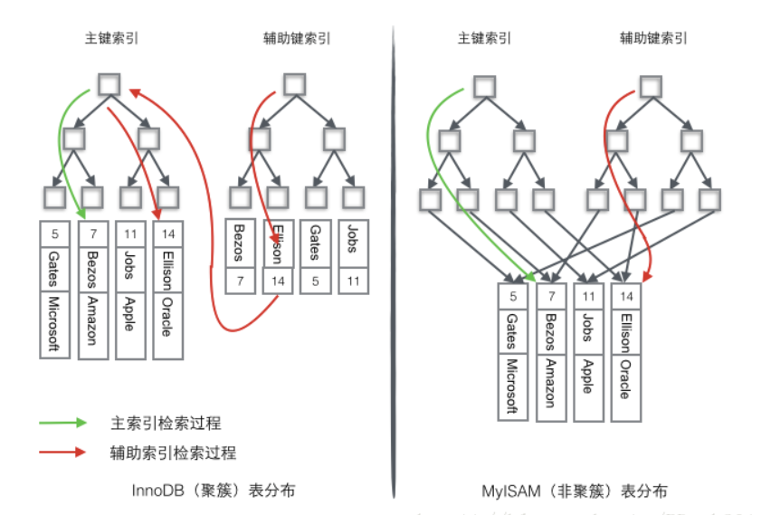

# 概念

数据库表的索引从**数据存储方式上**可以分为聚簇索引和非聚簇索引（又叫二级索引）两种。

`InnoDB`的聚簇索引在同一个`B-Tree`中保存了索引列和具体的数据，在聚簇索引中，实际的数据保存在叶子页中，中间的节点页保存指向下一层页面的指针。“聚簇”的意思是数据行被按照一定顺序一个个紧密地排列在一起存储。一个表只能有一个聚簇索引，因为在一个表中数据的存放方式只有一种。

# 优点

- 引用和数据放在一起，而较非聚簇索引需要第二次查询所以相比较减少一次IO,效率更高。
- 数据和引用在一个B-Tree中数据访问更快
- 使用覆盖索引扫描的查询可以直接使用页节点中的主键值。

# 缺点

- 聚簇索引的更新代价比较高，如果更新了行的聚簇索引列，就需要将数据移动到相应的位置。这可能因为要插入的页已满而导致“页分裂”。

- 插入速度严重依赖于插入顺序，按照主键进行插入的速度是加载数据到Innodb中的最快方式。如果不是按照主键插入，最好在加载完成后使用`OPTIMIZE TABLE`命令重新组织一下表。

- 聚簇索引在插入新行和更新主键时，可能导致“页分裂”问题。

- 聚簇索引可能导致全表扫描速度变慢，因为可能需要加载物理上相隔较远的页到内存中（需要耗时的磁盘寻道操作）。

# 图解

