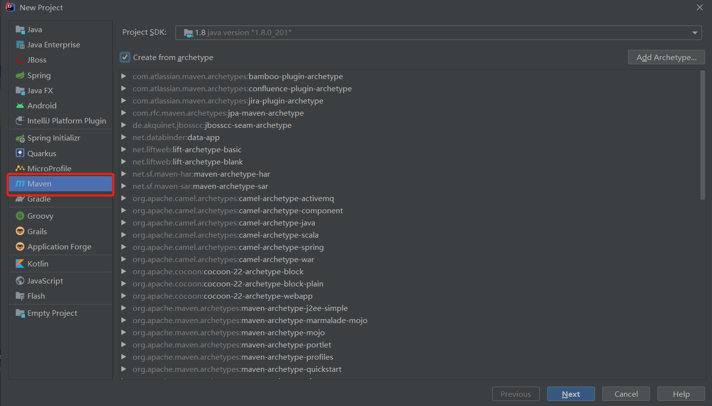

## 什么是 MyBatis

**MyBatis** 是一款优秀的持久层框架，它支持自定义 SQL、存储过程以及高级映射。MyBatis 免除了几乎所有的 JDBC 代码以及设置参数和获取结果集的工作。MyBatis 可以通过简单的 XML 或注解来配置和映射原始类型、接口和 Java POJO（Plain Old Java Objects，普通老式 Java 对象）为数据库中的记录。

**优点：**

​		1、与JDBC相比，减少了50%的代码量

​		2、 最简单的持久化框架，简单易学

​		3、SQL代码从程序代码中彻底分离出来，可以重用

​		4、提供XML标签，支持编写动态SQL

​		5、提供映射标签，支持对象与数据库的ORM字段关系映射

**缺点：**

​		1、SQL语句编写工作量大，熟练度要高

​		2、数据库移植性比较差，如果需要切换数据库的话，SQL语句会有很大的差异


## 快速构建一个 MyBatis 项目

### 创建一个新项目



为了方便使用包选择了`Maven`


### 配置 Jar 包

```xml
// pom.xml
<?xml version="1.0" encoding="UTF-8"?>
<project xmlns="http://maven.apache.org/POM/4.0.0"
         xmlns:xsi="http://www.w3.org/2001/XMLSchema-instance"
         xsi:schemaLocation="http://maven.apache.org/POM/4.0.0 http://maven.apache.org/xsd/maven-4.0.0.xsd">
    <modelVersion>4.0.0</modelVersion>

    <groupId>com.mashibing</groupId>
    <artifactId>mybatis_helloworld</artifactId>
    <version>1.0-SNAPSHOT</version>

    <dependencies>
        <!-- MyBatis -->
        <dependency>
            <groupId>org.mybatis</groupId>
            <artifactId>mybatis</artifactId>
            <version>3.5.4</version>
        </dependency>
        <!-- MySQL -->
        <dependency>
            <groupId>mysql</groupId>
            <artifactId>mysql-connector-java</artifactId>
            <version>8.0.16</version>
        </dependency>
        <!-- 日志 -->
        <dependency>
            <groupId>log4j</groupId>
            <artifactId>log4j</artifactId>
            <version>1.2.17</version>
        </dependency>
        <!-- 测试 -->
        <dependency>
            <groupId>junit</groupId>
            <artifactId>junit</artifactId>
            <version>RELEASE</version>
            <scope>test</scope>
        </dependency>

    </dependencies>

</project>
```

### 创建数据库及对应的实体类

```java
package entity;

import java.util.Date;

public class Student {
    public Integer id;
    public String name;
    public Integer sex;
    public Date birthday;
    public Integer classroom_id;

    public Integer getId() {
        return id;
    }

    public void setId(Integer id) {
        this.id = id;
    }

    public String getName() {
        return name;
    }

    public void setName(String name) {
        this.name = name;
    }

    public Integer getSex() {
        return sex;
    }

    public void setSex(Integer sex) {
        this.sex = sex;
    }

    public Date getBirthday() {
        return birthday;
    }

    public void setBirthday(Date birthday) {
        this.birthday = birthday;
    }

    public Integer getClassroom_id() {
        return classroom_id;
    }

    public void setClassroom_id(Integer classroom_id) {
        this.classroom_id = classroom_id;
    }

    @Override
    public String toString() {
        return "Student{" +
                "id=" + id +
                ", name='" + name + '\'' +
                ", sex=" + sex +
                ", birthday=" + birthday +
                ", classroom_id=" + classroom_id +
                '}';
    }
}

```

```sql
create table student
(
    id           int auto_increment primary key,
    name         varchar(64) charset utf8 null,
    sex          int                      null,
    birthday     varchar(255)             null,
    classroom_id int                      null
)
```

### 创建一个配置文件

```xml
<!-- MyBatisConfig.xml -->
<?xml version="1.0" encoding="UTF-8" ?>
<!DOCTYPE configuration
        PUBLIC "-//mybatis.org//DTD Config 3.0//EN"
        "http://mybatis.org/dtd/mybatis-3-config.dtd">
<configuration>
    <environments default="development">
        <environment id="development">
            <transactionManager type="JDBC"/>
            <!--配置数据库连接-->
            <dataSource type="POOLED">
                <property name="driver" value="com.mysql.cj.jdbc.Driver"/>
                <property name="url" value="jdbc:mysql://192.168.10.3:3306/test?serverTimezone=UTC"/>
                <property name="username" value="root"/>
                <property name="password" value="root"/>
            </dataSource>
        </environment>
    </environments>
    <!--引入每一个接口对应点xml文件-->
    <mappers>
        <mapper resource="MyBatisMapper/student.xml"/>
    </mappers>
</configuration>
```


### 创建映射配置

```xml
<!-- MyBatisMapper/student.xml -->
<?xml version="1.0" encoding="UTF-8" ?>
<!DOCTYPE mapper
        PUBLIC "-//mybatis.org//DTD Mapper 3.0//EN"
        "http://mybatis.org/dtd/mybatis-3-mapper.dtd">
<mapper namespace="dao.StudentDao">
    <select id="findStudentById" resultType="entity.Student">
        SELECT * FROM students WHERE id = #{id}
    </select>
</mapper>
```

### 创建 Dao 类

```java
package dao;

import entity.Student;

public interface StudentDao {

    public Student findStudentById(Integer id);
}

```


### 测试一哈

```java
import dao.StudentDao;
import entity.Student;
import org.apache.ibatis.io.Resources;
import org.apache.ibatis.session.SqlSession;
import org.apache.ibatis.session.SqlSessionFactory;
import org.apache.ibatis.session.SqlSessionFactoryBuilder;
import org.junit.Before;
import org.junit.Test;

import java.io.IOException;
import java.io.InputStream;
import java.text.SimpleDateFormat;

public class Demo {
    SqlSessionFactory sqlSessionFactory = null;
    @Before
    public void init(){
        // 根据全局配置文件创建出SqlSessionFactory
        // SqlSessionFactory:负责创建SqlSession对象的工厂
        // SqlSession:表示跟数据库建议的一次会话
        String resource = "MyBatisConfig.xml";
        InputStream inputStream = null;
        try {
            inputStream = Resources.getResourceAsStream(resource);
            sqlSessionFactory= new SqlSessionFactoryBuilder().build(inputStream);
        } catch (IOException e) {
            e.printStackTrace();
        }
    }

    @Test
    public void test01() {
        SqlSession sqlSession = sqlSessionFactory.openSession();
        StudentDao mapper = sqlSession.getMapper(StudentDao.class);
        Student student = mapper.findStudentById(1);
        SimpleDateFormat simpleDateFormat = new SimpleDateFormat("yyyy-MM-dd");
        String format = simpleDateFormat.format(student.getBirthday());
        System.out.println(format);
        System.out.println(student);
        sqlSession.commit();
        sqlSession.close();
    }
}


// 输出结果 
1997-11-06
Student{id=1, name='张三', sex=1, birthday=Thu Nov 06 08:00:00 CST 1997, classroom_id=1}
```

