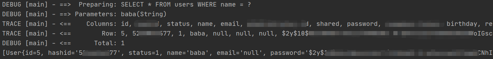

## 简述

Mybatis 通过使用内置的日志工厂提供日志功能。内置日志工厂将会把日志工作委托给下面的实现之一：

- SLF4J
- Apache Commons Logging
- Log4j 2
- Log4j
- JDK logging

## 配置

以 `log4j` 为例

### xml 配置

```xml
<configuration>
  <settings>
    ...
    <setting name="logImpl" value="LOG4J"/>
    ...
  </settings>
</configuration>
```

### 导入 log4j 的 Jar 包

```xml
<!-- pox.xml -->
 <dependency>
     <groupId>log4j</groupId>
     <artifactId>log4j</artifactId>
     <version>1.2.17</version>
</dependency>
```


### 日志配置文件

```properties
# 在 resources 下创建一个 log4j.properties 文件
# 全局日志配置 日志显示等级 
log4j.rootLogger=ERROR, stdout
# MyBatis 日志配置 
# 配置将使 Log4J 详细打印 org.mybatis.example.BlogMapper 的日志，对于应用的其它部分，只打印错误信息。
# 此处根据自己包名和代码结构自行修改
log4j.logger.org.mybatis.example.BlogMapper=TRACE

# 控制台输出
log4j.appender.stdout=org.apache.log4j.ConsoleAppender
log4j.appender.stdout.layout=org.apache.log4j.PatternLayout
log4j.appender.stdout.layout.ConversionPattern=%5p [%t] - %m%n
```


## 结果

