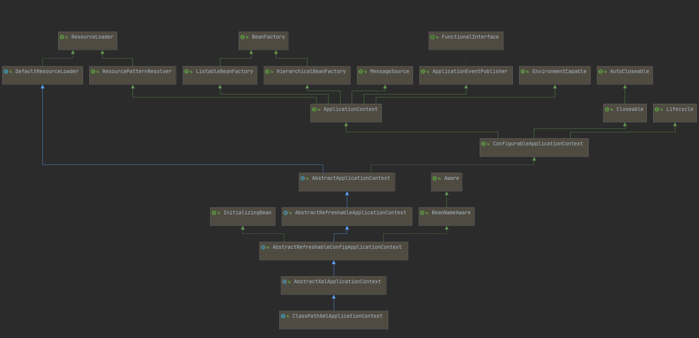

## Spring 源码分析（二）-  前言

```java
public static void main(String[] args) {
    ApplicationContext context = new ClassPathXmlApplicationContext("Spring.xml");
    User user = context.getBean(User.class);
    user.get();
}
```

三行很普通的 `Spring` 代码每行代码分别表达了：

1. 通过 `Spring.xml` 配置文件创建了 `context` 容器
2. 在容器中获取了一个 `User` 类、
3. 执行 `User` 类中的 `get` 方法

仅仅是三行就把庞大的 `Spring` 的 `IOC` 表现出来了，接下逐步介绍 `Spring` 的实现原理。


完整的 `Spring` 体系：




简化后的流程：


### 配置注册

`new ClassPathXmlApplicationContext("Spring.xml")` 可以传入多种参数，但是不同的配置最终得到的结果是一样的。所以`Spring`中有一套判断的逻辑


### 文字版的加载过程

> 加载过程： 通过 `ResourceLoader`和其子类`DefaultResourceLoader`完成资源文件位置定位，实现从类路径，文件系统，url等方式定位功能，完成定位后得到`Resource`对象，再交给`BeanDefinitionReader`，它再委托给`BeanDefinitionParserDelegate`完成bean的解析并得到`BeanDefinition`对象，然后通过`registerBeanDefinition`方法进行注册，IOC容器内ibu维护了一个HashMap来保存该`BeanDefinition`对象，Spring中的`BeanDefinition`其实就是我们用的`JavaBean`。
>
> 作者：FantJ_公众号PlayInJava
>
> 链接：https://juejin.im/post/5c34aa85e51d4551c65587f1
>
> 来源：掘金