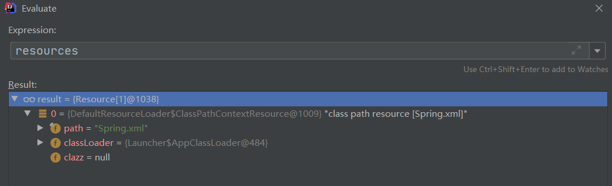
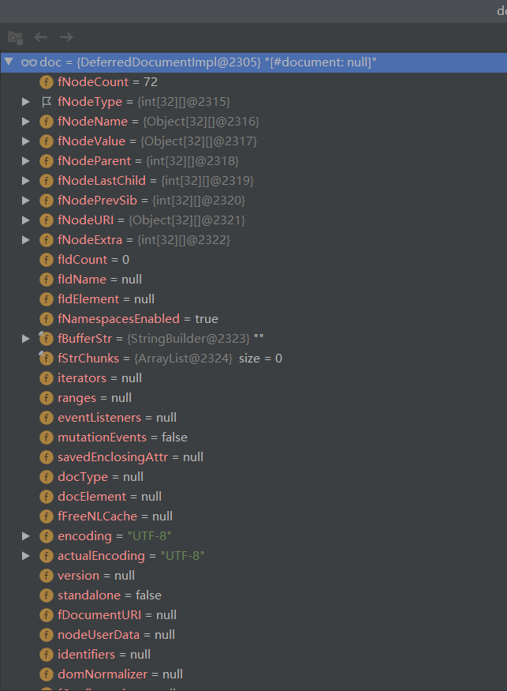
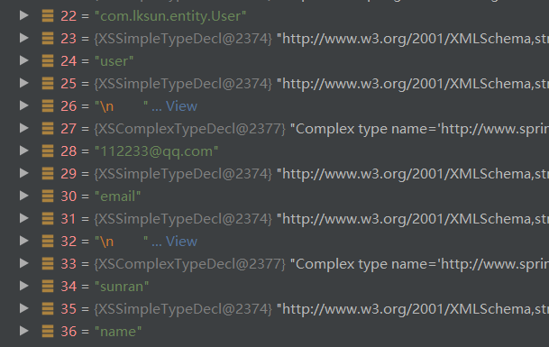

## Spring 源码分析（三）- 将XML解析为Document

### 3.1 getResources

```java
//---------------------------------------------------------------------
// Implementation of ResourcePatternResolver interface
// 实现 ResourcePatternResolver 接口
//---------------------------------------------------------------------

@Override
public Resource[] getResources(String locationPattern) throws IOException {
    return this.resourcePatternResolver.getResources(locationPattern);
}
```

```java
@Override
public Resource[] getResources(String locationPattern) throws IOException {
    Assert.notNull(locationPattern, "Location pattern must not be null");
    // 首先判断是不是 以 classpath*: 开头的资源路径
    if (locationPattern.startsWith(CLASSPATH_ALL_URL_PREFIX)) {
        // a class path resource (multiple resources for same name possible)
        // 判断:是否包含 * ? { }
        if (getPathMatcher().isPattern(locationPattern.substring(CLASSPATH_ALL_URL_PREFIX.length()))) {
            // a class path resource pattern
            return findPathMatchingResources(locationPattern);
        }
        else {
            // all class path resources with the given name
            // 查找所有所有类位置资源。
            return findAllClassPathResources(locationPattern.substring(CLASSPATH_ALL_URL_PREFIX.length()));
        }
    }
    else {
        // Generally only look for a pattern after a prefix here,
        // and on Tomcat only after the "*/" separator for its "war:" protocol.
        // 是不是以 war: 开头
        // 如果是 则得到 资源路径 */ 首次出现位置+1  如果不存在 */ 则为0
        // 否则 : 首次出现位置 +1
        // 最终得到 前缀结尾
        int prefixEnd = (locationPattern.startsWith("war:") ? locationPattern.indexOf("*/") + 1 :
                         locationPattern.indexOf(':') + 1);
        if (getPathMatcher().isPattern(locationPattern.substring(prefixEnd))) {
            // a file pattern
            return findPathMatchingResources(locationPattern);
        }
        else {
            // a single resource with the given name
            // 获取一个资源的对象 详情查看3.2
            return new Resource[] {getResourceLoader().getResource(locationPattern)};
        }
    }
}
```

### 3.2 getResource

```java
@Override
public Resource getResource(String location) {
    Assert.notNull(location, "Location must not be null");

    for (ProtocolResolver protocolResolver : getProtocolResolvers()) {
        Resource resource = protocolResolver.resolve(location, this);
        if (resource != null) {
            return resource;
        }
    }
	// 这个方法就是做了一堆判断
    // location 是否 / 开头
    if (location.startsWith("/")) {
        return getResourceByPath(location);
    }
    // 是否 classpath: 开头
    else if (location.startsWith(CLASSPATH_URL_PREFIX)) {
        return new ClassPathResource(location.substring(CLASSPATH_URL_PREFIX.length()), getClassLoader());
    }
    else {
        try {
            // Try to parse the location as a URL...
            // 如果都不是就根据 location 生成一个 URL对象
            URL url = new URL(location);
            return (ResourceUtils.isFileURL(url) ? new FileUrlResource(url) : new UrlResource(url));
        }
        catch (MalformedURLException ex) {
            // No URL -> resolve as resource path.
            // 上面声明 URL 对象时 传入的参数如果不是 URL 则会报错
            // 所以会通过 path 获取一个资源对象 详情3.3
            return getResourceByPath(location);
        }
    }
}
```


### 3.3  getResourceByPath

```java
// Return a Resource handle for the resource at the given path.
// 返回一个 Resource 通过给定的一个资源路径
protected Resource getResourceByPath(String path) {
    // 此处也很简单,就是 new 了一个 ClassPathContextResource 对象
    // 将 path 的参数传入进去
    return new ClassPathContextResource(path, getClassLoader());
}

public ClassPathResource(String path, @Nullable ClassLoader classLoader) {
    Assert.notNull(path, "Path must not be null");
    String pathToUse = StringUtils.cleanPath(path);
    if (pathToUse.startsWith("/")) {
        pathToUse = pathToUse.substring(1);
    }
    this.path = pathToUse;
    this.classLoader = (classLoader != null ? classLoader : ClassUtils.getDefaultClassLoader());
}
```


### 3.4 loadBeanDefinitions

> 🚀 在 `1.9 getResourceByPath` 我们成功获取到了一个配置文件的 `Resource` 对象
>
> 层层返回，此时我们需要回到 `1.6 loadBeanDefinitions` 中继续 加载Bean

```java
/**
* Load bean definitions from the specified resource location.
* 在指定的资源路径中(也就是XML)中加载定义的Bean
* <p>The location can also be a location pattern, provided that the
* ResourceLoader of this bean definition reader is a ResourcePatternResolver.
* @param location the resource location, to be loaded with the ResourceLoader
* (or ResourcePatternResolver) of this bean definition reader
* @param actualResources a Set to be filled with the actual Resource objects
* that have been resolved during the loading process. May be {@code null}
* to indicate that the caller is not interested in those Resource objects.
* @return the number of bean definitions found
* ↑ 注意 @return : 定义的Bean的数量
*/
public int loadBeanDefinitions(String location, @Nullable Set<Resource> actualResources) throws BeanDefinitionStoreException {
    // 获取一下资源加载器
    ResourceLoader resourceLoader = getResourceLoader();
    // 空验证
    if (resourceLoader == null) {
        throw new BeanDefinitionStoreException(
            "Cannot load bean definitions from location [" + location + "]: no ResourceLoader available");
    }

    if (resourceLoader instanceof ResourcePatternResolver) {
        // Resource pattern matching available.
        try {
            // 指定位置的Bean配置信息解析为Spring IOC容器封装的资源
            // 载多个指定位置的Bean配置信息
            // 得到了一个 Resource 对象的数组
            Resource[] resources = ((ResourcePatternResolver) resourceLoader).getResources(location);
            // 截止到现在我们完成的仅仅是将 Spring.xml 字符串转换成了 resource 对象
            // 看下图,一个存放着 resource 对象的数组
            // loadBeanDefinitions 具体操作看本文 3.5
            int count = loadBeanDefinitions(resources);
            if (actualResources != null) {
                Collections.addAll(actualResources, resources);
            }
            if (logger.isTraceEnabled()) {
                logger.trace("Loaded " + count + " bean definitions from location pattern [" + location + "]");
            }
            return count;
        }
        catch (IOException ex) {
            throw new BeanDefinitionStoreException(
                "Could not resolve bean definition resource pattern [" + location + "]", ex
            );
        }
    }else {
        // Can only load single resources by absolute URL.
        Resource resource = resourceLoader.getResource(location);
        int count = loadBeanDefinitions(resource);
        if (actualResources != null) {
            actualResources.add(resource);
        }
        if (logger.isTraceEnabled()) {
            logger.trace("Loaded " + count + " bean definitions from location [" + location + "]");
        }
        return count;
    }
}
```




### 3.5 loadBeanDefinitions

```java
@Override
public int loadBeanDefinitions(Resource... resources) throws BeanDefinitionStoreException {
    Assert.notNull(resources, "Resource array must not be null");
    int count = 0;
    for (Resource resource : resources) {
        // 本方法代码不多,处理在 loadBeanDefinitions()
        count += loadBeanDefinitions(resource);
    }
    return count;
}
```

```java
/**
* Load bean definitions from the specified XML file.
* 官方文档很重要:加载一个定义的bean在指定的xml文件中
* 至于这个指定的xml文件也很清楚了,就是我们声明是的参数 - Spring.xml
*/
@Override
public int loadBeanDefinitions(Resource resource) throws BeanDefinitionStoreException {
    // 第一步先将 Resource 对象进行了一个编码的处理
    // 第二步才是解析 XML
    // 具体操作查看本文 3.6
    return loadBeanDefinitions(new EncodedResource(resource));
}
```


### 3.6 loadBeanDefinitions

```java
/**
* Load bean definitions from the specified XML file.
*/
public int loadBeanDefinitions(EncodedResource encodedResource) throws BeanDefinitionStoreException {
    Assert.notNull(encodedResource, "EncodedResource must not be null");
    if (logger.isTraceEnabled()) {
        logger.trace("Loading XML bean definitions from " + encodedResource);
    }
	// 通过属性记录当前已经加载的资源
    Set<EncodedResource> currentResources = this.resourcesCurrentlyBeingLoaded.get();
    // 因为什么也没做 首次肯定为 null
    if (currentResources == null) {
        // 一个初始化长度为 4 的 HashSet
        currentResources = new HashSet<>(4);
        // 将 currentResources 的值加载进去
        this.resourcesCurrentlyBeingLoaded.set(currentResources);
    }
    
    if (!currentResources.add(encodedResource)) {
        throw new BeanDefinitionStoreException(
            "Detected cyclic loading of " + encodedResource + " - check your import definitions!");
    }
    try {
        // 通过 Resource 对象 获取字节流对象
        InputStream inputStream = encodedResource.getResource().getInputStream();
        try {
            // 通过字节流获取一个输入流
            InputSource inputSource = new InputSource(inputStream);
            if (encodedResource.getEncoding() != null) {
                inputSource.setEncoding(encodedResource.getEncoding());
            }
            // 看方法名:加载 定义 bean (此方法不简单)
            // 还有一个有意思的:在Spring中很多doxxxx的方法可能都是即将有实际操作的方法	
            // 具体做了什么 本文 3.7
            return doLoadBeanDefinitions(inputSource, encodedResource.getResource());
        }
        finally {
            // 不要忘记关闭输入流
            inputStream.close();
        }
    }
    catch (IOException ex) {
        throw new BeanDefinitionStoreException(
            "IOException parsing XML document from " + encodedResource.getResource(), ex);
    }
    finally {
        currentResources.remove(encodedResource);
        if (currentResources.isEmpty()) {
            this.resourcesCurrentlyBeingLoaded.remove();
        }
    }
}
```


### 3.7  doLoadBeanDefinitions

```java
/**
* Actually load bean definitions from the specified XML file.
* 怀疑是一个划水的官方方法文档,在定义的XML文件中加载Bean对象已经说了很多次了
*/
protected int doLoadBeanDefinitions(InputSource inputSource, Resource resource)
    throws BeanDefinitionStoreException {
    try {
        // 首先是读取一个文档,参数有两个:输入流和资源类
        // 查看本文3.8
        Document doc = doLoadDocument(inputSource, resource);
        int count = registerBeanDefinitions(doc, resource);
        if (logger.isDebugEnabled()) {
            logger.debug("Loaded " + count + " bean definitions from " + resource);
        }
        return count;
    }
    catch (BeanDefinitionStoreException ex) {
       // 源代码中此处有很多 catch 的异常捕获,为了看得舒服我删掉了
    }
}

```


### 3.8 doLoadDocument

```java
/**
* Actually load the specified document using the configured DocumentLoader.
* 创建bean所需要的参数都是从DocumentLoader读来的
*/
protected Document doLoadDocument(InputSource inputSource, Resource resource) throws Exception {
    // 验证偏多
    // loadDocument 方法查看本文 3.9
    return this.documentLoader.loadDocument(inputSource, getEntityResolver(),
                                            this.errorHandler,
                                            getValidationModeForResource(resource),
                                            isNamespaceAware());
}
```


```java
/**
* Determine the validation mode for the specified {@link Resource}.
* If no explicit validation mode has been configured, then the validation
* ode gets {@link #detectValidationMode detected} from the given resource.
* <p>Override this method if you would like full control over the validation
* mode, even when something other than {@link #VALIDATION_AUTO} was set.
* @see #detectValidationMode
*/
protected int getValidationModeForResource(Resource resource) {
    int validationModeToUse = getValidationMode();
    if (validationModeToUse != VALIDATION_AUTO) {
        return validationModeToUse;
    }
    // 这个是关键 
    // 检测验证模式
    int detectedMode = detectValidationMode(resource);
    if (detectedMode != VALIDATION_AUTO) {
        return detectedMode;
    }
    // Hmm, we didn't get a clear indication... Let's assume XSD,
    // since apparently no DTD declaration has been found up until
    // detection stopped (before finding the document's root tag).
    return VALIDATION_XSD;
}
```


```java
/**
* Detect which kind of validation to perform on the XML file identified by the supplied Resource
* 检测XML文件执行哪种验证由Resource决定
*  If the file has a {@code DOCTYPE} definition then DTD validation is used otherwise XSD validation is assumed.
* 如果有DOCTYPE定义则使用 DTD 否则用 XSD 验证
* <p>Override this method if you would like to customize resolution
* of the {@link #VALIDATION_AUTO} mode.
*/
protected int detectValidationMode(Resource resource) {
    if (resource.isOpen()) {
        throw new BeanDefinitionStoreException(
            "Passed-in Resource [" + resource + "] contains an open stream: " +
            "cannot determine validation mode automatically. Either pass in a Resource " +
            "that is able to create fresh streams, or explicitly specify the validationMode " +
            "on your XmlBeanDefinitionReader instance.");
    }

    InputStream inputStream;
    try {
        inputStream = resource.getInputStream();
    }
    catch (IOException ex) {
        throw new BeanDefinitionStoreException(
            "Unable to determine validation mode for [" + resource + "]: cannot open InputStream. " +
            "Did you attempt to load directly from a SAX InputSource without specifying the " +
            "validationMode on your XmlBeanDefinitionReader instance?", ex);
    }

    try {
        return this.validationModeDetector.detectValidationMode(inputStream);
    }
    catch (IOException ex) {
        throw new BeanDefinitionStoreException("Unable to determine validation mode for [" +
                                               resource + "]: an error occurred whilst reading from the InputStream.", ex);
    }
}
```


```java
/**
* Detect the validation mode for the XML document in the supplied {@link InputStream}.
* Note that the supplied {@link InputStream} is closed by this method before returning.
* @param inputStream the InputStream to parse
* @throws IOException in case of I/O failure
* @see #VALIDATION_DTD
* @see #VALIDATION_XSD
*/
public int detectValidationMode(InputStream inputStream) throws IOException {
    // Peek into the file to look for DOCTYPE.
    // 查看文件的寻找DOCTYPE
    BufferedReader reader = new BufferedReader(new InputStreamReader(inputStream));
    try {
        
        boolean isDtdValidated = false;
        String content;
        // 下面就是验证了
        // 循环判断
        while ((content = reader.readLine()) != null) {
            content = consumeCommentTokens(content);
            if (this.inComment || !StringUtils.hasText(content)) {
                continue;
            }
            if (hasDoctype(content)) {
                isDtdValidated = true;
                break;
            }
            if (hasOpeningTag(content)) {
                // End of meaningful data...
                break;
            }
        }
        // 如果是DTD验证则返回 2  , 否则为XSD 3
        return (isDtdValidated ? VALIDATION_DTD : VALIDATION_XSD);
    }
    catch (CharConversionException ex) {
        // Choked on some character encoding...
        // Leave the decision up to the caller.
        return VALIDATION_AUTO;
    }
    finally {
        reader.close();
    }
}
```


### 3.9 loadDocument

> 此步骤主要是用于创建一个工厂,用于读取XML文件

```java
/**
* Load the {@link Document} at the supplied {@link InputSource} using the standard JAXP-configured
* XML parser.
* 使用标准的JAXP配置，将{@link Document}加载到提供的{@link InputSource}中
*/
@Override
public Document loadDocument(InputSource inputSource, EntityResolver entityResolver,
                             ErrorHandler errorHandler, 
                             int validationMode, 
                             boolean namespaceAware) throws Exception {

    DocumentBuilderFactory factory = createDocumentBuilderFactory(validationMode, namespaceAware);
    if (logger.isTraceEnabled()) {
        logger.trace("Using JAXP provider [" + factory.getClass().getName() + "]");
    }
    // 工厂有了 ,可以创建了
    DocumentBuilder builder = createDocumentBuilder(factory, entityResolver, errorHandler);
    // 注意:说到底XML就是一堆字符串,不方便读取和操作
    // 这一步就是解析XML
    // 注意一下这个类的返回类型 Document,所以该方法就是 将字符串的 XML 解析为了 Document 对象
    return builder.parse(inputSource);
}
```


```java
/**
* Create the {@link DocumentBuilderFactory} instance.
* 创建一个构建文档的工厂
*/
protected DocumentBuilderFactory createDocumentBuilderFactory(int validationMode, boolean namespaceAware)
    throws ParserConfigurationException {

    DocumentBuilderFactory factory = DocumentBuilderFactory.newInstance();
    factory.setNamespaceAware(namespaceAware);
	// 验证方式 != 0
    if (validationMode != XmlValidationModeDetector.VALIDATION_NONE) {
        factory.setValidating(true);
        // 验证方式 == XSD
        if (validationMode == XmlValidationModeDetector.VALIDATION_XSD) {
            // Enforce namespace aware for XSD...
            factory.setNamespaceAware(true);
            try {
                // 添加一个属性,地址的验证
                factory.setAttribute(SCHEMA_LANGUAGE_ATTRIBUTE, XSD_SCHEMA_LANGUAGE);
            }
            catch (IllegalArgumentException ex) {
                ParserConfigurationException pcex = new ParserConfigurationException(
                    "Unable to validate using XSD: Your JAXP provider [" + factory +
                    "] does not support XML Schema. Are you running on Java 1.4 with Apache Crimson? " +
                    "Upgrade to Apache Xerces (or Java 1.5) for full XSD support.");
                pcex.initCause(ex);
                throw pcex;
            }
        }
    }
	// 返回一个工厂
    return factory;
}
```

```java
/**
* Create a JAXP DocumentBuilder that this bean definition reader
* 创建一个JAXP DocumentBuilder，该bean定义阅读器
* will use for parsing XML documents. Can be overridden in subclasses,
* 将用于解析XML文档。可以在子类中覆盖，
* adding further initialization of the builder.
* 添加构建器的进一步初始化
* @param factory the JAXP DocumentBuilderFactory that the DocumentBuilder
* should be created with
* @param entityResolver the SAX EntityResolver to use
* @param errorHandler the SAX ErrorHandler to use
* @return the JAXP DocumentBuilder
* @throws ParserConfigurationException if thrown by JAXP methods
*/
protected DocumentBuilder createDocumentBuilder(DocumentBuilderFactory factory,
                                                @Nullable EntityResolver entityResolver, 
                                                @Nullable ErrorHandler errorHandler)
    throws ParserConfigurationException {

    DocumentBuilder docBuilder = factory.newDocumentBuilder();
    if (entityResolver != null) {
        docBuilder.setEntityResolver(entityResolver);
    }
    if (errorHandler != null) {
        docBuilder.setErrorHandler(errorHandler);
    }
    return docBuilder;
}
```


### 3.10 doLoadBeanDefinitions

> 🚀 前面 loadDocument 方法主要是为了实现解析XML文件
>
> 现在 XML 已经解析为了 Document 对象
>
> 回到 doLoadBeanDefinitions 方法 

```java
/**
* Actually load bean definitions from the specified XML file.
* 怀疑是一个划水的官方方法文档,在定义的XML文件中加载Bean对象已经说了很多次了
*/
protected int doLoadBeanDefinitions(InputSource inputSource, Resource resource)
    throws BeanDefinitionStoreException {
    try {
        // 首先是读取一个文档,参数有两个:输入流和资源类
        // 解析XML 为 Document 对象
        Document doc = doLoadDocument(inputSource, resource);
        // 此时 DEBUG 看一下 doc是个啥 . 图在下面
        int count = registerBeanDefinitions(doc, resource);
        if (logger.isDebugEnabled()) {
            logger.debug("Loaded " + count + " bean definitions from " + resource);
        }
        return count;
    }
    catch (BeanDefinitionStoreException ex) {
       // 源代码中此处有很多 catch 的异常捕获,为了看得舒服我删掉了
    }
}


```



包含了很多属性，我逐个点开看了一下还是找到了熟悉的面孔



确实面熟，因为这是我之前在 `Spring.xml` 中定义的 Bean

```xml
<bean id="user" class="com.lksun.entity.User">
    <property name="email" value="112233@qq.com"/>
    <property name="name" value="sunran"/>
</bean>
```

看到这个说明我们定义的XML文件已经被Spring解析并存在了对象中

**划重点**：截止到目前仅仅是**将字符串的XML 解析为了 Document 对象**

