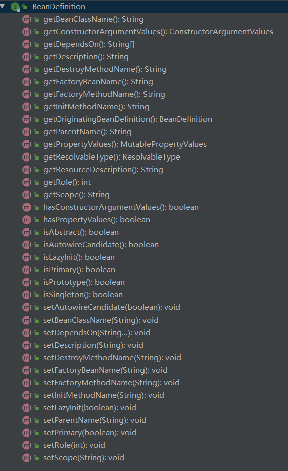
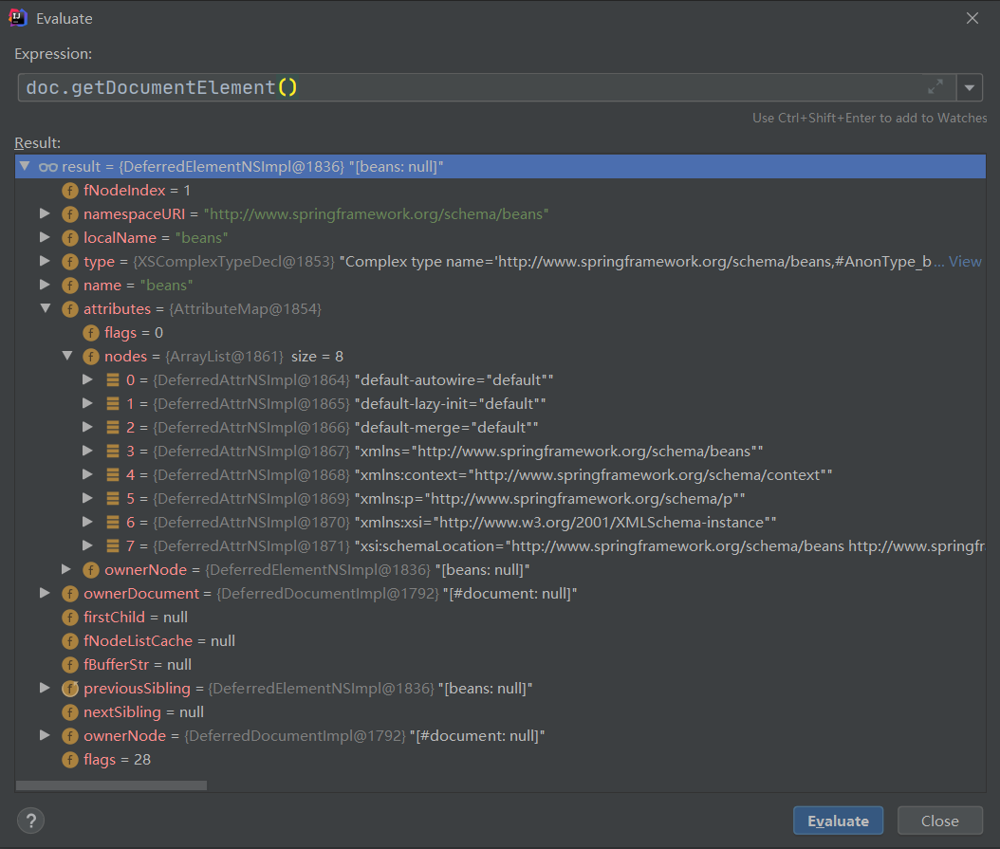

# 注册 BeanDefinitions

## 回顾

在上一篇已经介绍了 `Spring` 中如何通过`doLoadDocument`方法将XML文件解析为`Document`对象。

```java
protected int doLoadBeanDefinitions(InputSource inputSource, Resource resource)
    throws BeanDefinitionStoreException {
    try {
        Document doc = doLoadDocument(inputSource, resource);
        int count = registerBeanDefinitions(doc, resource);
        if (logger.isDebugEnabled()) {
            logger.debug("Loaded " + count + " bean definitions from " + resource);
        }
        return count;
    }
    catch (BeanDefinitionStoreException ex) {
       // 源代码中此处有很多 catch 的异常捕获,为了看得舒服我删掉了
    }
}
```

实现了 `Document` 不算完，后面紧跟着就来了一个`registerBeanDefinitions` 盲猜一下是 注册定义的Bean。

## BeanDefinition 是什么?

> 💡 `BeanDefinition` 是一个接口，`BeanDefinition`与`Bean`的关系, 就好比类与对象的关系。类在spring的数据结构就是`BeanDefinition`，根据`BeanDefinition`得到的对象就是我们需要的Bean。Bean与BeanDefinition是理解spring的整个架构的基础与关键。

用我个人的理解就是：所有东西都不是凭空出现、存在的，我们开发中常用到的`Bean` 都是依附于`BeanDefinition`的。

> 🎈  看一下 `BeanDefinition` 都定义了哪些方法和属性



放眼一瞅还是可以看到一些眼熟的方法的：

就随便拿一个举个栗子

> 📢  `BeanDefinition` 接口

```java
/**
* Override the target scope of this bean, specifying a new scope name.
* 重写该 bean 的作用域，指定一个新的
* @see #SCOPE_SINGLETON
* @see #SCOPE_PROTOTYPE
*/
void setScope(@Nullable String scope);

/**
* Return the name of the current target scope for this bean,
* or {@code null} if not known yet.
* 返回此bean当前目标作用域的名称，如果不知道就返回 null
*/
@Nullable
String getScope();

```

> 📢  `AbstractBeanDefinition` 抽象方法 （实现于`BeanDefinition`）

```java
/**
* Constant for the default scope name: {@code ""}, equivalent to singleton
* status unless overridden from a parent bean definition (if applicable).
* 这里有一个成员变量叫做 SCOPE_DEFAULT 
* scope的默认值 常量无法改变	默认是singleton（单例模式），除非在父类的Bean中进行覆盖
* 简单话来说就是你定义的 Bean 如果不设置就是单例的
*/
public static final String   = "";

// 在下面还看到一个 scope 变量 引用SCOPE_DEFAULT值
// 这个是没有 final 修饰的所以是可以改变的
// 我们自定义的scope就是修改这个值
@Nullable
private String scope = SCOPE_DEFAULT;


/**
* Set the name of the target scope for the bean.
* <p>The default is singleton status, although this is only applied once
* a bean definition becomes active in the containing factory. A bean
* definition may eventually inherit its scope from a parent bean definition.
* For this reason, the default scope name is an empty string (i.e., {@code ""}),
* with singleton status being assumed until a resolved scope is set.
* @see #SCOPE_SINGLETON
* @see #SCOPE_PROTOTYPE
*/
@Override
public void setScope(@Nullable String scope) {
    this.scope = scope;
}

/**
 * Return the name of the target scope for the bean.
 */
@Override
@Nullable
public String getScope() {
    return this.scope;
}

```

>  🔍 那么我们在定义Bean的时候如何设置的

```java
// 先看默认情况
ApplicationContext context = new ClassPathXmlApplicationContext("Spring.xml");
// 在 context 获取两个 User 对象
User user1 = context.getBean(User.class);
User user2 = context.getBean(User.class);
// 分别输出两个对象以及看一下他们时候相等
System.out.println(user1);
System.out.println(user2);
System.out.println(user1 == user2);
// 给其中一个对象设置一个ID
user1.setId(123);
// 再看一下时候相同
System.out.println(user1);
System.out.println(user2);
System.out.println(user1 == user2);

//输出结果
User{id=null, name='sunran', password='null', email='112233@qq.com'}
User{id=null, name='sunran', password='null', email='112233@qq.com'}
true
User{id=123, name='sunran', password='null', email='112233@qq.com'}
User{id=123, name='sunran', password='null', email='112233@qq.com'}

// 虽然我们是从 context 取了两次 User对象 
// 但是因为单例的缘故无论怎么操作都是同一个
```

如果修改一下`scope`

```xml
<bean id="user" class="com.lksun.entity.User" scope="prototype">
    <property name="email" value="112233@qq.com"/>
    <property name="name" value="sunran"/>
</bean>
```

再试一下

```java
// 测试代码不变
// 输出结果
User{id=null, name='sunran', password='null', email='112233@qq.com'}
User{id=null, name='sunran', password='null', email='112233@qq.com'}
false
User{id=123, name='sunran', password='null', email='112233@qq.com'}
User{id=null, name='sunran', password='null', email='112233@qq.com'}
false
```


## 4.1 registerBeanDefinitions

```java
/**
* Register the bean definitions contained in the given DOM document.
* Called by {@code loadBeanDefinitions}.
* 从给定的 Document 对象中解析定义的 BeanDefinition 并将他们注册到注册表中
*/
public int registerBeanDefinitions(Document doc, Resource resource) throws BeanDefinitionStoreException {
    // 方法的字面意思:创建一个定义的Bean的文档阅读器
    // 盲猜就是解析 Document 对象了
    // 具体如何创建 本文4.2
    BeanDefinitionDocumentReader documentReader = createBeanDefinitionDocumentReader();
    int countBefore = getRegistry().getBeanDefinitionCount();
    documentReader.registerBeanDefinitions(doc, createReaderContext(resource));
    return getRegistry().getBeanDefinitionCount() - countBefore;
}
```


## 4.2 createBeanDefinitionDocumentReader

```java
/**
* Create the {@link BeanDefinitionDocumentReader} to use for actually
* reading bean definitions from an XML document.
* 创建一个阅读器 用于从xml文档中读取定义的bean
*/
protected BeanDefinitionDocumentReader createBeanDefinitionDocumentReader() {
    // 没做什么操作 通过就是实例化一个 然后返回
    return BeanUtils.instantiateClass(this.documentReaderClass);
}
```


## 4.3  registerBeanDefinitions

```java
/**
* Register the bean definitions contained in the given DOM document.
* Called by {@code loadBeanDefinitions}.
* 从给定的 Document 对象中解析定义的 BeanDefinition 并将他们注册到注册表中
*/
public int registerBeanDefinitions(Document doc, Resource resource) throws BeanDefinitionStoreException {
    // 方法的字面意思:创建一个定义的Bean的文档阅读器
    // 只是实例化了一个阅读器,并没有填充
    BeanDefinitionDocumentReader documentReader = createBeanDefinitionDocumentReader();
    int countBefore = getRegistry().getBeanDefinitionCount();
    // 实际填充
    documentReader.registerBeanDefinitions(doc, createReaderContext(resource));
    return getRegistry().getBeanDefinitionCount() - countBefore;
}
```


## 4.4  registerBeanDefinitions

```java
/**
* This implementation parses bean definitions according to the "spring-beans" XSD
*  根据"spring-beans" XSD 解析定义的bean
*/	
@Override
public void registerBeanDefinitions(Document doc, XmlReaderContext readerContext) {
    // 赋值一下
    this.readerContext = readerContext;
    // doxxx 的方法,可能是开始实际操作了
    doRegisterBeanDefinitions(doc.getDocumentElement());
}
```

> 🔎 此时我们查看一下 `doc.getDocumentElement()` 的值
>
> 在里面看到了 `localName = beans`
>
> 在`attributes` 还有一些值
>
> 看的很眼熟，这些就是在`Spring.xml` 读取出来的，只不过是最外层的 `beans`




```java
/**
* Register each bean definition within the given root {@code <beans/>} element.
* 在给定的根元素里注册每个定义的bean
* 也就是把XML文件 beans 下的 bean 注册了
*/
@SuppressWarnings("deprecation")  // for Environment.acceptsProfiles(String...)
protected void doRegisterBeanDefinitions(Element root) {
    // Any nested <beans> elements will cause recursion in this method. In
    // order to propagate and preserve <beans> default-* attributes correctly,
    // keep track of the current (parent) delegate, which may be null. Create
    // the new (child) delegate with a reference to the parent for fallback purposes,
    // then ultimately reset this.delegate back to its original (parent) reference.
    // this behavior emulates a stack of delegates without actually necessitating one.
    
    // 具体的解析过程由BeanDefinitionParserDelegate实现，其中定义了Spring Bean定义XML文件的各种元素
    BeanDefinitionParserDelegate parent = this.delegate;
    // 创建一个新对象
    // 具体看本文4.5
    this.delegate = createDelegate(getReaderContext(), root, parent);
    
    if (this.delegate.isDefaultNamespace(root)) {
        String profileSpec = root.getAttribute(PROFILE_ATTRIBUTE);
        if (StringUtils.hasText(profileSpec)) {
            String[] specifiedProfiles = StringUtils.tokenizeToStringArray(
                profileSpec, BeanDefinitionParserDelegate.MULTI_VALUE_ATTRIBUTE_DELIMITERS);
            // We cannot use Profiles.of(...) since profile expressions are not supported
            // in XML config. See SPR-12458 for details.
            if (!getReaderContext().getEnvironment().acceptsProfiles(specifiedProfiles)) {
                if (logger.isDebugEnabled()) {
                    logger.debug("Skipped XML bean definition file due to specified profiles [" + profileSpec +"] not matching: " + getReaderContext().getResource());
                }
                return;
            }
        }
    }

    preProcessXml(root);
    parseBeanDefinitions(root, this.delegate);
    postProcessXml(root);

    this.delegate = parent;
}
```


## 4.5  createDelegate

```java
protected BeanDefinitionParserDelegate createDelegate(
    XmlReaderContext readerContext, Element root, @Nullable BeanDefinitionParserDelegate parentDelegate) {
	// 创建一个BeanDefinitionParserDelegate对象
    BeanDefinitionParserDelegate delegate = new BeanDefinitionParserDelegate(readerContext);
    // 初始化详情查看本文4.6
    delegate.initDefaults(root, parentDelegate);
    return delegate;
}
```

```java
public class BeanDefinitionParserDelegate {
    /**
	 * Create a new BeanDefinitionParserDelegate associated with the supplied
	 * 先创建
	 */
    public BeanDefinitionParserDelegate(XmlReaderContext readerContext) {
        Assert.notNull(readerContext, "XmlReaderContext must not be null");
        this.readerContext = readerContext;
    }
}
```
> 📢 在 `BeanDefinitionParserDelegate` 定义了很多常量字符串，都是在配置文件中常见的属性值。
>

```java
/**
* Value of a T/F attribute that represents true.
* Anything else represents false. Case seNsItive.
*/
public static final String TRUE_VALUE = "true";

public static final String FALSE_VALUE = "false";

public static final String DEFAULT_VALUE = "default";

public static final String DESCRIPTION_ELEMENT = "description";

public static final String AUTOWIRE_NO_VALUE = "no";

public static final String AUTOWIRE_BY_NAME_VALUE = "byName";

public static final String AUTOWIRE_BY_TYPE_VALUE = "byType";

public static final String AUTOWIRE_CONSTRUCTOR_VALUE = "constructor";

public static final String AUTOWIRE_AUTODETECT_VALUE = "autodetect";

public static final String NAME_ATTRIBUTE = "name";

public static final String BEAN_ELEMENT = "bean";

public static final String META_ELEMENT = "meta";

public static final String ID_ATTRIBUTE = "id";

public static final String PARENT_ATTRIBUTE = "parent";

public static final String CLASS_ATTRIBUTE = "class";

public static final String ABSTRACT_ATTRIBUTE = "abstract";

public static final String SCOPE_ATTRIBUTE = "scope";
```

>📢 也可以看到一些是否存在某些属性的判断

```java
if (root.hasAttribute(DEFAULT_AUTOWIRE_CANDIDATES_ATTRIBUTE)) {
	defaults.setAutowireCandidates(root.getAttribute(DEFAULT_AUTOWIRE_CANDIDATES_ATTRIBUTE));
}
else if (parentDefaults != null) {
	defaults.setAutowireCandidates(parentDefaults.getAutowireCandidates());
}

if (root.hasAttribute(DEFAULT_INIT_METHOD_ATTRIBUTE)) {
	defaults.setInitMethod(root.getAttribute(DEFAULT_INIT_METHOD_ATTRIBUTE));
}
else if (parentDefaults != null) {
	defaults.setInitMethod(parentDefaults.getInitMethod());
}
```


## 4.6 populateDefaults


```java
/**
* Initialize the default lazy-init, autowire, dependency check settings,
* init-method, destroy-method and merge settings. Support nested 'beans'
* element use cases by falling back to the given parent in case the
* defaults are not explicitly set locally.
*/
public void initDefaults(Element root, @Nullable BeanDefinitionParserDelegate parent) {
    populateDefaults(this.defaults, (parent != null ? parent.defaults : null), root);
    this.readerContext.fireDefaultsRegistered(this.defaults);
}
```


> 📢 期间创建了一个 `DocumentDefaultsDefinition` 对象

```java
private final DocumentDefaultsDefinition defaults = new DocumentDefaultsDefinition();
```

> 📢 对对象进行填充

```java
/**
* Populate the given DocumentDefaultsDefinition instance with the default lazy-init,
* autowire, dependency check settings, init-method, destroy-method and merge settings.
* Support nested 'beans' element use cases by falling back to {@code parentDefaults}
* in case the defaults are not explicitly set locally.
*/
protected void populateDefaults(DocumentDefaultsDefinition defaults, @Nullable DocumentDefaultsDefinition parentDefaults, Element root) {
    String lazyInit = root.getAttribute(DEFAULT_LAZY_INIT_ATTRIBUTE);
    if (isDefaultValue(lazyInit)) {
        // Potentially inherited from outer <beans> sections, otherwise falling back to false.
        lazyInit = (parentDefaults != null ? parentDefaults.getLazyInit() : FALSE_VALUE);
    }
    defaults.setLazyInit(lazyInit);
	// 首先获取 merge 的值
    String merge = root.getAttribute(DEFAULT_MERGE_ATTRIBUTE);
    // 判断是否为 default
    if (isDefaultValue(merge)) {
        // Potentially inherited from outer <beans> sections, otherwise falling back to false.
        // 返回默认值
        merge = (parentDefaults != null ? parentDefaults.getMerge() : FALSE_VALUE);
    }
    defaults.setMerge(merge);

    String autowire = root.getAttribute(DEFAULT_AUTOWIRE_ATTRIBUTE);
    if (isDefaultValue(autowire)) {
        // Potentially inherited from outer <beans> sections, otherwise falling back to 'no'.
        autowire = (parentDefaults != null ? parentDefaults.getAutowire() : AUTOWIRE_NO_VALUE);
    }
    defaults.setAutowire(autowire);

    if (root.hasAttribute(DEFAULT_AUTOWIRE_CANDIDATES_ATTRIBUTE)) {
        defaults.setAutowireCandidates(root.getAttribute(DEFAULT_AUTOWIRE_CANDIDATES_ATTRIBUTE));
    }
    else if (parentDefaults != null) {
        defaults.setAutowireCandidates(parentDefaults.getAutowireCandidates());
    }

    if (root.hasAttribute(DEFAULT_INIT_METHOD_ATTRIBUTE)) {
        defaults.setInitMethod(root.getAttribute(DEFAULT_INIT_METHOD_ATTRIBUTE));
    }
    else if (parentDefaults != null) {
        defaults.setInitMethod(parentDefaults.getInitMethod());
    }

    if (root.hasAttribute(DEFAULT_DESTROY_METHOD_ATTRIBUTE)) {
        defaults.setDestroyMethod(root.getAttribute(DEFAULT_DESTROY_METHOD_ATTRIBUTE));
    }
    else if (parentDefaults != null) {
        defaults.setDestroyMethod(parentDefaults.getDestroyMethod());
    }

    defaults.setSource(this.readerContext.extractSource(root));
}
```


## 4.7 doRegisterBeanDefinitions

```java
/**
* Register each bean definition within the given root {@code <beans/>} element.
* 在给定的根元素里注册每个定义的bean
* 也就是把XML文件 beans 下的 bean 注册了
*/
@SuppressWarnings("deprecation")  // for Environment.acceptsProfiles(String...)
protected void doRegisterBeanDefinitions(Element root) {
    // 具体的解析过程由BeanDefinitionParserDelegate实现，其中定义了Spring Bean定义XML文件的各种元素
    BeanDefinitionParserDelegate parent = this.delegate;
    // 创建一个新对象
    // 具体看本文4.5
    this.delegate = createDelegate(getReaderContext(), root, parent);
    
    if (this.delegate.isDefaultNamespace(root)) {
        String profileSpec = root.getAttribute(PROFILE_ATTRIBUTE);
        if (StringUtils.hasText(profileSpec)) {
            String[] specifiedProfiles = StringUtils.tokenizeToStringArray(
                profileSpec, BeanDefinitionParserDelegate.MULTI_VALUE_ATTRIBUTE_DELIMITERS);
            // We cannot use Profiles.of(...) since profile expressions are not supported
            // in XML config. See SPR-12458 for details.
            if (!getReaderContext().getEnvironment().acceptsProfiles(specifiedProfiles)) {
                if (logger.isDebugEnabled()) {
                    logger.debug("Skipped XML bean definition file due to specified profiles [" + profileSpec +"] not matching: " + getReaderContext().getResource());
                }
                return;
            }
        }
    }
    // 解析前处理
    // 进去之后发现是空的，是需要自己去定义
    preProcessXml(root);
    // 解析
    // 比较重要 详情在本文4.8
    parseBeanDefinitions(root, this.delegate);
    // 解析
    postProcessXml(root);

    this.delegate = parent;
}
```


## 4.8 parseBeanDefinitions

```java
/**
* Parse the elements at the root level in the document:
* "import", "alias", "bean".
* @param root the DOM root element of the document
*/
protected void parseBeanDefinitions(Element root, BeanDefinitionParserDelegate delegate) {
    // 首先判断是不是一个默认的命名空间
    if (delegate.isDefaultNamespace(root)) {
        // 获取 beans 里的所有标签
        NodeList nl = root.getChildNodes();
        for (int i = 0; i < nl.getLength(); i++) {
            Node node = nl.item(i);
            if (node instanceof Element) {
                Element ele = (Element) node;
                if (delegate.isDefaultNamespace(ele)) {
                    // 解析默认的元素
                    // bean 会走这里
                    // 4.9
                    parseDefaultElement(ele, delegate);
                }
                else {
                    // 解析定制的元素
                    // context:component-scan 会走这里
                    delegate.parseCustomElement(ele);
                }
            }
        }
    }
    else {
        delegate.parseCustomElement(root);
    }
}
```


## 4.9 parseDefaultElement

```java
private void parseDefaultElement(Element ele, BeanDefinitionParserDelegate delegate) {
    // import
    if (delegate.nodeNameEquals(ele, IMPORT_ELEMENT)) {
        importBeanDefinitionResource(ele);
    }
    // alias
    else if (delegate.nodeNameEquals(ele, ALIAS_ELEMENT)) {
        processAliasRegistration(ele);
    }
    // bean
    else if (delegate.nodeNameEquals(ele, BEAN_ELEMENT)) {
        processBeanDefinition(ele, delegate);
    }
    // beans
    else if (delegate.nodeNameEquals(ele, NESTED_BEANS_ELEMENT)) {
        // recurse
        doRegisterBeanDefinitions(ele);
    }
}
```


> 📢  `processBeanDefinition`

```java
/**
* Process the given bean element, parsing the bean definition
* 处理给定的bean元素，解析定义的bean
* and registering it with the registry.
* 并在注册表中注册
*/
protected void processBeanDefinition(Element ele, BeanDefinitionParserDelegate delegate) {
    BeanDefinitionHolder bdHolder = delegate.parseBeanDefinitionElement(ele);
    if (bdHolder != null) {
        bdHolder = delegate.decorateBeanDefinitionIfRequired(ele, bdHolder);
        try {
            // Register the final decorated instance.
            BeanDefinitionReaderUtils.registerBeanDefinition(bdHolder, getReaderContext().getRegistry());
        }
        catch (BeanDefinitionStoreException ex) {
            getReaderContext().error("Failed to register bean definition with name '" +
                                     bdHolder.getBeanName() + "'", ele, ex);
        }
        // Send registration event.
        getReaderContext().fireComponentRegistered(new BeanComponentDefinition(bdHolder));
    }
}
```

