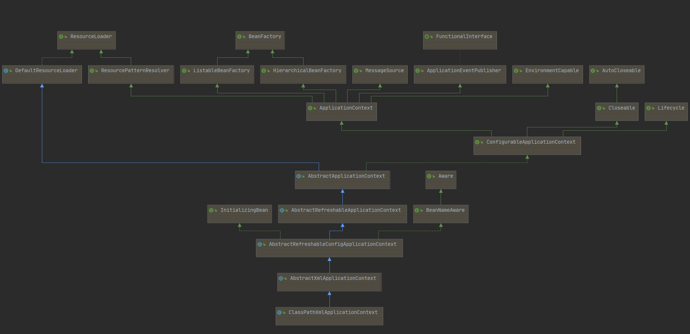

## 

```java
public static void main(String[] args) {
    ApplicationContext context = new ClassPathXmlApplicationContext("Spring.xml");
    User user = context.getBean(User.class);
    user.get();
}
```

三行很普通的 `Spring` 代码每行代码分别表达了：

1. 通过 `Spring.xml` 配置文件创建了 `context` 容器
2. 在容器中获取了一个 `User` 类、
3. 执行 `User` 类中的 `get` 方法

仅仅是三行就把庞大的 `Spring` 的 `IOC` 表现出来了，接下逐步介绍 `Spring` 的实现原理。


完整的 `Spring` 体系：




简化后的流程：


