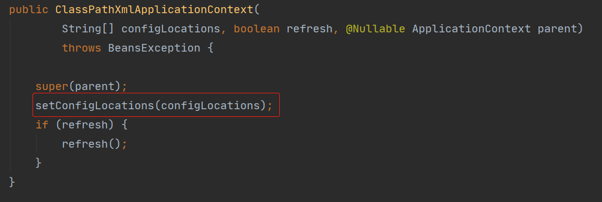

## Spring 源码分析（三）- obtainFreshBeanFactory

本文主要讲述 `obtainFreshBeanFactory` 方法及其相关类，根据方法的字面意思可以想到这个方法是用于**创建一个新的 Bean 工厂**

### 1.0 ConfigurableListableBeanFactory

```java
/**
* 告诉子类刷新内部bean工厂
* Tell the subclass to refresh the internal bean factory.
* @return the fresh BeanFactory instance
* @see #refreshBeanFactory()
* @see #getBeanFactory()
*/
protected ConfigurableListableBeanFactory obtainFreshBeanFactory() {
    // 方法内部很简单 就两个方法
    // 字面意思:刷新一个 Bean 工厂
    refreshBeanFactory();
    // 返回则是一个 获取 Bean 工厂的方法
    return getBeanFactory();
}
```

### 1.1 refreshBeanFactory

```java
/**
* This implementation performs an actual refresh of this context's underlying
* bean factory, shutting down the previous bean factory (if any) and
* initializing a fresh bean factory for the next phase of the context's lifecycle.
*/
@Override
protected final void refreshBeanFactory() throws BeansException {
    // 第一步 : 判断是否有BeanFactory 详情查看本文1.1
    if (hasBeanFactory()) {
        // 如果已经存在则:,销毁容器中的Bean 关闭BeanFactory
        destroyBeans();
        closeBeanFactory();
    }
    try {
        // 创建一个内部的bean工厂  空的 没什么东西 初始化了一些配置
        DefaultListableBeanFactory beanFactory = createBeanFactory();
        // 为 beanFactory 设置序列化
        beanFactory.setSerializationId(getId());
        // 制 beanfactory ，设置相关属性，如:启动参数、开启注解的自动装配等
        customizeBeanFactory(beanFactory);
        // 调用载入Bean定义的方法，此类只是定义了抽象方法，通过子类容器实现
        // 很关键的一个加载方法,详情查看本文1.3
        loadBeanDefinitions(beanFactory);
        synchronized (this.beanFactoryMonitor) {
            this.beanFactory = beanFactory;
        }
    }
    catch (IOException ex) {
        throw new ApplicationContextException("I/O error parsing bean definition source for " + getDisplayName(), ex);
    }
}
```

### 1.2  hasBeanFactory
```java
/**
* Determine whether this context currently holds a bean factory,
* i.e. has been refreshed at least once and not been closed yet.
* 判断是够已经有存在的bean工厂,至少refreshed了一次且美哦与关闭
*/
protected final boolean hasBeanFactory() {
    synchronized (this.beanFactoryMonitor) {
        return (this.beanFactory != null);
    }
}
```

```java
// 销毁 Bean 及关闭 BeanFactory
protected void destroyBeans() {
    getBeanFactory().destroySingletons();
}


@Override
protected final void closeBeanFactory() {
    synchronized (this.beanFactoryMonitor) {
        if (this.beanFactory != null) {
            // 将 beanFactory 的序列化值设为 null
            this.beanFactory.setSerializationId(null);
            // beanFactory 也设为 null
            this.beanFactory = null;
        }
    }
}
```


### 1.3 loadBeanDefinitions

> :fire: 高能预警：接下来会出现多个不同的 loadBeanDefinitions 重载类 ，注意区分

```java
/**
* 所属类：AbstractXmlApplicationContext
* 通过 XmlBeanDefinitionReader 加载定义的 Bean
* Loads the bean definitions via an XmlBeanDefinitionReader.
* @see org.springframework.beans.factory.xml.XmlBeanDefinitionReader
* @see #initBeanDefinitionReader
* @see #loadBeanDefinitions
*/
@Override
protected void loadBeanDefinitions(DefaultListableBeanFactory beanFactory) throws BeansException, IOException {
    // Create a new XmlBeanDefinitionReader for the given BeanFactory.
    // 为给定的BeanFactory创建一个新的 XmlBeanDefinitionReader
    // 主要是声明了一些配置
    XmlBeanDefinitionReader beanDefinitionReader = new XmlBeanDefinitionReader(beanFactory);

    // Configure the bean definition reader with this context's
    // resource loading environment.
    // 为 Bean 读取器设置Spring资源加载器
    // 只是声明没做什么处理
    beanDefinitionReader.setEnvironment(this.getEnvironment());
    beanDefinitionReader.setResourceLoader(this);
    beanDefinitionReader.setEntityResolver(new ResourceEntityResolver(this));

    // Allow a subclass to provide custom initialization of the reader,
    // then proceed with actually loading the bean definitions.
    // 当Bean读取器读取Bean定义的xml资源文件时，启用xml的校验机制
    initBeanDefinitionReader(beanDefinitionReader);
    // Bean读取器真正实现加载的方法
    // 注意真正的读取方法,具体讲解在本文1.4
    loadBeanDefinitions(beanDefinitionReader);
}
```


### 1.4  loadBeanDefinitions

```java
/**
* Load the bean definitions with the given XmlBeanDefinitionReader.
* <p>The lifecycle of the bean factory is handled by the {@link #refreshBeanFactory}
* method; hence this method is just supposed to load and/or register bean definitions.
* 使用给定的 XmlBeanDefinitionReader 去定义 Bean
* Bean factory 的声明周期由 refreshBeanFactory 决定
* 所以该方法只用于加载和注册Bean
*/
protected void loadBeanDefinitions(XmlBeanDefinitionReader reader) throws BeansException, IOException {
    Resource[] configResources = getConfigResources();
    if (configResources != null) {
        reader.loadBeanDefinitions(configResources);
    }
    // 获取配置的路径
    // 注意:之前在 ClassPathXmlApplicationContext 方法里曾经有一个 setConfigLocations 方法,如下图
    String[] configLocations = getConfigLocations();
    if (configLocations != null) {
        // 如果不为空则加载定义的Bean
        // 此时 configLocations 就等于 开始定义的XML文件名 => Spring.xml
        // read 之前声明的一个 XmlBeanDefinitionReader 对象
        // loadBeanDefinitions 具体做了什么在本文1.5
        reader.loadBeanDefinitions(configLocations);
    }
}
```




### 1.5  loadBeanDefinitions

```java
@Override
public int loadBeanDefinitions(String... locations) throws BeanDefinitionStoreException {
    // 首先判断是不是为空
    Assert.notNull(locations, "Location array must not be null");
    // 此处定义了一个计数器
    int count = 0;
    for (String location : locations) {
        // += 加载定义的Bean 参数是 XML的文件名,盲猜是返回所有配置文件里Bean的个数
        count += loadBeanDefinitions(location);
    }
    return count;
}
```


### 1.6 loadBeanDefinitions

```java
/**
* Load bean definitions from the specified resource location.
* 在指定的资源路径中(也就是XML)中加载定义的Bean
* <p>The location can also be a location pattern, provided that the
* ResourceLoader of this bean definition reader is a ResourcePatternResolver.
* @param location the resource location, to be loaded with the ResourceLoader
* (or ResourcePatternResolver) of this bean definition reader
* @param actualResources a Set to be filled with the actual Resource objects
* that have been resolved during the loading process. May be {@code null}
* to indicate that the caller is not interested in those Resource objects.
* @return the number of bean definitions found
* ↑ 注意 @return : 定义的Bean的数量
*/
public int loadBeanDefinitions(String location, @Nullable Set<Resource> actualResources) throws BeanDefinitionStoreException {
    // 获取一下资源加载器
    ResourceLoader resourceLoader = getResourceLoader();
    // 空验证
    if (resourceLoader == null) {
        throw new BeanDefinitionStoreException(
            "Cannot load bean definitions from location [" + location + "]: no ResourceLoader available");
    }
	
    if (resourceLoader instanceof ResourcePatternResolver) {
        // Resource pattern matching available.
        try {
            Resource[] resources = ((ResourcePatternResolver) resourceLoader).getResources(location);
            int count = loadBeanDefinitions(resources);
            if (actualResources != null) {
                Collections.addAll(actualResources, resources);
            }
            if (logger.isTraceEnabled()) {
                logger.trace("Loaded " + count + " bean definitions from location pattern [" + location + "]");
            }
            return count;
        }
        catch (IOException ex) {
            throw new BeanDefinitionStoreException(
                "Could not resolve bean definition resource pattern [" + location + "]", ex);
        }
    }
    else {
        // Can only load single resources by absolute URL.
        Resource resource = resourceLoader.getResource(location);
        int count = loadBeanDefinitions(resource);
        if (actualResources != null) {
            actualResources.add(resource);
        }
        if (logger.isTraceEnabled()) {
            logger.trace("Loaded " + count + " bean definitions from location [" + location + "]");
        }
        return count;
    }
}
```

