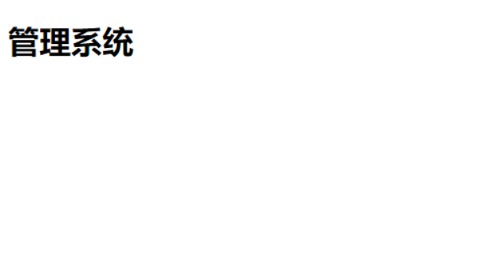
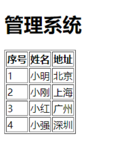
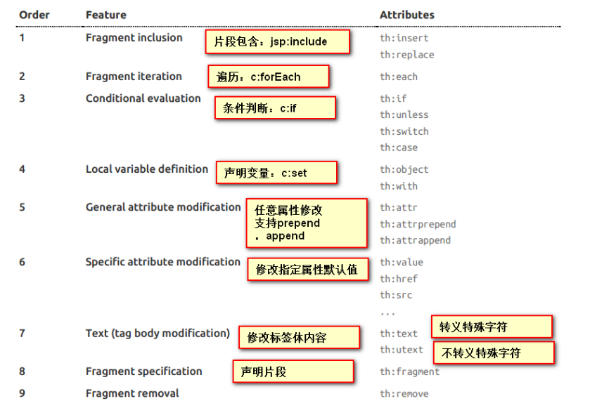

在前后端分离MVVM的开发模式下差点忘记了还有传统的MVC，虽然用的少了还是要会。

**为什么不能很友好的支持JSP：**

SpringBoot是以jar包的形式存在的，而且TomCat也是内嵌的。使用JSP部署的时候把war包放在TomCat，使用`java -jar`启动一个可执行war包，但是无法直接执行jar包


## 支持HTML

在`resources`下创建以下目录：

- public
- resources
- static

### 开始

- 在/public下创建了一个`index.html`

  ```html
  <!DOCTYPE html>
  <html lang="en">
  <head>
      <meta charset="UTF-8">
      <title>Title</title>
      <!-- 此处导入了一个JQuery -->
      <script src="/js/jquery-3.4.1.min.js"></script>
  </head>
  <body>
      <h1>Hello</h1>
  </body>
  </html>
  <script>
      // 测试下Jquery是否导入正常
      alert($)
  </script>
  ```

  

- 在`/static/js`下复制来一个Jquery文件

  - 可以通过浏览器访问`localhost:1244/jquery-3.4.1.min.js`测试是否成功

  

- 还可以自定义favicon.ico

  - 制作一张ico放在static、resources下

  

### 效果

- ico效果，若无效果可尝试**CTRL+F5**强制刷新

  

- 输出$

  

- 显示Hello

  


## 模板引擎

模板引擎还是比较熟悉的，在PHP中很多框架和CMS都会用到模板引擎例如：**Laravel**中的Blade思想都差不多。

**常用的模板引擎：**

- Freemarker
- Thymeleaf
- JSP也算是一种

### 基本使用

#### 开始

- 首先引入jar包

  ```xml
  <dependency>
      <groupId>org.springframework.boot</groupId>
      <artifactId>spring-boot-starter-thymeleaf</artifactId>
  </dependency>
  ```

- 控制器

  ```java
  @RequestMapping("/users")
  public static String users(Model model) {
      model.addAttribute("title","管理系统");
      return "users"; // 此处注意和后面创建的html文件名对应 无需后缀
  }
  
  // 也可以这样
  
  @RequestMapping("/users")
  public static String cfg(Map<String,Object> map) {
      map.put("title","管理系统");
      return "users"; 
  }
  ```

- 在`/resources/templates/`下创建`user.html`

  ```html
  <!DOCTYPE html>
  <html lang="en" xmlns:th="http://www.thymeleaf.org">
  <head>
      <meta charset="UTF-8">
      <title>Title</title>
  </head>
  <body>
      <h1 th:text="${title}">这是标题</h1>
  </body>
  </html>
  ```

  

#### 效果

访问`http://localhost:1244/users`




#### 其他

因为要在html文件中写好多thymeleaf的语法建议安装插件自动补全，亲测**JBLHtmlToThymeleaf**还不错


### 遍历表格

后台模拟了一个List发送到前台遍历，如果把他改成数据库获取然后使用一个html模板就是一个简单的管理系统了。

#### 开始

- 后台定义一个List

  ```java
  @RequestMapping("/users")
  public static String cfg(Map<String,Object> map) {
      map.put("title","管理系统");
      ArrayList<User> users = new ArrayList<>();
      users.add(getUser("小明","北京"));
      users.add(getUser("小刚","上海"));
      users.add(getUser("小红","广州"));
      users.add(getUser("小强","深圳"));
      map.put("users",users);
      return "users";
  }
  
  private static User getUser(String username,String address){
      User user = new User();
      user.setUsername(username);
      user.setAddress(address);
      return user;
  }
  ```


- 前台遍历

  ```html
  <h1 th:text="${title}">这是标题</h1>
  <table border="1" >
      <tr>
          <th>序号</th>
          <th>姓名</th>
          <th>地址</th>
      </tr>
      <tr  th:each="user,key : ${users}">
          <td th:text="${key.count}">id</td>
          <td th:text="${user.username}">username</td>
          <td th:text="${user.address}">address</td>
      </tr>
  </table>
  ```

#### 效果

  访问`localhost:1244/users`

  


### 其他使用方法


#### if else

也就是我们常用的**if**和**else**

```html
<td>
    <span th:if = "${user.address} == '北京'">√</span>
    <span th:unless = "${user.address} == '北京'">×</span>
</td>
```


#### switch

```html
<td th:switch = "${user.address}">
    <span th:case = "北京" th:text = "帝都" >称号</span>
    <span th:case = "上海" th:text = "魔都" >称号</span>
    <span th:case = "*"    th:text = "无"   >称号</span> <!-- * 表示default-->
</td>
```


  

## 总结

