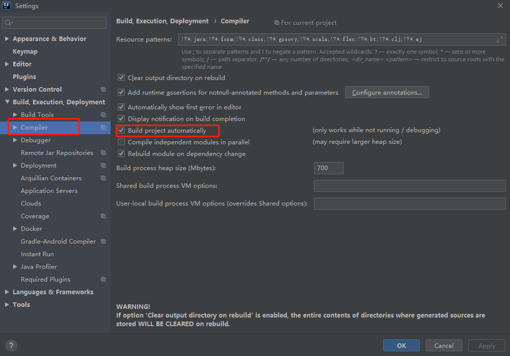
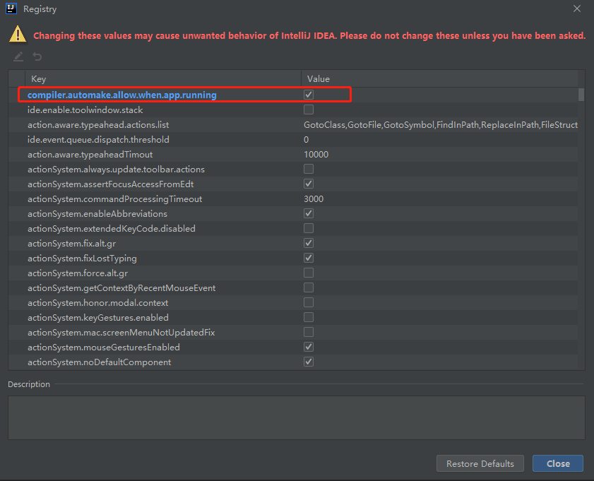
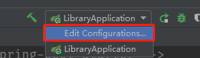
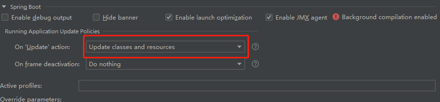
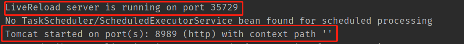

## 前提

一定是一个**SpringBoot**的项目，本文是在**IDEA**下开发


## 开始

### 导入Jar包

```xml
<!-- 热部署模块 -->
<dependency>
    <groupId>org.springframework.boot</groupId>
    <artifactId>spring-boot-devtools</artifactId>
    <optional>true</optional>
    <scope>runtime</scope>
</dependency>

<!-- 很多文章下都要加这个东西 但是我没有加同样有效 。。。 -->
<build>
	<plugins>
		<plugin>
			<groupId>org.springframework.boot</groupId>
			<artifactId>spring-boot-maven-plugin</artifactId>
			<configuration>
				<fork>true</fork>
			</configuration>
		</plugin>
	</plugins>
</build>

```


此时其实已经可以实现了热部署了，但是每次还是需要手动**Build Project**一下也就是**Ctrl + F9**，这样显然是不香的


### 配置IDEA

- **setting**中查找到**Compiler**，将**Build project automatically** 勾上。

  

- 快捷键：**ctrl+alt+shift+/ ** ，点击**Registry**，将**compiler.automake.allow.when.app.running** 勾上

  

- 设置**Configurations**

  





### 启动成功




### LiveReload

在[Chrome 应用商店](https://chrome.google.com/webstore/detail/livereload/jnihajbhpnppcggbcgedagnkighmdlei)下载**LiveReload**插件

不要选择在所有网站上，否则你每次编译成功所有网站都跟着刷新一下

