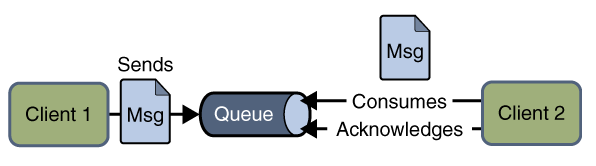
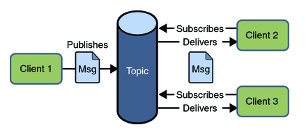

# JMS 和 AMQP对比

### JMS

​         通常而言提到 **JMS（Java MessageService）**实际上是指JMS API。JMS是由Sun公司早期提出的消息标准，旨在为java应用提供统一的消息操作，包括create、send、receive等。JMS已经成为Java Enterprise Edition的一部分。从使用角度看，JMS和JDBC担任差不多的角色，用户都是根据相应的接口可以和实现了JMS的服务进行通信，进行相关的操作。

### 角色：

| **Elements**            | **Notes**                                                    |
| ----------------------- | ------------------------------------------------------------ |
| JMS provider            | 实现了JMS接口的消息中间件，如ActiveMQ                        |
| JMS client              | 生产或者消费消息的应用                                       |
| JMS producer/publisher  | JMS消息生产者                                                |
| JMS consumer/subscriber | JMS消息消费者                                                |
| JMS message             | 消息，在各个JMS client传输的对象；                           |
| JMS queue               | Provider存放等待被消费的消息的地方                           |
| JMS topic               | 一种提供多个订阅者消费消息的一种机制；在MQ中常常被提到，topic模式。 |

### 消息模式

- peer-2-peer（点对点）

  

  > 使用**队列（Queue）作为消息通信载体；满足生产者与消费者模式**，一条消息只能被一个消费者使用，未被消费的消息在队列中保留直到被消费或超时。比如：我们生产者发送100条消息的话，两个消费者来消费一般情况下两个消费者会按照消息发送的顺序各自消费一半（也就是你一个我一个的消费。）

  

- publish-subscribe（发布订阅）

  

  > 发布订阅模型（Pub/Sub） 使用**主题（Topic）作为消息通信载体，类似于广播模式**；发布者发布一条消息，该消息通过主题传递给所有的订阅者，**在一条消息广播之后才订阅的用户则是收不到该条消息的**。

> 当采用点对点模型时，消息将发送到一个队列，该队列的消息只能被一个消费者消费。
>
> 采用发布订阅模型时，消息可以被多个消费者消费。在发布订阅模型中，生产者和消费者完全独立，不需要感知对方的存在。

### 消息正文格式

- `StreamMessage`（ Java原始值的数据流）
- `MapMessage`（一套名称值对）
- `TextMessage`（一个字符串对象）
- `ObjectMessage`（一个序列化的Java对象）
- `BytesMessage`（一个字节的数据流）

 ### 实现

常见的消息队列，大部分都实现了JMS API，可以担任JMS provider的角色，如`ActiveMQ`，`Redis`等。

## AMQP

> **高级消息队列协议 AMQP（advanced message queuing protocol）**在2003年时被提出，最早用于解决金融领不同平台之间的消息传递交互问题。顾名思义，**AMQP是一种协议**，更准确的说是一种binary wire-level protocol（链接协议）。**这是其和JMS的本质差别**，**AMQP不从API层进行限定**，而是**直接定义网络交换的数据格式**。这使得实现了AMQP的provider天然性就是跨平台的。意味着我们可以使用Java的AMQP provider，同时使用一个python的producer加一个rubby的consumer。从这一点看，AQMP可以用http来进行类比，不关心实现的语言，只要大家都按照相应的数据格式去发送报文请求，不同语言的client均可以和不同语言的server链接。

### 实现

 目前AMQP逐渐成为消息队列的一个标准协议，当前比较流行的`Rabbitmq`、`stormmq`都使用了AMQP实现。

# 总结

|              | JMS                                                          | AMQP                                                         |
| ------------ | ------------------------------------------------------------ | ------------------------------------------------------------ |
| 定义         | Java api                                                     | Wire-protocol                                                |
| 跨语言       | 否                                                           | 是                                                           |
| 跨平台       | 否                                                           | 是                                                           |
| Model        | 提供两种消息模型： （1）、Peer-2-Peer （2）、Pub/sub | 提供了五种消息模型： （1）、direct exchange （2）、fanout exchange （3）、topic change （4）、headers exchange （5）、system exchange 本质来讲，后四种和JMS的pub/sub模型没有太大差别，仅是在路由机制上做了更详细的划分； |
| 支持消息类型 | 多种消息类型： `TextMessage` `MapMessage` `BytesMessage` `StreamMessage` `ObjectMessage` `Message` （只有消息头和属性） | byte[] 当实际应用时，有复杂的消息，可以将消息序列化后发送。 |
| 综合评价     | JMS 定义了JAVA API层面的标准；在java体系中，多个client均可以通过JMS进行交互，不需要应用修改代码，但是其对跨平台的支持较差； | AMQP定义了wire-level层的协议标准；天然具有跨平台、跨语言特性。 |