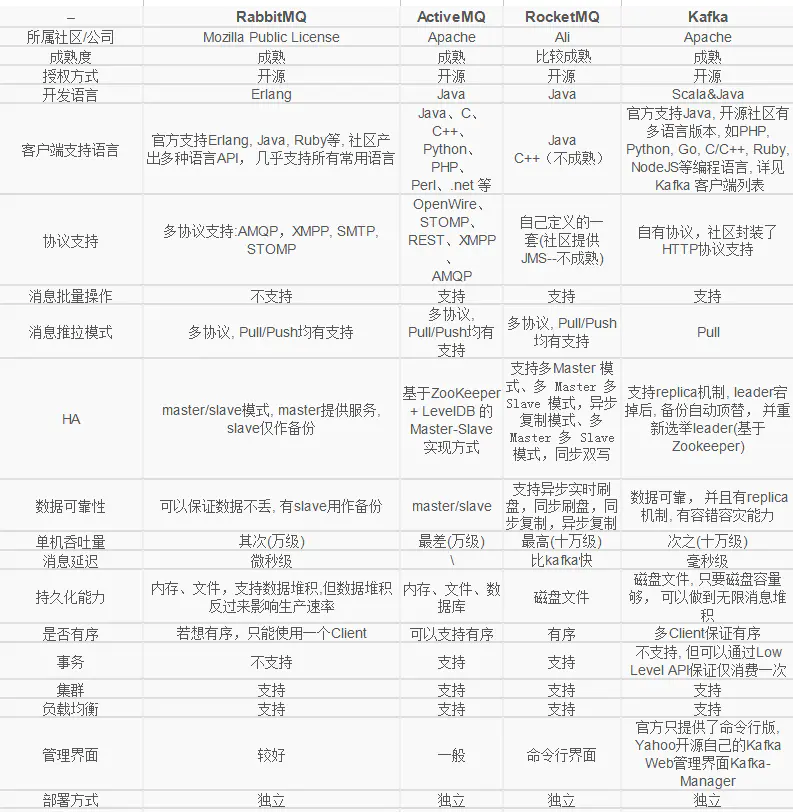

# 消息队列概述

`RabbitMQ`、`Kafka`、`RocketMQ`...在日常学习与开发过程中，我们常常听到消息队列这个关键词。我也在我的多篇文章中提到了这个概念。可能你是熟练使用消息队列的老手，又或者你是不懂消息队列的新手，不论你了不了解消息队列，本文都将带你搞懂消息队列的一些基本理论。如果你是老手，你可能从本文学到你之前不曾注意的一些关于消息队列的重要概念，如果你是新手，相信本文将是你打开消息队列大门的一板砖。

## 1	、什么是消息队列

我们可以把消息队列比作是一个存放消息的容器，当我们需要使用消息的时候可以取出消息供自己使用。消息队列是分布式系统中重要的组件，使用消息队列主要是为了通过异步处理提高系统性能和削峰、降低系统耦合性。

**目前使用较多的消息队列有：**

- ActiveMQ
- RabbitMQ
- Kafka
- RocketMQ

另外，我们知道队列 Queue 是一种先进先出的数据结构，所以消费消息时也是按照顺序来消费的。

## 2、为什么要用消息队列

### 2.1异步处理（削峰、减少响应时长）

**消息队列具有很好的削峰作用的功能**——即**通过异步处理，将短时间高并发产生的事务消息存储在消息队列中，从而削平高峰期的并发事务。**

- 在不使用消息队列服务器的时候，用户的请求数据直接写入数据库，在高并发的情况下数据库压力剧增，使得响应速度变慢。

- 在使用消息队列之后，用户的请求数据发送给消息队列之后立即返回，再由消息队列的消费者进程从消息队列中获取数据，异步写入数据库。

在上图中，两种架构的服务器压力差距还是很大的，就好比：持续降雨发生涝灾，假设有一个无限大动态的闸口持续向下游泄洪。如果突然闸口很大下游压力会突增甚至导致下游被淹，而如果闸口很小则下游没什么影响上游依旧涝灾。

> 因为**用户请求数据写入消息队列之后就立即返回给用户了，但是请求数据在后续的业务校验、写数据库等操作中可能失败**。因此使用消息队列进行异步处理之后，需要**适当修改业务流程进行配合**，比如**用户在提交订单之后，订单数据写入消息队列，不能立即返回用户订单提交成功，需要在消息队列的订单消费者进程真正处理完该订单之后，甚至出库后，再通过电子邮件或短信通知用户订单成功**，以免交易纠纷。这就类似我们平时手机订火车票和电影票。

### 2.2 解耦

　**使用消息队列还可以降低系统耦合性**，在系统模块之间不存在直接调用使用消息中间件尽最大的减少影响。

生产者（客户端）发送消息到消息队列中去，接受者（服务端）处理消息，需要消费的系统直接去消息队列取消息进行消费即可而不需要和其他系统有耦合， 这显然也提高了系统的扩展性。

## 3、可能存在问题

- **系统可用性降低：** 系统可用性在某种程度上降低，为什么这样说呢？在加入MQ之前，你不用考虑消息丢失或者说MQ挂掉等等的情况，但是，引入MQ之后你就需要去考虑了！
- **系统复杂性提高：** 加入MQ之后，你需要保证消息没有被重复消费、处理消息丢失的情况、保证消息传递的顺序性等等问题！
- **一致性问题：** 我上面讲了消息队列可以实现异步，消息队列带来的异步确实可以提高系统响应速度。但是，万一消息的真正消费者并没有正确消费消息怎么办？这样就会导致数据不一致的情况了!

## 4、同类对比

### 选型

### RabbitMQ 和 Kafka

