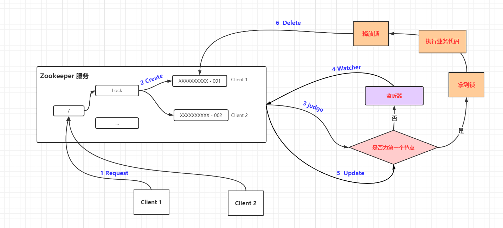

#  ZooKeeper在项目中的应用

## **分布式锁**

这是雅虎研究员设计Zookeeper的初衷。利用Zookeeper的临时顺序节点，可以轻松实现分布式锁。

### 举个栗子

> 假设有一个 `ZooKeeper` 服务，定义了一个节点`Lock`，此时有`Client 1`和`Client 2` 两个节点先后发起请求。

1. `Client 1` 向`Zookeeper`服务发送一个请求
2. 创建一个归属于该请求的子节点
3. 判断该请求的子节点是否为第一个节点，如果是则拿到锁，如果不是则等待。
4. 没有拿到锁则对`Lock`节点进行监控
5. 当`Lock`节点发生变动时则重新是否为第一个节点
6. 业务执行结束释放锁则删除对应子节点即可

## **服务注册和发现**

利用Znode和Watcher，可以实现分布式服务的注册和发现。最著名的应用就是阿里的分布式RPC框架Dubbo。

## **共享配置和状态信息**

Redis的分布式解决方案Codis，就利用了Zookeeper来存放数据路由表和 codis-proxy 节点的元信息。同时 codis-config 发起的命令都会通过 ZooKeeper 同步到各个存活的 codis-proxy。

此外，Kafka、HBase、Hadoop，也都依靠Zookeeper同步节点信息，实现高可用。

