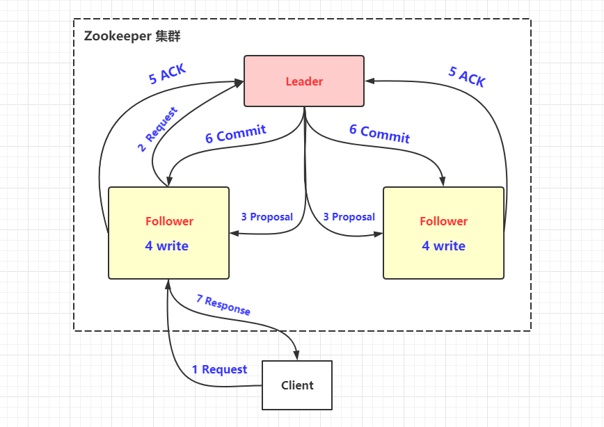
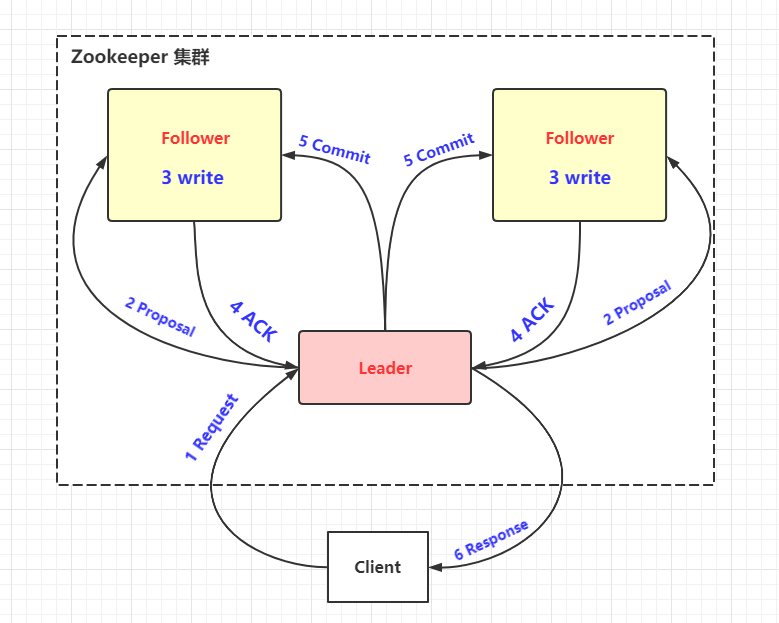

# ZooKeeper 的数据写入

`Zookeeper`常规情况下更新数据的时候，由`Leader`广播到所有的`Follower`。

像极了小时候在商场走丢的你，“XX小朋友，听到广播后请速到一楼服务台你的妈妈在这里等你”

## 广播 （Broadcast）

### 由 Follower 或 Observer 写入

1. 客户端向任意`Follwer`发起写入请求
2. `Follwer`将请求转发给`Leader`
3.  `Leader`以Proposal的形式发给所有`Follower`并等待`ACK`
4. `Follower`写入日志
5. 写入成功后返回`ACK`消息
6. 当`Leader`接到半数以上`ACK`消息，返回成功给客户端，并且广播`Commit`请求给`Follower`
7. 最后返回给客户端

### 由 Leader 写入

1. 客户端向任意`Leader`发起写入请求
2. `Leader`以Proposal的形式发给所有`Follower`并等待`ACK``
3. `Follower`写入日志
4. 写入成功后返回`ACK`消息
5. 当`Leader`接到半数以上`ACK`消息，返回成功给客户端，并且广播`Commit`请求给`Follower`
6. 最后返回给客户端

