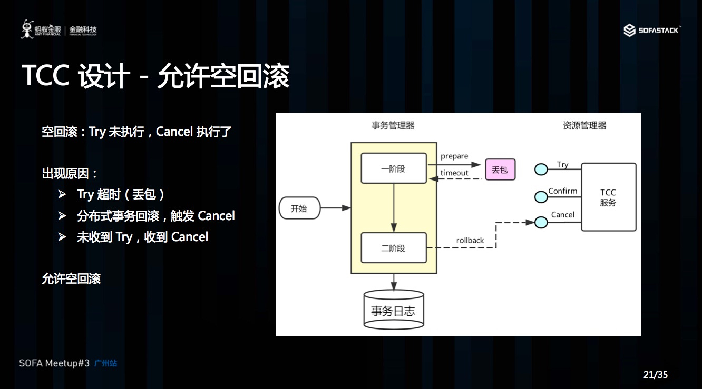
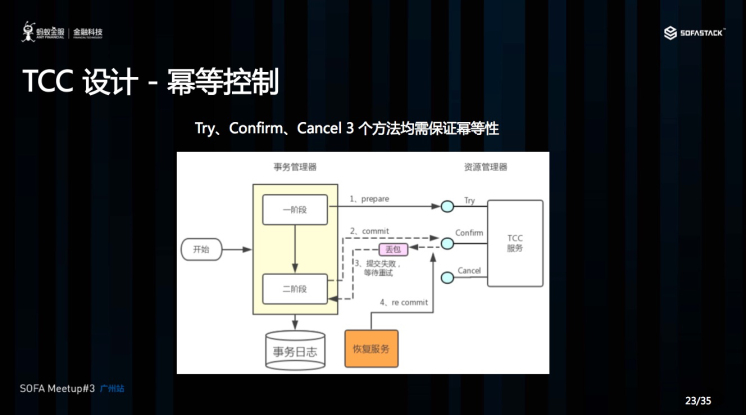
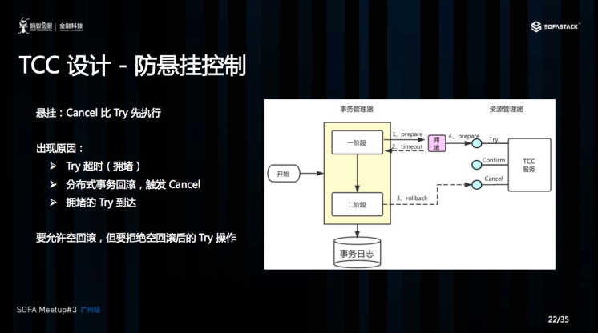

# Seata Tcc 模式下的空回滚、幂等、悬挂

## 空回滚

Cancel 接口设计时需要允许空回滚。在 Try 接口因为丢包时没有收到，事务管理器会触发回滚，这时会触发 Cancel 接口，这时 Cancel 执行时发现没有对应的事务 xid 或主键时，需要返回回滚成功。让事务服务管理器认为已回滚，否则会不断重试，而 Cancel 又没有对应的业务数据可以进行回滚。

> Try 没执行，Cancel 执行，空Cancel 

## 幂等

对同一个系统，使用同样的条件，一次请求和重复的多次请求对系统资源的影响是一致的。因为网络抖动或拥堵可能会超时，事务管理器会对资源进行重试操作，所以很可能一个业务操作会被重复调用，为了不因为重复调用而多次占用资源，需要对服务设计时进行幂等控制，通常我们可以用事务 xid 或业务主键判重来控制。

> 多次 Cancel 或者 Confirm  判重

## 悬挂

Cancel 比 Try 接口先执行，出现的原因是 Try 由于网络拥堵而超时，事务管理器生成回滚，触发 Cancel 接口，而最终又收到了 Try 接口调用，但是 Cancel 比 Try 先到。按照前面允许空回滚的逻辑，回滚会返回成功，事务管理器认为事务已回滚成功，则此时的 Try 接口不应该执行，否则会产生数据不一致，所以我们在 Cancel 空回滚返回成功之前先记录该条事务 xid 或业务主键，标识这条记录已经回滚过，Try 接口先检查这条事务xid或业务主键如果已经标记为回滚成功过，则不执行 Try 的业务操作。

> Cancel 比 Try 接口先执行了，空Try